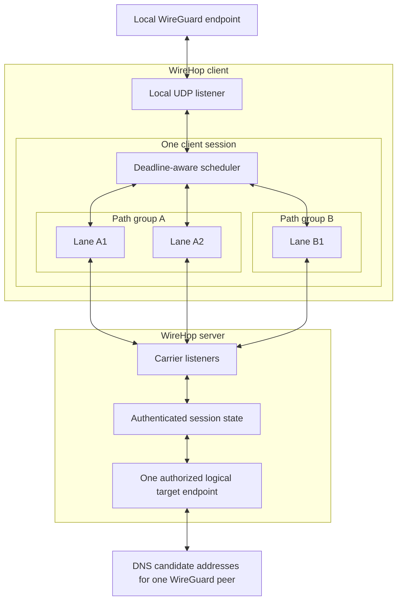
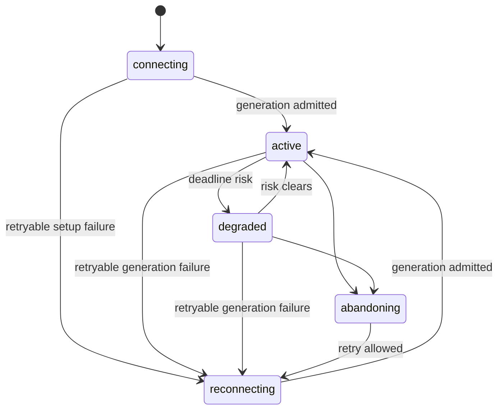
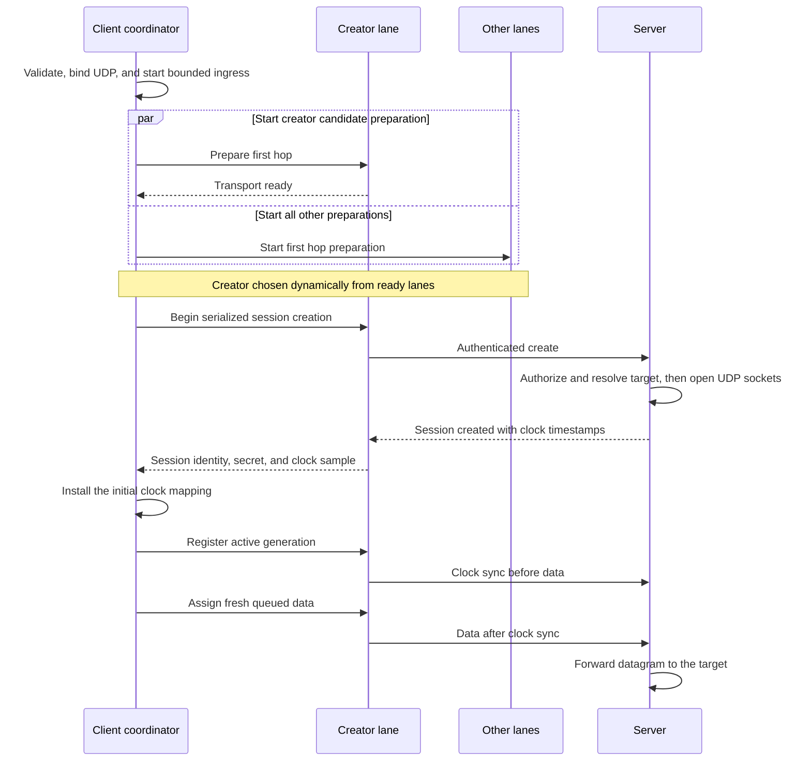
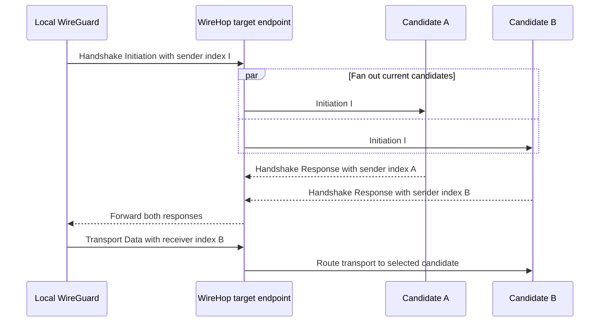

# WireHop product and technical design

## Overview

WireHop is a multipath relay that carries WireGuard UDP packets over TCP-based carrier lanes. It is designed to maximize
useful goodput, reduce latency under load, and improve path resilience on networks where native UDP is blocked,
unstable, or rate limited.

> A multipath relay for WireGuard over TCP-based transports.

WireHop combines WireGuard-aware packet handling with independently measured carrier lanes. The design targets:

- WebSocket or TLS TCP reachability when native UDP is unavailable or performs poorly
- Concurrent lanes across different addresses, IP families, or carrier types
- Independent connections to one carrier endpoint when a single TCP stream is insufficient
- Continued forwarding and bounded recovery when one lane stalls or fails

## Document status

This document defines WireHop's product behavior and technical design. Present-tense statements describe supported
behavior. Protocol requirements define the version 1 wire contract. Deployment recommendations and the performance
validation matrix are guidance rather than runtime requirements.

## Design boundary

WireHop remains transparent to WireGuard cryptography. It inspects the outer WireGuard packet type and public structural
fields without decrypting or authenticating WireGuard cryptographic content. Complete datagrams are preserved unless the
client or direct forwarder is configured to translate the public three-byte reserved field at its local UDP boundary.

WireHop is an application-layer packet relay rather than a WireGuard peer or VPN implementation. Each relay session
carries WireGuard packets for exactly one remote WireGuard endpoint. The direct forwarding mode connects one local UDP
listener to one logical target without creating a WireHop session.

## Supported scope

The CLI supports these carrier schemes:

| Scheme | Role | Production use |
| --- | --- | --- |
| `tcp://` | Insecure raw TCP stream | No, trusted networks and benchmarks only |
| `tls://` | Raw TCP stream protected by TLS | Yes |
| `ws://` | Insecure WebSocket stream | No, local tests and trusted networks only |
| `wss://` | WebSocket over TLS | Yes |

UDP ingress accepts only WireGuard-looking datagrams at the client listener, server target endpoint, and forward
listener. The message type is the first byte. The following three reserved bytes are opaque to classification. Datagrams
that fail public WireGuard type and length classification are dropped before scheduling or direct forwarding. Each
client session binds one local listener to one logical remote WireGuard endpoint through one or more carrier lanes.

The `forward` command provides a separate direct UDP path for deployments that need WireGuard packet filtering, target
resolution, or reserved field translation without a TCP-based carrier. It accepts the same WireGuard-looking datagrams
as a client, connects one local listener to one logical target, and uses no WireHop framing, lane, session, or
authentication state.

## Basic architecture

The end-to-end topology is:



The path groups and lanes are illustrative. Each lane-to-listener edge is an independent full-duplex carrier stream.
Forward and reverse proxies may appear on that edge without changing the session topology.

Direct forwarding uses the simpler topology `Local WireGuard <-> forward listener <-> target endpoint`. The target
endpoint retains the DNS candidate and WireGuard index affinity behavior described below, but the two UDP directions
otherwise forward synchronously without a queue or scheduler.

## Lane model

A lane is one authenticated, long-lived carrier connection slot. A connected lane owns exactly one current carrier
connection, while a disconnected or connecting lane may own none. Every carrier connection belongs to exactly one lane
and one session.

Every supported carrier maps one lane to one underlying TCP connection:

| Scheme | Carrier stack | TCP connections per lane |
| --- | --- | --- |
| `tcp://` | WireHop over TCP | 1 |
| `tls://` | WireHop over TLS over TCP | 1 |
| `ws://` | WireHop over WebSocket over TCP | 1 |
| `wss://` | WireHop over WebSocket over TLS over TCP | 1 |

One full-duplex TCP connection carries both directions of a lane. WireHop does not create separate upstream and
downstream connections. It does not multiplex multiple lanes or multiple sessions over one TCP connection.

The client supervisor retains the canonical carrier URL, optional fixed resolution, stable lane identifier, path group
identifier, connection generation, and reconnect backoff for each configured lane. Each direction of the scheduler
independently tracks the lane's smoothed round trip time, estimated delivery rate, retained byte backlog, and
deadline-risk state.

Lane states:

| State | Meaning |
| --- | --- |
| `connecting` | The carrier connection is being established |
| `reconnecting` | The lane has no current connection and has a retry scheduled or in progress |
| `active` | The generation is admitted, connected, and available to the scheduler |
| `degraded` | The lane remains connected but receives no new packet assignments while existing work may recover |
| `abandoning` | The lane is being closed without waiting for its outstanding data to drain |
| `rejected` | The lane received a terminal security, policy, or protocol rejection |
| `closed` | The lane or containing session was closed and the lane is no longer scheduled to reconnect |

Retryable and abandonment transitions are:



A lane enters `degraded` or `abandoning` according to the connection abandonment policy.

A terminal security, policy, or protocol rejection moves a lane from `connecting`, `reconnecting`, `active`, or
`degraded` to `rejected`. Closing the lane or its containing session moves any nonterminal state to `closed`. Both
terminal states end the current supervisor and never reconnect within that session. A replacement session starts new
supervisors from the complete configured lane set.

These names describe lifecycle behavior. An `active` lane is not necessarily scheduling-eligible because eligibility
also depends on the path-group limit, retained-store capacity, deadline risk, and abandonment state. It is not a second
user-configurable mode.

## Path group model

A path group is an internal scheduling scope for lanes that are known or conservatively expected to share the same
configured carrier endpoint and a substantial part of the same network bottleneck. It prevents WireHop from assuming
that two TCP connections automatically provide two independent paths or twice the capacity.

Repeated occurrences of the same canonical URL and fixed resolution belong to the same path group. They remain
independent lanes with independent TCP sequence spaces, congestion windows, retransmission queues, measurements, and
lifecycle state. Different fixed resolutions belong to different path groups even when their logical URLs are identical.
A normally resolved URL and an explicitly resolved declaration also belong to different groups.

Canonicalization lowercases DNS names, normalizes IP literals and decimal ports, fills omitted `ws://` and `wss://`
ports with `80` and `443`, uppercases percent-escape digits, and uses `/` for an omitted WebSocket path. Raw `tcp://`
and `tls://` URLs require an explicit port. Canonicalization does not decode path-significant escapes or infer that two
different hostnames or fixed IP addresses reach the same bottleneck.

Carrier URLs reject user information, query parameters, and fragments. Raw `tcp://` and `tls://` URLs cannot contain a
path. WebSocket URLs use their canonical escaped path as an exact admission endpoint.

The client assigns an opaque session-scoped path group identifier to every configured group and authenticates it during
lane creation or join. The server accepts and returns that identifier, binds it to the stable lane identity, and rejects
a reconnect generation that proposes a different group.

Different path groups may still share access links, radio resources, proxies, or server bottlenecks. A path group is a
conservative scheduling and observability boundary, not proof that groups are physically disjoint.

The path group identifier participates in same-group lane eligibility and WireGuard control-packet duplication across
groups. RTT, delivery rate, retained backlog, and deadline risk remain lane-local rather than being merged into a
synthetic group estimate.

## Lane lifecycle

Lanes are long-lived. Their lifecycle is event-driven rather than age-based, which avoids unnecessary handshakes, packet
reordering, and scheduling instability.

A lane has a stable lane identifier and a connection generation that starts at 1 and increases within one relay session.
Reconnecting replaces the old underlying TCP connection with a new generation. Frames and delivery reports identify the
generation so that stale reports from a previous connection cannot modify current scheduler state. A replacement session
resets the generation namespace. Generation values never wrap, and exhausting the 64-bit space requires replacing the
session before that stable lane can reconnect.

For each stable lane identifier, the server accepts only a higher generation. When the admitted generation registers
with the scheduler, it replaces the previous scheduler generation and closes the old carrier. Before discarding the old
scheduler state, the server applies the bounded migration policy to eligible transport packets. The same or a lower
generation is rejected.

An abandoning lane receives no new packets and closes its carrier specifically to discard TCP-buffered data that is no
longer worth waiting for.

The client reconnects a retryable lane after any of these generation-ending conditions:

- Carrier read, write, TLS, or WebSocket operation fails
- Ping timeout occurs
- A carrier write exceeds its operation deadline
- The scheduler abandons a generation whose retained work can no longer arrive usefully
- The peer requests generation-specific lane abandonment

Certificate, authentication, protocol, and policy rejections close only the affected lane unless a machine-readable
error received on an admitted lane has session scope.

## Client startup and availability policy

The client validates its complete local configuration before creating any sockets. It requires every lane declaration,
carrier scheme, local UDP listener, target, authentication input, TLS option, proxy selection, and insecure-carrier
opt-in to be valid. A fixed resolution must be a single unbracketed IP without a port or zone, and its URL must contain
a hostname. One invalid declaration makes the invocation fail even when another lane could connect. Repeated identical
declarations are valid and remain independent lanes.

Network reachability is not part of local configuration validation. An unreachable lane does not invalidate another
correctly configured lane.

After validation, the client binds the local UDP listener before dialing carrier lanes. A bind failure is terminal. Once
bound, the listener starts receiving WireGuard datagrams immediately, including while the first carrier is still being
established. These datagrams enter the bounded session ingress queue with deadlines derived from their arrival times.

### Session bootstrap coordination

Carrier preparation starts concurrently across all configured lanes. DNS resolution and first-hop TCP connection
establishment race for every normally resolved carrier. A fixed-resolution lane bypasses DNS and uses the same IP on
every reconnect generation. A `tls://` lane also completes its TLS handshake during preparation. WebSocket HTTP Upgrade,
HTTPS proxy TLS, CONNECT negotiation, and any target-side WSS TLS handshake remain part of authenticated creation or
join. One slow or unreachable lane therefore cannot block later declarations.

Authentication nonces, wall-clock timestamps, and clock-bootstrap monotonic send timestamps are generated only after the
available preparation stage completes. For raw TCP and TLS lanes, this excludes DNS, TCP connect, and TLS setup from the
four-timestamp sample. For WebSocket lanes, it excludes first-hop DNS and TCP connect. HTTPS proxy TLS, HTTP CONNECT or
SOCKS tunnel negotiation, target TLS, and HTTP Upgrade remain after `t1` because authentication is carried by the
Upgrade request itself, so the initial mapping conservatively includes those stages until later ping samples refresh it.

Local validation enforces the configured per-session lane limit before this concurrent work begins. Carrier preparation
is therefore concurrent across the accepted configuration while remaining bounded by explicit resource policy.

Session creation itself is single-flight. At most one candidate lane sends a session creation request at a time.

The creator is selected from transport-ready candidates and is not fixed to the first `--lane` occurrence. A creation
attempt has a bounded deadline. If it fails, the client classifies the failure and selects another eligible candidate.
Once one creation request succeeds, all other lanes join the resulting session instead of creating their own sessions.
This prevents duplicate sessions while allowing a bad first lane to be bypassed.

After session creation, all prepared lanes start their authenticated joins concurrently. Configured lanes whose carrier
preparation finishes later join as soon as they are ready. Background ping and probe timers use stable lane-based phase
offsets so concurrent lane startup does not create a synchronized control burst.

### Data-plane activation

WireHop starts useful forwarding as soon as one lane is safely usable. It never waits for every configured lane, a
second lane, a probe interval, or a final connected-lane count.

The initial data-plane gate requires all of the following:

- Complete local validation and a bound local UDP listener
- An authenticated and accepted creator lane
- Successful target authorization, initial server-side resolution, and creation of at least one target UDP socket
- An initial session clock mapping
- One client-to-server clock-sync frame ordered before the first data frame on the creator generation

The `session-created` response means that authentication, target authorization, initial resolution, and target socket
creation have completed. It includes the timestamps needed for the client to derive the initial session clock mapping.
The client then sends exactly one clock-sync frame as the generation's first in-session frame. Fresh queued data can
follow in the next carrier write. Clock synchronization requires no acknowledgement and adds no extra round trip before
the first data packet.

The successful bootstrap and earliest data-plane activation path is:



Other lanes join as they become ready and send a clock-sync frame first on each generation. Their preparation and
admission never gate forwarding on the creator lane. Each accepted generation becomes `active` immediately after this
gate with conservative RTT and delivery-rate estimates. It does not wait for a probe.

### Availability behavior

Initial session creation has a bounded startup deadline. The process exits with a nonzero status when local validation
fails, no candidate creates a session within that deadline, or all candidates finish with terminal rejections. Startup
failures identify the configured lane occurrence and declaration that supplied the retained cause. A startup timeout
includes the most recent actionable lane failure when one is available.

After a session has existed, retryable lane failures reconnect independently. If all current generations are down, the
client remains alive while their supervisors retry. The already-bound UDP socket and bounded ingress queue remain in
place. Fresh packets may survive a short outage. Expired packets are discarded on dequeue and reclaimed under capacity
pressure before they can make the queue reject fresh ingress. If the retained session is gone, each replacement creation
round remains bounded, but retryable rounds continue without an overall recovery deadline.

A single terminal lane rejection never terminates a client that still has another active or retryable lane. A client
with no remaining lane supervisor exits because the session can no longer make progress. When another lane preserves the
session's viability, the terminal rejection produces one degradation warning for the disabled lane.

### Error classification

Every connection, handshake, and control-plane failure maps to one stable error class:

| Class | Examples | Behavior |
| --- | --- | --- |
| `configuration` | Malformed URL, unsupported scheme, missing token, invalid TLS option | Fail before network startup |
| `retryable` | Network failure, timeout, clock skew, HTTP 408, 429, or 5xx | Reconnect with backoff |
| `lane_rejected` | Certificate validation failure, authentication rejection, incompatible protocol | Reject that lane |
| `session_gone` | Join refers to an unknown, closed, or expired session | Coordinate session replacement |
| `session_rejected` | All viable endpoints reject the credentials, target, or protocol | Terminate the client |

A rejection from one endpoint is lane-specific until the client has evaluated other viable candidates. This prevents a
misdirected or incorrectly configured URL from turning its own authentication failure into a false session-wide failure.
Before session establishment, the client treats a remote `session_rejected` response as evidence for that candidate and
promotes it to a process-level terminal result only after every viable candidate has failed terminally. An in-session
`session_rejected` control received on an admitted lane and scoped to the current session is terminal immediately.

A `session_gone` response from one lane never replaces a session that still has another accepted lane. In that case the
response is isolated to the failed lane as an endpoint inconsistency. Session replacement starts only after no remaining
lane supervisor can preserve the old session.

After a session is established, a rejected lane supervisor does not participate in reconnect backoff. During the bounded
initial bootstrap, complete candidate rounds may re-evaluate declarations while another candidate still has a retryable
failure. Changing a certificate, credential, URL, or incompatible protocol deployment requires restarting the client
after the startup budget is exhausted.

Raw-stream responses, WebSocket rejections, and in-session error frames carry machine-readable error classes. A
WebSocket rejection that follows successful request parsing carries an authenticated binary rejection in the
`WireHop-Rejection` response header. Its signed class and scope override the HTTP status for client lifecycle decisions.
An unsigned or invalid response retains status-based handling for intermediary-generated errors. Retry behavior never
depends on free-form diagnostic text. The `lane_rejected` class always has lane scope. The `session_gone` and
`session_rejected` classes always have session scope. A `retryable` error may use either scope according to the resource
that failed. A lane-scoped retryable error reconnects only that stable lane identity. A session-scoped retryable error
replaces the complete session after bounded backoff. An in-session `session_rejected` or session-scoped `retryable`
error received on an admitted lane applies to the complete session rather than only its carrying lane. A `session_gone`
error follows the multi-lane preservation rule above. Raw servers return an HMAC-authenticated terminal rejection when
the client hello uses an unsupported WireHop version.

### Reconnection policy

Each retryable lane reconnects independently with exponential backoff and full jitter. Backoff is capped and resets only
after the lane remains healthy for a stability interval. Independent jitter prevents all lanes and clients from
reconnecting in synchronized bursts after a shared outage. Whole-session replacement uses the same backoff and
stability-reset rule, so a session that is repeatedly created and immediately invalidated cannot form a tight retry
loop.

When an active lane fails, WireHop immediately removes it from new scheduling decisions, applies the connection
abandonment and packet migration policy when relevant, increments its connection generation, and enters `reconnecting`.
Other active lanes continue forwarding without restarting their carrier connections or session state.

If all lanes fail at runtime but at least one failure remains retryable, the client enters `disconnected` instead of
exiting. The first accepted reconnect refreshes the session clock mapping and passes through the normal data-plane gate.
Later lanes register independently.

## Multipath scheduling

The scheduler chooses a lane for each WireGuard packet. Lane activation is path-group aware, while packet placement uses
per-lane delivery predictions.

The scheduling goal is to maximize useful goodput within packet deadlines while minimizing delivery time and unnecessary
reordering. Maximum raw carrier throughput is not a reason to stripe packets when one lane can deliver them earlier.

Each usable lane direction maintains these scheduling estimates:

- Smoothed round trip time
- Estimated delivery rate
- Retained encoded bytes, including queued and sent-but-unreported data

The session clock mapping is shared by all lanes in that session. RTT, delivery rate, and retained backlog remain
lane-local and direction-local. Preferred-lane state is also direction-local, so observations in one direction do not
stand in for capacity in the reverse direction. A new lane refines path timing without creating a separate clock domain.

The scheduler does not use unconditional round robin because that can create excessive reordering and continue sending
packets into stalled lanes.

For packet `p` and candidate lane `i`, the baseline prediction is:

```text
queue_delay_i = retained_bytes_i / estimated_delivery_rate_i
serialization_delay_i = frame_size(p) / estimated_delivery_rate_i

predicted_arrival_i =
  now
  + queue_delay_i
  + serialization_delay_i
  + smoothed_rtt_i / 2
```

The scheduler assigns the packet to the eligible lane with the earliest predicted arrival that can meet the packet
deadline. Successful admission transfers the complete frame into that generation's bounded transmission store. Retained
bytes remain part of later predictions until delivery feedback releases them.

Sparse probes validate an idle carrier and its cross-lane delivery-report path. Their interval backs off exponentially
while the lane remains idle, and any completed real data write restores the initial interval. Probes do not update the
capacity estimate. Delivery rate changes only after at least 4 KiB of dense real data arrives within a 250 ms sampling
window. This avoids treating probe cadence or isolated packets as available path capacity. A sample above the current
estimate can increase it immediately. A lower sample decreases the estimate only when its completing report arrives
while unsent work exists or at least half of the lane's packet or byte retention window is occupied. Pressure is sampled
before that report releases acknowledged data. A lower application-limited offered rate therefore cannot be mistaken for
a reduction in path capacity, while sustained sender pressure can still detect a real capacity drop.

Each lane sends its first timing request within a stable phase spread over the first quarter of the active ping
interval. Timing requests back off exponentially while no real data is written and return to the active interval when
traffic resumes. The first valid RTT sample replaces the conservative startup estimate directly. Later RTT samples and
accepted delivery-rate samples use a seven-to-one previous-to-new weighted average.

Each session direction maintains one preferred lane for sparse traffic. The scheduler keeps that lane when it is
healthy, can meet the current packet's deadline, and another lane's predicted advantage is no larger than the fixed 2 ms
switching margin:

```text
switch_gain = preferred_predicted_arrival - best_predicted_arrival

switch only when switch_gain > 2 ms
```

Equal predictions use a stable lane identifier as the tie-break. They never use randomness. This stickiness prevents
measurement noise from causing repeated lane changes.

Under sparse transport-data traffic, the preferred lane may carry every packet because its retained backlog remains
empty. This is expected and avoids needless reordering. Under sustained load, assigning packets to the preferred lane
increases its retained backlog until another eligible lane predicts an earlier arrival beyond the switching margin.
Traffic then spills across lanes according to their observed RTT, real-data delivery rate, and outstanding work.

WireHop cannot determine whether encrypted transport data contains bulk, interactive, or control traffic. Scheduling
therefore uses observable packet timing, size, deadlines, and lane behavior rather than inferred inner payload
semantics.

Handshake and cookie packets use the duplication policy below. Transport data is not proactively duplicated during
normal operation.

## Lane count policy

More lanes are not always better.

Benefits of more lanes:

- Avoid single stream head-of-line blocking
- Avoid single connection rate limits
- Use multiple carrier paths
- Use IPv4 and IPv6 when they behave differently
- Improve failover speed

Costs of more lanes:

- More TLS and WebSocket state
- More CPU and memory use
- More packet reordering
- More contention on the same bottleneck
- More bufferbloat risk
- More proxy and NAT state

For each packet, at most the two best healthy lanes with enough transmission-store capacity in one path group are
eligible for WireGuard packet scheduling. The eligible pair can change as predictions, retained capacity, and health
change. Other connected lanes remain liveness-monitored and may carry session control or delivery feedback. Lanes from
different path groups compete using the same per-lane predictions.

Two active lanes in one path group isolate TCP sequence spaces and permit progress around one stalled stream. They do
not prove that the underlying path has additional bandwidth. Large numbers of parallel TCP connections are not a
supported strategy for taking an unfair share of a shared bottleneck.

WireHop cannot portably couple congestion windows managed by independent kernel TCP implementations. It therefore caps
same-group WireGuard packet scheduling eligibility at two lanes and does not claim the bottleneck fairness guarantees of
a transport with native coupled congestion control. Ping, probe, session-lifecycle control, and delivery-feedback paths
may still use other connected lanes in the same group.

One lane is the default when reachability and capacity are sufficient. Two repeated declarations in one path group are
recommended when isolating a single TCP stream stall matters. Additional path groups are useful only when measurements
or independent failure domains justify their resource cost.

## WireGuard packet awareness

WireHop performs shallow WireGuard packet classification.

WireGuard packets begin with a one-byte message type followed by a three-byte reserved field:

| Type | Meaning | Length rule |
| --- | --- | --- |
| `1` | Handshake initiation | Exactly 148 bytes |
| `2` | Handshake response | Exactly 92 bytes |
| `3` | Cookie reply | Exactly 64 bytes |
| `4` | Transport data | At least 32 bytes |

Transport ciphertext is normally padded to a 16-byte boundary, but WireGuard caps that padding at the interface MTU. A
full-MTU packet can therefore produce a transport datagram whose length is not a multiple of 16.

Standard WireGuard sends a zero reserved field:

```text
01 00 00 00
02 00 00 00
03 00 00 00
04 00 00 00
```

WireHop treats this as "WireGuard-looking" classification, not validation. It cannot prove that a packet is valid
without WireGuard keys. Classification uses only the first byte for the message type. The three reserved bytes may be
nonzero and do not change packet lengths or public sender and receiver index offsets.

The real WireGuard endpoint remains responsible for authentication, MAC checks, decryption, replay protection, and peer
selection.

Classification drives datagram admission in every mode and drives control priority, duplication, packet lifetime, and
control-versus-transport scheduling in relay sessions.

### Reserved field handling

When `--reserved` is omitted, the data path treats the complete three-byte reserved field as opaque and preserves it in
both directions. A local WireGuard implementation that already applies a nonzero reserved value must therefore leave
`--reserved` unset. The server never assigns, validates, clears, or otherwise interprets the value.

The client and direct forwarder optionally translate one fixed nonzero value at their local UDP boundary. The remote
endpoint must apply the inverse translation outside standard WireGuard cryptographic processing. The value is configured
as the canonical Base64 encoding of exactly three bytes and is not carried separately in the WireHop wire protocol.
Translation follows these rules:

- A locally produced packet has byte offsets 1 through 3 overwritten before scheduling or direct upstream delivery
- A returning packet must carry the configured value or it is dropped as an invalid target datagram
- A matching returning packet has byte offsets 1 through 3 cleared for synchronous local UDP delivery
- The original returning payload is restored after the UDP write, preserving caller ownership

The local endpoint wrapper adds no per-packet allocation. Read payloads are caller-owned and inbound UDP writes are
serialized, so both transformations run in place while preserving ownership. Translation does not change a datagram
length. In a relay session it also does not change WireHop framing overhead, packet ID, deadline, or scheduling class.

The CLI rejects an explicitly configured all-zero value because it would have no effect. The fixed-value adapter
intentionally does not model per-peer, per-direction, negotiated, or rotating reserved schemes. Local peers that need
different fixed values require separate client sessions or direct forwarder processes.

## Packet duplication policy

WireHop duplicates selected handshake and cookie packets rather than every packet. Proactively duplicating transport
data would waste bandwidth, compete at a shared bottleneck, and make congestion worse.

Packet duplication policy:

- Duplicate handshake initiation on up to two deadline-eligible lanes
- Duplicate handshake response on up to two deadline-eligible lanes
- Duplicate cookie reply on up to two deadline-eligible lanes
- Do not proactively duplicate transport data during normal scheduling
- Permit one migration attempt for an unexpired transport packet only when its original connection is abandoned

The first control-packet copy uses the eligible lane with the earliest predicted arrival. The second copy prefers an
eligible lane in another path group. When none is available, it uses the next eligible independent lane in the same
group so one TCP stream stall does not delay both copies.

The receiver deduplicates direction-local packet IDs before writing to its WireGuard-facing UDP socket. The same
mechanism suppresses proactive control-packet copies, uncertain copies caused by delayed reports, and transport packets
migrated from an abandoned connection.

Each session direction serializes writes to its UDP socket. This preserves the per-operation write deadline because Go
socket deadlines are connection-wide, while the kernel would serialize writes to the same socket in any case. A packet
waiting for the write slot is checked against the latest clock mapping again before delivery.

Deduplication uses a bounded direction-local sliding window. Its size must cover the configured reordering and migration
budgets. A packet ID enters the window only after its UDP write completes successfully. A failed write leaves that
packet ID available to a waiting duplicate or later migrated copy and cannot advance the retained window. Packets older
than the retained window are dropped rather than causing unbounded identifier history.

WireGuard itself can handle duplicate packets, but WireHop suppresses unnecessary duplicates to reduce load and noise.

## Queue and deadline policy

Each direction has a bounded session ingress queue before lane assignment, and each lane has a bounded transmission
store after assignment. The client session ingress queue also holds datagrams received while the client is `starting` or
`disconnected`. It remains bounded by bytes, packets, and packet deadlines throughout startup and runtime outages. A
shared process budget additionally caps retained packets and bytes across ingress queues, scheduler-held work, and
transmission stores, so opening more sessions or lanes cannot multiply retained packet memory without bound. A packet is
charged at its payload size in ingress and at its complete encoded Data-frame size after lane assignment. Moving a
packet between those states transfers and resizes the same reservation without an unaccounted gap.

Each packet carries an absolute deadline in the sender's protocol clock, expressed in process-relative monotonic
microseconds. The sender computes it once at UDP ingress from the packet-class lifetime. It separately retains an
equivalent local wall-time deadline, without Go's optional monotonic reading, for queueing and scheduling. The receiver
maps the protocol deadline into its own protocol clock and drops the packet only when the complete clock-uncertainty
interval proves that the deadline has expired.

The wire protocol permits at most five minutes of packet lifetime. A receiver rejects a deadline when its earliest
plausible mapped value is more than five minutes in the future. A deadline that cannot be translated without timestamp
overflow is also a protocol violation. Expired but otherwise valid data is silently dropped after being counted as
parsed carrier progress.

Each lane direction has one bounded transmission store for queued and sent-but-unreported data. Retention preserves the
packet metadata and payload needed for possible migration. A queued entry that expires before entering carrier order is
reclaimed when it reaches the write-order head, under capacity pressure, or by the periodic deadline-risk scan. A sent
entry cannot be removed from the middle of an ordered TCP stream. Its expiry instead causes generation abandonment,
after which the complete retained state is drained.

Before exposing any bytes to a potentially partial carrier write, the writer moves the complete batch into the sent
prefix. Neither this ownership transition nor local write success releases retained capacity.

Queued expiry reclaims its retained capacity. Once an entry enters the sent prefix, only a valid cumulative delivery
report or complete generation drain can release it. The transmission store is therefore also a per-lane feedback window.
Sustainable throughput is bounded by that packet and byte window divided by the report return time. Delivery progress
triggers a report after 256 data packets or 256 KiB, while the 25 ms interval bounds reporting delay under sparse load.
The default 16,384-packet and 32 MiB lane limits leave headroom for common bandwidth-delay products, and the shared
process budget keeps their aggregate memory cost bounded. Deployments should validate these defaults against the
intended path bandwidth and delivery-report return time.

The scheduler also drops a packet before assignment when no eligible lane predicts delivery before its deadline. It does
not enqueue work that is already expected to arrive stale.

Before rejecting fresh ingress for local or shared retention pressure, the queue reclaims its expired entries. A fresh
control packet may evict the oldest unassigned transport packet to obtain local or shared capacity, or preempt one
not-yet-assigned transport packet held by the scheduler. A lane transmission store never evicts admitted work for a
newer packet.

### Default resource and timing limits

The command uses these packet and resource limits:

| Resource | Default |
| --- | ---: |
| Configured lanes per client session | 16 |
| Stable lane IDs per server session | 16 |
| Retained plus in-progress server sessions | 1024 |
| Pending unauthenticated admissions across all listeners | 512 |
| Creation replay nonces | 65,536 |
| Join replay nonces per session | 4096 |
| Session ingress queue per direction | 1024 packets and 4 MiB |
| Combined transmission store per lane direction | 16,384 packets and 32 MiB |
| Aggregate retained relay work per client process | 131,072 packets and 256 MiB |
| Aggregate retained relay work per server process | 262,144 packets and 256 MiB |
| Deduplication window per session direction | 1,048,576 packet IDs in a 128 KiB sliding bitmap |
| Internally generated controls per lane direction | 64 pending frames |
| Scheduler events per session direction | 256 pending events |
| Client TLS session cache | 64 entries scoped by carrier role, scheme, and socket endpoint |

The command uses these time and traffic limits:

| Policy | Default |
| --- | ---: |
| Authentication timestamp skew | 2 minutes |
| Carrier handshake | 5 seconds |
| Initial session startup | 15 seconds |
| Detached-session reconnect grace | 30 seconds |
| WireGuard handshake and cookie packet lifetime | 2 seconds |
| WireGuard transport packet lifetime | 1 second |
| UDP delivery operation | 1 second |
| Delivery-report trigger | 256 data packets, 256 KiB, or 25 milliseconds |
| Deadline-risk abandonment check | 25 milliseconds |
| Ping interval and timeout | 1 second active, exponential idle backoff to 15 seconds, and 3-second response timeout |
| Carrier write operation | 3 seconds |
| Probe interval and payload | Exponential idle backoff from 2 to 60 seconds and 1200 bytes |
| Initial lane RTT and delivery rate | 100 milliseconds and 1,000,000 bytes per second |
| Reconnect backoff and stability reset | 100 ms initial, 5 s maximum, reset after 30 s healthy |
| Graceful client session-close attempt | 200 milliseconds |

## Connection abandonment and packet migration

TCP cannot remove one stale application frame after its bytes have entered the stream. When a lost TCP segment blocks
the stream, the only way to discard all bytes trapped behind that loss is to close the carrier connection.

WireHop marks a lane `degraded` and stops assigning new packets when any retained frame is predicted to complete at or
after its own deadline. It recomputes that risk after cumulative delivery progress or queued expiry changes retained
backlog. The lane resumes scheduling whenever no remaining work is at risk. Risk prediction follows the sent FIFO,
queued WireGuard control packets, and queued WireGuard transport packets in transmission-store order. It counts only
bytes at or before each retained frame. Bytes ordered after a frame cannot make that earlier frame appear late.

WireHop abandons the connection when waiting for recovery is no longer predicted to deliver its earliest-deadline
unconfirmed work usefully. An eligible alternative lane permits earlier abandonment only after cumulative delivery
progress has also stopped for at least the greater of 250 milliseconds or two estimated round trips plus two delivery
report intervals. Requiring both deadline risk and a progress stall prevents ordinary sustained congestion from churning
healthy carrier generations. The alternative must still be predicted to carry a frame of the same encoded size as the
earliest-deadline retained frame before that deadline. This permits future traffic and eligible migrations to continue
immediately, but does not make an otherwise unduplicated control frame migratable. Without such an alternative or
confirmed progress stall, WireHop keeps the generation until a sent-but-unreported frame reaches its hard deadline.
Queued frames expire in place and do not by themselves force generation abandonment.

The abandonment sequence is:

1. Stop assigning new packets to the affected lane generation
2. Attempt to queue a lane-abandon control frame on another healthy lane, preferring the earliest predicted delivery
3. Close the affected carrier connection without waiting for its outstanding bytes to drain
4. Drain queued and sent-but-unreported state from the abandoned generation
5. Requeue retained transport packets only when they are unexpired, have not migrated before, and can still meet their
   deadline on an eligible lane
6. Process eligible migrations by earliest deadline first
7. Preserve the direction-local packet ID on the migrated copy
8. Enter per-lane reconnect backoff, then start a replacement carrier connection with the next generation

Closing one full-duplex TCP connection affects both directions. The lane-abandon frame identifies the lane and
generation so both peers stop using it, process their own retained outbound packets, and ignore late state updates. If
the control frame cannot be delivered, connection closure triggers the same generation-specific cleanup.

Each transport packet can migrate at most once. Migration is opportunistic and deadline-bound. It does not promise
delivery, wait for an acknowledgment, retry repeatedly, or retain expired data. Delayed delivery reports can cause a
packet already parsed by the peer to be migrated conservatively, so direction-local packet deduplication remains
mandatory.

## Reordering policy

WireHop deduplicates packet IDs and forwards packets through a shared UDP write serializer without a global reorder
buffer. Enforcing packet ID order would let one slow lane delay fresher packets from faster lanes and recreate
head-of-line blocking.

Transport data may therefore reach the WireGuard endpoint out of order. Preferred-lane stickiness and the 2 ms switching
margin limit unnecessary reordering, especially when WireGuard carries TCP, without changing UDP delivery semantics.

## Reliability policy

WireHop does not implement reliable retransmission for WireGuard transport data packets.

Reasons:

- WireGuard is UDP-based
- Inner TCP streams already handle retransmission
- Adding another reliable retransmission policy between WireGuard and the TCP carrier can create competing recovery
  loops
- Retransmitting stale encrypted packets can increase latency
- TCP carrier reliability is already present per lane

Delivery reports are scheduling feedback, not reliable application acknowledgments. A changed delivery snapshot remains
eligible for later report intervals until a carrier write completes. Carrier admission and failed lanes follow their own
retry and reconnect policies. Other individual in-session control frames are best-effort and are not covered by a
general control-message retransmission service. The one-time migration of an unexpired packet from an abandoned
connection is a bounded stale-queue escape mechanism, not a reliable delivery service.

## Target policy

The server is not an open UDP relay. It requires an explicit target allowlist, and a client can create a session only
for an allowed target.

The `client --target`, `server --allow-target`, and `forward --target` options accept an IP literal or ASCII RFC 1123
hostname with an explicit, nonzero UDP port. Hostnames are lowercased and a trailing DNS root label is removed. IP
literals and decimal ports use their canonical text forms. IPv4-mapped IPv6 addresses, unspecified addresses, multicast
addresses, the IPv4 limited broadcast address, IPv6 link-local addresses, and IPv6 zone identifiers are rejected.

A hostname consisting only of decimal digits and dots is rejected because it is ambiguous with noncanonical IPv4
notation. DNS lookups use the canonical hostname as an absolute name, so resolver search suffixes do not change the
authorized identity.

Authorization compares the complete canonical logical target, including its hostname and port, before any DNS lookup. It
never authorizes a hostname by comparing one transient resolution result with an IP-literal allowlist entry. CNAMEs and
returned addresses do not replace the authorized identity. Wildcards and service-name ports are not supported.

Authorizing a DNS target delegates address selection to the server's configured name service. A direct forwarder instead
delegates selection to its local name service without an allowlist. In either case, the operator must trust that
hostname's DNS authority and every returned address. All records must represent the same logical WireGuard peer. They
may reach one dual-stack server or multiple servers configured with the same WireGuard identity. This invariant is
required because WireHop may send one handshake initiation to every current candidate and later move transport affinity
between them.

Example target allowlist entry:

```text
wg.example.com:51820
```

## Target resolution and socket model

The server creates one target endpoint per session, while a direct forwarder creates one for its process lifetime. An
IP-literal target produces one candidate without invoking the resolver. A DNS target uses the server's resolver during
session creation or the forwarder's local resolver during startup. The result combines A and AAAA addresses, converts
IPv4-mapped results to canonical IPv4, removes duplicates and disallowed addresses, and retains at most 16 candidates in
resolver order. Startup requires at least one usable candidate and one usable UDP address family. A server reports a
resolution or socket setup error as a retryable creation failure, while a direct forwarder exits with a runtime error.

Each target endpoint owns at most one unconnected IPv4 UDP socket and one unconnected IPv6 UDP socket. Candidates in the
same family share the endpoint's source socket and port. Replies are accepted only from the current DNS candidates, the
current transport candidate, candidates retained by unexpired WireGuard index affinity, or recently replaced candidates
completing an in-flight handshake. A replaced candidate remains eligible to reply for 15 seconds but no longer receives
new handshake fan-out. Multiple WireHop sessions and forwarder processes may use the same logical target without sharing
target sockets or routing state.

The standard resolver does not expose DNS TTL values. WireHop therefore refreshes a DNS target when a WireGuard
handshake initiation or a concrete UDP network error arrives, with at most one lookup every five seconds and one lookup
in flight per target endpoint. A lookup has a five-second deadline. Successful resolution atomically replaces the
handshake fan-out set. Failure retains the last successful set and established affinity, so a temporary resolver outage
does not break an otherwise usable path.

Target address changes remain internal to the target endpoint. They do not replace a WireHop session, reset packet IDs
or deduplication state, reconnect carrier lanes, or restart a direct forwarder.

## WireGuard candidate affinity

WireHop uses only WireGuard's public routing fields. It does not authenticate or decrypt WireGuard messages. Target-side
UDP handling preserves complete messages, including the reserved field. The endpoint keeps separate bounded maps for
sender indexes learned from remote handshake initiations and handshake responses. Each entry expires after three
minutes, matching WireGuard's maximum key lifetime, and each map retains at most 1024 entries.

Routing follows these rules:

- A local Handshake Initiation is sent to every current DNS candidate
- A remote Handshake Initiation records its sender index and source candidate
- A local Handshake Response or Cookie Reply uses its receiver index to return to the recorded initiator candidate
- A remote Handshake Response records its sender index and source candidate, and every candidate response is forwarded
  to the local WireGuard implementation
- A local Transport Data packet uses its receiver index to select the candidate whose initiation or response established
  that index
- Transport Data with no retained index route uses the current candidate and is never fanned out

The local WireGuard implementation emits Transport Data only after authenticating the corresponding handshake exchange.
When the client or forward UDP listener is restricted to that implementation or another trusted boundary, its receiver
index provides WireHop with an indirect selection signal grounded in WireGuard authentication without exposing any key
material. Multiple candidates may answer one initiation, but the first candidate whose response the local peer accepts
gains transport affinity. An address that remains in DNS but stops responding is bypassed by the next successful
handshake with another candidate.



The client and direct forwarder track the local UDP source address that sent packets to their listener and write replies
back to that address. In the normal case this is stable because one WireGuard interface uses one local UDP socket, but
the process tolerates a source address change after a local WireGuard restart. Because the latest structurally valid
local packet selects that return address, binding the listener to loopback or another trusted local network boundary is
an operational security requirement. A target reply received before any valid local packet establishes this return
address is dropped.

The direct forwarder runs one synchronous worker in each UDP direction. It has no intermediate packet queue and bounds
each UDP write to one second. A per-datagram drop does not stop forwarding. Cancellation or a terminal endpoint read or
write failure closes both endpoints, waits for both workers, and terminates the command.

While a session is detached, the server continues draining its target sockets so their kernel receive buffers cannot
grow without bound. It drops replies that cannot meet a packet deadline because no lane is available. On either UDP
side, per-datagram ICMP refusal, reset, route-unreachable, message-size, buffer-pressure, and deadline errors drop the
affected datagram without destroying the reusable endpoint. A target-side network error also requests a rate-limited DNS
refresh.

## Authentication model

WireHop authenticates every lane. A long-term token authorizes session creation. The server then issues a 128-bit random
session identifier and a 256-bit random ephemeral session secret, which authorizes additional and reconnecting lanes
through a session-bound HMAC.

The server keeps both session values valid while the session is attached or detached within its reconnect grace period.
It invalidates them when the session closes and never writes the secret to logs.

The long-term token uses the RFC 6750 `b64token` character set and is limited to 4096 bytes so the same value is valid
in raw-stream HMACs and WebSocket authorization headers. Deployments should generate a high-entropy random value rather
than a human password.

Each configured lane maintains an authentication-only estimate of its server's Unix time. Before receiving an
authenticated sample, it uses the local wall clock. A signed response supplies the server time and echoes the request
nonce. After verifying both, the client advances that sample with local wall-clock elapsed time for later admission
timestamps. This includes time spent suspended. A backward local-clock adjustment temporarily freezes the estimate
rather than moving it backward. A later authenticated response replaces the sample, so an authentication-time mismatch
can be corrected without widening the acceptance window. This estimate never changes the operating-system clock and is
not used for TLS certificate validation, packet deadlines, RTT, logging, or the session clock mapping.

## Authentication for WebSocket lanes

For `ws://` and `wss://`, authentication occurs in HTTP headers during the WebSocket handshake.

The lane that creates a session uses:

```text
Authorization: Bearer <token>
WireHop-Target: <host:port>
WireHop-Lane-ID: <lane-id>
WireHop-Lane-Generation: <generation>
WireHop-Path-Group-ID: <path-group-id>
WireHop-Nonce: <nonce>
WireHop-Timestamp: <unix-seconds>
WireHop-Monotonic-Send: <monotonic-microseconds>
```

Each lane that joins an existing session uses:

```text
WireHop-Session-ID: <session-id>
WireHop-Lane-ID: <lane-id>
WireHop-Lane-Generation: <generation>
WireHop-Path-Group-ID: <path-group-id>
WireHop-Nonce: <nonce>
WireHop-Timestamp: <unix-seconds>
WireHop-Monotonic-Send: <monotonic-microseconds>
Authorization: WireHop-HMAC <auth-tag>
```

Each nonce is a 96-bit random value. For a lane join, the HMAC covers the HTTP method, request path, session identifier,
lane identifier, connection generation, proposed path group identifier, nonce, Unix timestamp, and monotonic send
timestamp. A creation request relies on its bearer token and the carrier's security. Production creation requests
therefore require `wss://` rather than `ws://`.

The join HMAC input concatenates a one-byte method length, method bytes, a two-byte path length, escaped path bytes,
session ID (16 bytes), lane ID (16 bytes), generation (`u64`), path group ID (16 bytes), nonce (12 bytes), Unix
timestamp (`u64`), and monotonic send time (`u64`). Lengths and integers use network byte order.

Clients encode identifiers, nonces, and HMAC tags as fixed-width lowercase hexadecimal. Receivers accept either
hexadecimal case. Generations, Unix timestamps, and monotonic microsecond values use base-10 integers. The creation
target uses its canonical logical `HOST:PORT` form.

WebSocket admission uses HTTP `GET`. Lane URLs and admission requests use an exact path with no query component,
including an empty trailing query marker. The canonical escaped path is limited to 8 KiB so it fits the direct server's
16 KiB request-header budget together with the bounded token and admission fields. It also fits the authenticated join
encoding. These rules keep the endpoint identity identical to the path covered by join authentication.

The server validates the WireHop authentication, target, lane, generation, path-group, nonce, and timestamp fields
before accepting the WebSocket upgrade. It applies a bounded clock-skew window to creation and join requests and caches
each nonce until the complete inclusive timestamp-validity window has elapsed. A reused nonce is rejected as a replay.

The direct server uses a 16 KiB request-header budget, and the client limits relay or proxy response headers to 16 KiB
during the WebSocket handshake.

After successfully parsing an admission request, the server represents every rejection with the same signed server hello
used by raw-stream carriers. It writes the unpadded base64url encoding into one `WireHop-Rejection` response header.
Creation rejections use the long-term token. Rejections for a retained session use its session secret. An
unknown-session rejection uses the long-term token because no session secret remains. The signed response includes the
request nonce, server Unix time, error code, class, scope, and bounded diagnostic.

Authentication and clock-skew rejections use HTTP 401, target denial uses 403, replay and generation conflicts use 409,
an unknown session uses 410, admission rate limiting uses 429, and temporary server failures use 5xx.

The client trusts this metadata only after verifying the HMAC and exact request nonce. A valid `clock_skew` rejection is
lane-scoped and retryable. It refreshes the lane's authentication clock before the next attempt. Authentication failure
and nonce replay remain terminal. Missing, malformed, incorrectly signed, or request-mismatched metadata cannot alter
the authentication clock.

The client does not follow HTTP redirects during WebSocket admission. A lane URL is an exact admission endpoint, and
forwarding bearer or join headers to a redirected URL would weaken that boundary. For an unsigned intermediary response,
HTTP 408, 429, and 5xx are retryable. During a join, HTTP 410 means that the referenced session is gone and enters the
coordinated session-recovery path. Every other unsigned non-upgrade HTTP response permanently rejects that lane
candidate.

## Authentication for TCP and TLS lanes

For `tcp://` and `tls://`, WireHop needs its own binary client hello.

The client hello contains:

- Magic value
- Protocol version
- Mode: create session or join session
- 96-bit random client nonce
- Unix timestamp in seconds
- Client monotonic send timestamp
- Lane identifier
- Connection generation
- Proposed path group identifier
- Session identifier when joining
- Target when creating
- Authentication tag

For session creation:

```text
auth_tag = HMAC_SHA256(token, canonical_client_hello_without_auth_tag)
```

For lane join:

```text
auth_tag = HMAC_SHA256(session_secret, canonical_lane_join_without_auth_tag)
```

The server authenticates creation responses and pre-session rejections with the long-term token. Once a join resolves an
existing session, its acceptance or rejection uses that session's secret. An unknown-session `session_gone` rejection
uses the long-term token because the server has no retained session secret. The client accepts that fallback only for a
`session_not_found` code with session-gone class and session scope. Every response echoes the request nonce and supplies
the server Unix time under the same HMAC.

This avoids sending the long-term token directly over insecure raw TCP. It does not provide the same protection as TLS,
but it is better than a plaintext token. The returned session secret and all later control frames remain visible and
modifiable on `tcp://`, so raw HMAC admission does not turn the carrier into a secure channel.

The server accepts timestamps only within a bounded clock-skew window and keeps the nonce in a replay cache for that
window. A timestamp outside the window returns a retryable `clock_skew` response before the nonce enters the cache. A
repeated nonce that already entered the cache returns terminal `replay`. Clock correction never weakens replay
protection.

## TLS policy

WireGuard payload encryption does not protect WireHop authorization material, target metadata, lane joins, session
controls, or scheduling feedback. TLS provides confidentiality and integrity for this carrier-level state.

Plaintext carriers require the explicit `--allow-insecure` CLI flag and a trusted network path.

Neither `tcp://` nor `ws://` provides carrier confidentiality or integrity. In particular, `ws://` exposes the bearer
token directly in the HTTP request, while `tcp://` exposes the returned session secret after its HMAC-authenticated
creation hello.

Clients using `tls://` or `wss://` validate the server certificate chain and hostname. A fixed lane resolution changes
only the socket destination, so the URL hostname still supplies the TLS SNI and certificate identity.
`--tls-server-name` remains an explicit global override for deployments whose URL itself must use an IP address. It does
not disable certificate validation. Both sides require TLS 1.2 or later.

The client shares one bounded 64-entry TLS session cache across reconnect generations. Cache keys separate HTTPS proxy
TLS from target TLS, separate raw TLS from WSS, and include the connected socket endpoint when it is observable. Direct
lanes and HTTPS proxy first hops therefore retain independent tickets for different IP addresses behind one hostname. A
tunneled WSS target uses its logical address because the proxy does not expose the upstream socket. HTTPS proxy TLS and
WSS use only HTTP/1.1 ALPN. Raw TLS does not claim an HTTP application protocol.

## Carrier data-path policy

All carrier implementations prioritize bounded latency over maximizing bytes accepted by local socket buffers.

Fast-path behavior:

- Enable `TCP_NODELAY` on every carrier TCP connection
- Use binary WebSocket messages without text encoding or base64
- Schedule each WireGuard datagram independently
- Allow one socket write or WebSocket message to contain several already-scheduled complete WireHop frames
- Coalesce only frames already available to the writer, with no batching timer
- Bound one data batch to 16 frames and a target of 64 KiB before the final admitted frame
- Keep application queues and unconfirmed retention bounded independently from kernel socket buffers
- Use an abortive TCP close for an abandoned generation so unacknowledged stale bytes are discarded
- Reuse maximum-sized UDP receive buffers and copy accepted datagrams into exact owned queue storage
- Bound each WebSocket binary message to two maximum encoded frames, or 131,112 bytes, on receipt

Socket write success only means that the local kernel or TLS stack accepted bytes. It never counts as peer delivery or
as permission to release retained backlog and packet state.

### WebSocket transport

Each WebSocket lane uses a separate HTTP/1.1 Upgrade and TCP connection. WireHop does not multiplex lanes over one
HTTP/2 connection. A reverse proxy may terminate the client-side connection and create a new upstream connection, but
WireHop measures the complete carrier instance as one lane. The server marks every admission response
`Cache-Control: no-store`.

The reverse proxy must preserve the exact request path and WireHop admission headers, forward the HTTP/1.1 Upgrade and
selected subprotocol, pass the `WireHop-Rejection` response header, permit a long-lived full-duplex upgraded stream, and
use timeouts compatible with the intended lane lifetime. It must not cache, intercept, or replace WireHop admission
responses. Redirects and path rewriting are incompatible with authenticated lane joins. TLS termination at the proxy is
allowed. The WireHop listener scheme must match the proxy-to-server connection, so a plaintext `ws://` upstream still
requires `--allow-insecure` even when the client-facing URL is `wss://`.

The client offers and the server requires the `wirehop.v1` WebSocket subprotocol. A missing or different negotiated
subprotocol rejects the lane.

WebSocket compression is disabled because encrypted WireGuard payloads are effectively incompressible.

WebSocket lanes honor `HTTP_PROXY`, `HTTPS_PROXY`, and `NO_PROXY`. Proxy selection maps `ws://` to HTTP policy and
`wss://` to HTTPS policy. Secure WebSocket lanes use CONNECT through selected HTTP or HTTPS proxies. Selected `socks5`
and `socks5h` proxies use their native TCP tunneling behavior.

Raw `tcp://` and `tls://` lanes dial their declared or fixed-resolution destinations directly and do not consult these
proxy variables.

A fixed-resolution WebSocket lane requires direct access because a forward proxy could resolve the logical hostname
independently. If proxy selection returns an HTTP, HTTPS, SOCKS5, or SOCKS5H proxy for such a lane, client validation
fails before binding the local UDP socket. Operators use `NO_PROXY` to select direct access.

### Carrier route exclusion

Carrier route exclusion is a deployment invariant. A client carrier connection and any DNS lookup needed to establish it
cannot depend on the WireGuard tunnel that it carries. Every carrier dial follows this order:

```text
1. Resolve the first-hop hostname through a route-excluded resolver socket when resolution is required
2. Create the TCP socket
3. Apply route-exclusion and interface policy
4. Connect the socket
5. Apply connected-socket TCP options
6. Perform TLS or WebSocket handshakes
```

On Linux, an optional `--fwmark` value applies `SO_MARK` to carrier TCP sockets before `connect` and to local DNS
sockets used by the Go resolver. Deployments on other platforms must provide external routes that exclude the DNS path
and every actual first hop, including a selected forward proxy. Every lane and every replacement connection generation
applies the same route-exclusion policy independently.

### Direct forwarding route exclusion

A direct forwarder's upstream UDP traffic must also avoid the local WireGuard tunnel when that tunnel captures its
target route. The kernel WireGuard peer knows only the forwarder's local listen address and cannot automatically exclude
the real target. On Linux, forward `--fwmark` applies `SO_MARK` before binding every upstream IPv4 and IPv6 UDP socket
and to DNS sockets used to resolve a target hostname. The local WireGuard-facing listener remains unmarked.

The mark does not create a policy-routing rule. Deployments must provide the corresponding rule, or equivalent explicit
target and DNS routes on platforms without `SO_MARK`. Every target socket opened after a DNS refresh receives the same
socket policy.

The logical target must not resolve to an address and port covered by the forwarder's local listener. Otherwise,
outbound datagrams re-enter local ingress and form a UDP feedback loop.

### Carrier overhead and MTU

WireHop does not modify a WireGuard interface MTU. It documents the carrier overhead needed to choose one. Each datagram
adds exactly 21 bytes of WireHop framing. TCP/IP, TLS, and WebSocket overhead depends on IP family, TCP options, record
boundaries, and write coalescing, so deployment guidance describes those parts as a range.

The forwarding protocol remains correct when one WireHop frame spans several TCP segments. A conservative WireGuard MTU
is still desirable because fitting a normal WireGuard transport packet within one carrier segment reduces segment count,
loss amplification, and head-of-line delay. Mixed-lane deployments should use the most restrictive active carrier path
when choosing an MTU.

Direct forwarding adds no WireHop framing and does not change the WireGuard datagram length. It still crosses a
userspace UDP boundary, but its MTU requirement is the native IP and UDP path to the target rather than a TCP-based
carrier path.

## Frame protocol

WireHop defines a small binary framing protocol inside each carrier lane.

The carrier provides a byte stream or WebSocket message stream. WireHop frames provide packet boundaries and control
messages.

### Admission messages

Raw stream carriers exchange the client and server hellos below before in-session framing begins. After a WebSocket
Upgrade, the server instead sends session-created or lane-accepted as the first WireHop frame. Both forms carry the
accepted path group and clock-bootstrap timestamps defined by their layouts below. A creation response also carries the
new session credentials. A lane carries no data before receiving its corresponding successful admission response.

Session-close and lane-abandon are in-session lifecycle controls. A client-to-server session-close is bound to its
session by the carrier context. Lane-abandon explicitly identifies the stable lane and connection generation.

An error response contains a stable machine-readable code, error class, scope, and printable-ASCII diagnostic. The scope
identifies the session or lane generation when applicable. The error class distinguishes `retryable`, `lane_rejected`,
`session_gone`, and `session_rejected` outcomes. Free-form diagnostics never determine retry or exit behavior.
Successful admission responses carry no diagnostic.

When a lane detects deterministic in-session protocol input, it attempts to queue a lane-scoped protocol-violation error
through the normal single writer. If the bounded control queue accepts it, the lane waits at most 200 milliseconds for
the write-completion callback before closing. Transport failures and local UDP failures close through their own
lifecycle paths and are not mislabeled as peer violations.

Raw-stream admission responses use exact protocol codes and classes. WebSocket admission carries the same signed
rejection as an unpadded base64url `WireHop-Rejection` response header because rejection occurs before the upgrade. Its
HTTP status remains a conventional summary for intermediaries. In-session error frames carry the full code, class,
scope, optional lane generation, and bounded diagnostic.

All WireHop integers use network byte order. The raw client hello is 126 plus `N` bytes, where `N` is the canonical
target length and is zero for a join:

| Offset | Size | Field |
| ---: | ---: | --- |
| 0 | 4 | Magic `WHOP` |
| 4 | 2 | Protocol version |
| 6 | 1 | Mode: `1` create or `2` join |
| 7 | 1 | Reserved zero byte |
| 8 | 8 | Unix timestamp in seconds |
| 16 | 8 | Client monotonic send time in microseconds |
| 24 | 12 | Nonce |
| 36 | 16 | Stable lane ID |
| 52 | 8 | Connection generation |
| 60 | 16 | Path group ID |
| 76 | 16 | Session ID, zero for create |
| 92 | 2 | Target length `N` |
| 94 | N | Canonical target text, absent for join |
| 94 + N | 32 | HMAC-SHA256 tag |

The target is canonical ASCII `HOST:PORT` text and is limited to 259 bytes. A creation hello is therefore at most 385
bytes. A join uses a zero target length and contains no target bytes. The complete variable prefix, target, and
authentication tag are consumed as one hello. The HMAC covers every byte before the tag. The raw server hello is 146
bytes plus a diagnostic of at most 512 bytes:

| Offset | Size | Field |
| ---: | ---: | --- |
| 0 | 4 | Magic `WHOR` |
| 4 | 2 | Protocol version |
| 6 | 1 | Result: `1` created, `2` accepted, or `3` rejected |
| 7 | 1 | Reserved zero byte |
| 8 | 12 | Echoed request nonce |
| 20 | 8 | Server Unix timestamp in seconds |
| 28 | 16 | Session ID |
| 44 | 32 | Session secret for creation only |
| 76 | 16 | Path group ID |
| 92 | 8 | Server receive time in microseconds |
| 100 | 8 | Server send time in microseconds |
| 108 | 2 | Error code |
| 110 | 1 | Error class |
| 111 | 1 | Error scope |
| 112 | 2 | Diagnostic length |
| 114 | N | Diagnostic bytes |
| 114 + N | 32 | HMAC-SHA256 tag |

Every client hello requires a positive Unix timestamp, nonzero nonce, lane ID, generation, and path group ID. Create
mode requires a zero session ID and a valid target. Join mode requires a nonzero session ID and a zero target.

A created response requires nonzero session ID, session secret, and path group ID with zero error fields. An accepted
response requires nonzero session and path group IDs with a zero session secret and zero error fields. A rejected
response requires valid error fields and zero session ID, session secret, and path group ID. Every response requires a
positive server Unix timestamp, the request nonce being answered, and server receive time no later than server send
time. An unsupported-version rejection may use a zero request nonce because the server cannot trust an unknown request
layout. Diagnostics are optional printable ASCII and are limited to 512 bytes.

### Framed messages

Every WireHop frame, including successful WebSocket admission responses and all post-admission traffic, uses this
envelope:

| Offset | Size | Field |
| ---: | ---: | --- |
| 0 | 1 | Frame type |
| 1 | 4 | Type-specific content length |
| 5 | N | Type-specific payload |

The content length excludes the five-byte common header. The maximum content length is 65,551 bytes, and the maximum
encoded frame is 65,556 bytes. Data content has 16 bytes of metadata followed by one WireGuard datagram:

| Payload offset | Size | Field |
| ---: | ---: | --- |
| 0 | 8 | Direction-local packet ID |
| 8 | 8 | Absolute deadline in sender monotonic microseconds |
| 16 | N | WireGuard packet bytes |

The complete per-datagram overhead is therefore 1 byte of type, 4 bytes of content length, and 16 bytes of metadata. The
total is 21 bytes. The content length covers the packet ID, deadline, and WireGuard packet, so a generic frame parser
can skip or reject a complete frame without interpreting Data fields. A separate WireGuard packet length is unnecessary
because it is the Data content length minus 16. The lane handshake binds every frame to a session, so data frames do not
repeat the session identifier.

WireGuard class and duplicate or migration state are not transmitted. Both peers derive the class from the public
WireGuard packet structure. The sender keeps migration state locally, while copies share the same packet ID.

Protocol version 1 frame types and phase constraints are:

| ID | Frame | Payload size | Allowed use |
| ---: | --- | ---: | --- |
| 1 | Data | 48 to 65,551 bytes | Both directions after admission |
| 2 | Ping | 16 bytes | Both directions after admission |
| 3 | Pong | 32 bytes | Both directions after admission |
| 4 | Clock sync | 32 bytes | Client to server, first post-admission frame |
| 5 | Probe | 8 to 1,208 bytes | Both directions after admission |
| 6 | Delivery report | 56 bytes | Both directions after admission |
| 7 | Session created | 80 bytes | Server to client, first WebSocket create response |
| 8 | Lane accepted | 48 bytes | Server to client, first WebSocket join response |
| 9 | Session close | 1 byte | Client to server after admission |
| 10 | Lane abandon | 24 bytes | Both directions after admission |
| 11 | Error | 30 to 542 bytes | Both directions after admission |

In the client-to-server direction, no other in-session frame may precede the generation's clock-sync frame. The
server-to-client direction may carry in-session frames immediately after admission.

A valid pong must match the sole outstanding ping ID and original send timestamp on the carrying lane. Session-created
and lane-accepted are valid only in their first-response positions and never on an admitted lane. Any recognized frame
used outside its allowed phase or direction is a protocol violation.

Control payload fields appear in the following order:

- `Ping`: ping ID (`u64`), send time (`u64`)
- `Pong`: ping ID (`u64`), original send time (`u64`), receive time (`u64`), send time (`u64`)
- `Clock sync`: client send, server receive, server send, and client receive times (four `u64` values)
- `Probe`: probe ID (`u64`) followed by 0 to 1200 opaque bytes
- `Delivery report`: lane ID (16 bytes), generation (`u64`), then data bytes, data packets, probe bytes, and probe
  packets (four `u64` counters)
- `Session created`: session ID (16 bytes), session secret (32 bytes), path group ID (16 bytes), server receive time
  (`u64`), and server send time (`u64`)
- `Lane accepted`: session ID (16 bytes), path group ID (16 bytes), server receive time (`u64`), and server send time
  (`u64`)
- `Session close`: close reason (`u8`)
- `Lane abandon`: lane ID (16 bytes) and generation (`u64`)
- `Error`: code (`u16`), class (`u8`), scope (`u8`), lane ID (16 bytes), generation (`u64`), diagnostic length (`u16`),
  and diagnostic bytes

Ping, pong, and probe IDs are nonzero. Ping and probe ID counters start at 1 for each connection generation and never
wrap. Exhausting either counter ends that generation. Delivery reports and lane-abandon frames require a nonzero lane ID
and generation. Session-created requires nonzero session ID, secret, and path group ID. Lane-accepted requires nonzero
session and path group IDs. Encoded receive and send timestamp pairs must not run backward.

Version 1 control enums are:

| Enum | Value | Name |
| --- | ---: | --- |
| Error code | 1 | `malformed` |
| Error code | 2 | `unsupported_version` |
| Error code | 3 | `authentication` |
| Error code | 4 | `replay` |
| Error code | 5 | `target_denied` |
| Error code | 6 | `session_not_found` |
| Error code | 7 | `stale_generation` |
| Error code | 8 | `lane_limit` |
| Error code | 9 | `session_limit` |
| Error code | 10 | `protocol_violation` |
| Error code | 11 | `unavailable` |
| Error code | 12 | `rate_limited` |
| Error code | 13 | `internal` |
| Error code | 14 | `clock_skew` |
| Error class | 1 | `retryable` |
| Error class | 2 | `lane_rejected` |
| Error class | 3 | `session_gone` |
| Error class | 4 | `session_rejected` |
| Error scope | 1 | `lane` |
| Error scope | 2 | `session` |
| Session close reason | 1 | `client_shutdown` |

Unknown enum values are protocol violations. In an Error frame, lane scope requires a nonzero lane ID and generation,
while session scope requires both fields to be zero. After lane admission, a lane-scoped Error must identify the
carrying lane and its current generation. The `clock_skew` code is valid only in an admission rejection and is invalid
in an in-session Error frame.

The Data parser requires at least the 16-byte metadata prefix. Packet IDs and absolute deadlines must be nonzero.
In-session validation additionally requires a recognized WireGuard packet, whose shortest valid form is a 32-byte
transport-data packet.

The WireHop protocol accepts at most 65,535 bytes of UDP payload for one datagram. UDP ingress reserves one additional
receive-buffer byte and drops any larger datagram, so an unsupported IPv6 UDP jumbogram cannot be truncated into an
apparently valid frame.

### Clock mapping and liveness

The creation exchange bootstraps the session clock mapping with four monotonic timestamps:

```text
t1 = client request send
t2 = server request receive
t3 = server response send
t4 = client response receive

server_minus_client_offset = ((t2 - t1) + (t3 - t4)) / 2
offset_span = abs((t4 - t1) - (t3 - t2))
initial_uncertainty = ceil(offset_span / 2)
```

The client derives the initial mapping, then sends all four timestamps in a clock-sync frame. This is the first
in-session frame sent from the client on that accepted connection generation, and it occurs exactly once per generation.
Carrier ordering guarantees that the server parses it before any following data frame. Fresh data can follow in the next
carrier write or WebSocket message without an acknowledgement or extra round trip.

Ping and pong frames refresh the session clock mapping and provide lane-local RTT observations. Every valid join or ping
sample replaces the current session mapping with that sample's offset and uncertainty. Mappings are not averaged across
lanes. Path delay and delivery-rate estimates remain lane-local. A joining lane can use the existing session mapping
immediately and collect its own path observations in the background.

Every accepted join produces the same four-timestamp sample, and the client sends exactly one clock-sync frame first on
the new generation. An additional lane updates the mapping without blocking traffic on existing active lanes. The server
never sends a clock-sync frame to the client. Later bidirectional clock updates use ping and pong. The receiver maps the
sender's absolute deadline into its local protocol clock and drops an expired frame before writing its payload to UDP.

Each lane permits one outstanding ping. A valid pong echoes both its ID and original send timestamp. The response
timeout starts only after the complete ping frame is written to the carrier. The connection generation fails when no
matching pong arrives within 3 seconds. Timing requests use a 1-second interval during real data transfer and
exponential idle backoff capped at 15 seconds, which bounds idle traffic without delaying active-path measurements.

Clock samples are measurements rather than authorization data. The estimator rejects reversed spans and values outside
safe signed arithmetic. Deadline checks use the latest edge of the mapped uncertainty interval, so asymmetric delay does
not make the receiver drop a packet earlier than the sample supports.

Linux protocol clocks use `CLOCK_BOOTTIME`, and Darwin protocol clocks use `CLOCK_MONOTONIC_RAW`, so packet deadlines
and clock samples advance across system suspend on both platforms. Local packet retention also uses wall-time deadlines
without Go's optional monotonic reading. This ensures that sleep cannot preserve stale packets in ingress or lane queues
on platforms whose ordinary monotonic clock pauses while suspended.

### Delivery feedback and packet identity

Probe frames contain opaque padding, are discarded by the receiving WireHop process, and are never written to UDP. A
sender starts at a 2-second idle interval and backs off exponentially to 60 seconds while no real data is written. A
completed real data write suppresses the next probe and restores the initial interval. The receiver enforces the
protocol payload bound, and the bounded control queue prevents probe generation from growing an independent backlog.

Each direction sends delivery reports containing the target lane identifier, connection generation, and separate
cumulative counters for data-frame and probe bytes and packets. A report is triggered after 256 newly parsed data
packets or 256 KiB of newly parsed data, and a 25 ms interval bounds the delay for smaller changes. All four counters
start at zero for each connection generation and never wrap. Data bytes count the five-byte frame header, 16-byte Data
metadata, and WireGuard packet. Probe bytes count the five-byte frame header, eight-byte probe ID, and opaque padding.
The counters describe the exact prefix parsed from that generation's ordered carrier. Reported probe packets cannot
exceed the number exposed to that generation's carrier writer, and their cumulative byte count must equal the packet
count times that generation's fixed encoded Probe frame size.

A report may travel over any healthy lane in the session. Its counters describe carrier parsing progress and do not
promise that the WireGuard target accepted or authenticated the payload. Exhausting a cumulative counter ends the owning
connection generation instead of reusing a lower value.

The single carrier writer gives internally generated control frames priority in bursts of at most eight writes. When
WireGuard data is ready after such a burst, the writer sends one data batch before accepting another control burst. This
keeps timing, feedback, and lifecycle controls prompt without allowing sustained control traffic to starve relay data.

A changed report snapshot is offered to its target lane when healthy and to the best healthy alternate lane when
available. The first completed carrier write marks the snapshot reported, and duplicate callbacks are coalesced. If no
copy completes, the cumulative snapshot becomes eligible again after four report intervals. The sender releases only the
matching prefix of its sent FIFO. Packet and byte counters must identify the same prefix. A mixed, partially changed, or
impossible active-generation report is a protocol violation. A wholly stale report from an older snapshot or generation
is ignored.

New packet IDs start at 1 and increase strictly within each session direction. The scheduler chooses the next ID before
lane selection and commits it only after at least one copy enters a lane transmission store. Every proactive duplicate
or migrated copy preserves that ID. Exhausting the 64-bit identifier space requires session replacement rather than
zero-value reuse.

### Carrier mapping

For WebSocket lanes, one nonempty binary message carries one or more complete WireHop frames. A WireHop frame does not
span WebSocket messages. Text messages, empty messages, incomplete frames, and trailing partial frame bytes are protocol
violations. For TCP and TLS lanes, length-prefixed frames are read directly from the ordered byte stream.

## Session lifecycle and recovery

A session binds one local UDP listener and one remote WireGuard target through one or more path groups and lanes. The
server tracks that authenticated session independently from the lifetime of any one lane:

| State | Meaning |
| --- | --- |
| `attached` | At least one admitted lane is connected or an accepted lane reservation is completing |
| `detached` | No lane is connected or completing an accepted reservation, but reconnect grace has not expired |
| `closed` | Session state, credentials, queues, resolver state, and target sockets have been released |

An unexpected loss of the final lane moves the session to `detached` unless an authenticated join has reserved lane
capacity and is still completing. The server starts a bounded reconnect grace timer only after both active lanes and
accepted reservations reach zero. During that grace period it retains:

- Session identifier and ephemeral session secret
- Logical target, last successful DNS candidates, WireGuard index affinity, and per-family UDP sockets
- Path groups, stable lane identifiers, and highest accepted connection generations
- Direction-local packet ID, deduplication, and clock-mapping state
- Bounded session ingress queued from the target UDP sockets

Detached state does not suspend packet deadlines or queue limits. Retained packets and target replies continue to expire
and are dropped when they cannot be delivered usefully.

The client retains the session identifier, secret, path groups, lane generations, and direction-local packet ID,
deduplication, and clock-mapping state while it is `disconnected`. A reconnecting lane first attempts a normal
authenticated join with its next generation. A successful join returns the server session to `attached` without
replacing the target endpoint or resetting direction-local packet ID state.

Every reconnecting lane attempts an authenticated join independently. The first successful join preserves the old
session and activates through the clock-sync gate. A lone `session_gone` response is isolated while another lane can
still preserve the session. If all remaining supervisors report that the session is gone, the client erases the old
secret and creates one replacement session through the normal single-flight bootstrap. The replacement reuses the
configured stable lane and path group identifiers, but resets the connection generation, packet ID, deduplication, and
clock-mapping namespaces.

A session-scoped retryable error or local exhaustion of a nonwrapping relay counter enters the same replacement path
after bounded backoff. Before the first successful session, one overall startup deadline bounds all creation rounds.
After a session has existed, each replacement round retains bounded connection and handshake deadlines, but retryable
replacement rounds continue indefinitely. A permanent credential, certificate, protocol, or policy rejection still
terminates the affected lane or complete client according to its authenticated scope.

The scheduler returns any currently held control packet and preempted transport packet to the bounded ingress queue only
while each packet remains fresh and queue capacity is still available. Packets already admitted to an old lane
transmission store are not carried into the replacement session. Removing an old generation may apply its normal
one-time migration to another lane in the old session, but the replacement session never retransmits that packet.

An explicit session-close control received on an admitted lane, an unrecoverable session worker error, or reconnect
grace expiry moves the session to `closed`. Explicit client shutdown gives the close control up to 200 milliseconds to
complete a carrier write before closing its lanes. Connection loss alone is never interpreted as an explicit close.

Closing a session closes every remaining member lane, invalidates and erases its ephemeral secret, and releases its
target resolver state, UDP sockets, and retained packet state.

The default reconnect grace is 30 seconds. Attached and detached sessions share the same global session limit, so a
detached session cannot escape the server resource bound.

## CLI model

WireHop receives runtime configuration from command-line flags. The client and server read authentication tokens from
the `WIREHOP_TOKEN` environment variable so that they do not need to appear in process arguments. Direct forwarding does
not use the WireHop admission protocol and therefore does not read a token.

`wirehop version` and `wirehop --version` write the Go toolchain-embedded module version, or `devel` for an unversioned
local build, to standard output and exit with status `0`.

Client flags:

- `--listen` local UDP address
- `--target` remote WireGuard endpoint
- Repeatable `--lane` carrier declaration
- Optional `--reserved` canonical Base64 value for client-side reserved field translation
- Optional `--tls-server-name` override when connecting by IP address
- Optional Linux `--fwmark` for carrier route exclusion
- `--allow-insecure` when a plaintext lane is configured

Server flags:

- Repeatable `--listen` carrier URL
- Repeatable `--allow-target` WireGuard endpoint
- `--tls-cert` and `--tls-key` for TLS listeners
- `--allow-insecure` when plaintext carriers are enabled

Every configured listener must have a distinct canonical bind address. Different schemes or WebSocket paths cannot
declare the same local address as separate listeners.

The server validates all options, loads the TLS key pair when required, and binds every configured listener before
serving any of them. A listener preparation failure prevents partial startup. A terminal listener failure stops the
remaining listeners and the server process. One configured TLS key pair serves all `tls://` and `wss://` listeners.
Listener URLs may omit the host to bind a wildcard address, but they still require an effective nonzero port. Shutdown
cancels and waits for active raw-stream and hijacked WebSocket handlers before the command returns.

Forward flags:

- `--listen` local UDP address
- `--target` remote WireGuard endpoint
- Optional `--reserved` canonical Base64 value for local reserved field translation
- Optional Linux `--fwmark` for upstream target and DNS route exclusion

Every configuration option other than `--lane`, server `--listen`, and `--allow-target` may appear at most once.

The client and forward `--listen` values are IP-literal endpoints with an explicit port. Port `0` requests a dynamic
port. IPv4-mapped IPv6 and multicast listen addresses are rejected. The `client --target`, `server --allow-target`, and
`forward --target` values use the canonical logical target policy and may contain an IP literal or ASCII hostname with
an explicit, nonzero port. The client and forward `--reserved` values decode to exactly three bytes, must not be all
zero, and affect only the local UDP boundary.

A lane declaration is either a carrier URL or a structured fixed-resolution declaration:

```text
wss://relay.example.com/_wirehop
url=wss://relay.example.com/_wirehop,resolve=203.0.113.10
```

IP literals used as client lane destinations or fixed `resolve` results must be unicast addresses. Unspecified,
multicast, and IPv4 limited broadcast addresses are rejected before startup.

The structured form is one CSV record containing exactly one `url` field and one `resolve` field in either order. CSV
quoting permits a URL field to contain a comma. `resolve` accepts one unbracketed IPv4 or IPv6 address without a port or
zone. IPv6 link-local addresses are not accepted as fixed results because they require a zone. Every client lane URL
requires a nonempty host. A structured declaration requires that host to be a hostname, and its effective port remains
the socket destination port. The fixed IP does not replace the HTTP Host, TLS SNI, certificate hostname, scheme, or
WebSocket path.

The client and server require `WIREHOP_TOKEN` in their environment. Repeating `--listen` on the server enables multiple
carrier listeners. Every `--lane` occurrence creates an independent lane and TCP connection in the same session. The CLI
preserves identical declarations. Identical canonical URLs with the same resolution belong to one path group, while
different fixed resolutions belong to different groups.

The forwarder binds its local listener and then performs initial target resolution and opens UDP sockets for the usable
target address families before it begins forwarding. Any startup failure closes the local listener. A fixed-port startup
is silent. With port `0`, the selected address is printed only after the target endpoint is ready.

## IPv4 and IPv6 policy

IPv4 and IPv6 are lane properties rather than separate operating modes. A session can use lanes across different
addresses, IP families, and carrier schemes.

Scheduling uses observed lane behavior and has no fixed preference for either IP family. A fixed resolution provides
deterministic address-family and server-address selection for one lane. Without one, the system resolver and connection
address selection apply, and the lane still creates only one connection.

## Deployment guidance

The scheduler does not infer physical independence from carrier scheme, server address, or IP family. Operators should
add lanes only when reachability, failure isolation, or measured capacity justifies their connection and queue cost.

Mobile carriers may make WSS or TLS more reachable than UDP, but IPv4 and IPv6 commonly share one radio bottleneck.
Additional lanes can increase radio wakeups, battery use, bufferbloat, and synchronized disruption during mobility.
Mobile deployments should start with one lane and add a second only for measured benefit or an independent failure
domain.

Wi-Fi lanes commonly share one wireless medium and can similarly increase latency under contention. Wired deployments
are more likely to benefit when one TCP stream cannot fill the path, a per-connection limit exists, or lanes use
independently provisioned paths. Two lanes in one path group are appropriate when single-stream stall isolation alone is
the goal.

## Observability

The command follows a quiet-by-default output contract:

- Help is written to standard output and exits with status `0`
- A client whose requested `--listen` port is `0` writes the selected UDP address to standard output immediately after
  the UDP bind succeeds
- A direct forwarder whose requested port is `0` writes the selected UDP address after initial target resolution and
  target socket creation succeed
- Successful startup for a fixed-port client, a server, and a fixed-port direct forwarder, ordinary operation, and
  graceful signal-driven shutdown produce no output
- Command-line and environment validation errors write one diagnostic and a command-specific help hint to standard
  error, then exit with status `2`
- Runtime failures write one diagnostic to standard error and exit with status `1`

The client's dynamic UDP address is a bind result rather than a readiness signal. Carrier establishment continues
concurrently after it is emitted. A forwarder's dynamic address is a readiness signal for both local bind and initial
target preparation.

The client writes one timestamped structured warning when a permanently failed lane is disabled while another supervisor
keeps the client running. The warning identifies the lane occurrence, canonical URL, optional fixed resolution, and
either the local error or stable remote code, class, and scope. Retryable lane failures are silent.

The server writes timestamped structured text records to standard error for actionable failures that do not terminate
the process. These include post-admission protocol violations, local target-session failures, relay worker failures, and
recovered HTTP server failures. Authentication failures, malformed unauthenticated requests, capacity rejections,
routine TLS scans, connection loss, ping timeout, retryable lane failure, peer shutdown, and process cancellation are
silent. Successful clock-skew correction and runtime session replacement are also silent. Terminal listener or process
failures are returned to the command layer and printed once instead of also being logged as warnings. Peer error frames
received after admission are logged by stable code, class, and scope without their peer-controlled diagnostic text.
Client and server logs never include peer-controlled diagnostics, tokens, session secrets, or packet payloads.

The direct forwarder emits no warning log. A terminal endpoint failure is returned to the command layer and printed
once. Structurally invalid packets, reserved mismatches, unavailable local peers, and per-datagram network errors that
leave the UDP socket reusable are silent drops.

WireHop exposes no network metrics endpoint or stable telemetry schema. Any telemetry interface must exclude tokens,
session secrets, packet payloads, and identifying target metadata by default.

## Performance validation matrix

Performance claims require reproducible results from the relevant comparisons, workloads, conditions, and measurements
below.

### Comparisons

- Native WireGuard UDP
- Direct `forward` UDP
- Single `tcp://` lane
- Single `tls://` lane
- Single `ws://` lane
- Single `wss://` lane
- Two identical lane declarations in one path group
- Three and four identical lane declarations in one path group
- One logical URL pinned to two independently provisioned server IPs
- One fixed IPv4 lane plus one fixed IPv6 lane
- Mixed `tls://` and `wss://` lanes

### WireGuard workloads

- Handshake and idle keepalive traffic
- Standard zero-reserved packets
- Transparent nonzero reserved packets
- Client and forward fixed reserved translation and mismatched return packets
- Latency-sensitive small UDP traffic inside WireGuard
- One long-lived TCP flow inside WireGuard
- Multiple concurrent TCP flows inside WireGuard
- Sustained UDP traffic at a controlled offered rate inside WireGuard

### Network and load conditions

- Clean low-latency network
- Sparse offered load below the fastest lane's capacity
- Sustained offered load below the fastest lane's capacity
- Sustained offered load between the fastest lane's capacity and aggregate lane capacity
- Sustained offered load above aggregate lane capacity
- Independent per-lane bandwidth limits
- A shared bottleneck across multiple lanes
- A per-connection rate limit on a shared endpoint
- A competing long-lived TCP flow at the same bottleneck
- Heterogeneous lane RTT and bandwidth
- Conservative lane startup estimates and immediate activation
- Packets arriving at the local UDP listener before session creation
- Clock-bootstrap asymmetry, uncertainty, and drift
- Alternating timing samples from lanes with different path asymmetry
- A long idle period followed by a traffic burst
- A sudden increase or decrease in one lane's available capacity
- Artificial packet loss
- Artificial high RTT
- Artificial jitter
- One stalled lane
- One direction of a full-duplex lane stalled while the reverse direction remains healthy
- A stall that recovers before connection abandonment
- A stall that triggers connection abandonment and packet migration
- Delayed or lost delivery reports during connection abandonment
- Lane reconnect during traffic

### Startup and recovery conditions

- One malformed lane declaration among otherwise valid declarations prevents all network activity
- An unreachable first lane does not block a later creator
- One fast lane becomes usable while other lanes remain slow or unreachable
- The sole accepted lane forwards without waiting for a probe interval
- Prepared lanes join concurrently after the session is created
- Concurrent background controls remain within per-lane and global startup bounds
- Fresh and expired packets coexist in the startup ingress queue
- One lane is rejected while another lane becomes active
- All viable lanes return terminal rejections before session creation
- One active lane fails while another keeps forwarding
- All active lanes fail and reconnect within the server grace period
- All active lanes fail and reconnect after the server grace period
- The server restarts and reports the previous session as gone
- Client authentication time is hours behind or ahead of the server during startup on each carrier scheme
- Client wall time jumps after a WebSocket session is active, then the retained session reconnects over `ws` and `wss`
- Signed time correction is modified, signed with the wrong key, or bound to another request nonce
- Replacement creation remains unavailable longer than the initial startup deadline
- Many clients reconnect after a shared outage

### Measurements

- Local validation result and whether any network operation occurred after failure
- Time from process start to local UDP bind
- Time from local UDP bind to the first accepted lane
- Time from lane acceptance to the first data frame
- Time from process start to the first forwarded WireGuard packet
- Session creator attempts and candidate-selection delay
- Throughput
- Per-lane traffic share and utilization
- Aggregate utilization of independently available lane capacity
- Median latency
- Tail latency
- Scheduler prediction error against observed delivery time
- Initial prediction error and delivery-rate convergence time
- Clock-offset uncertainty and premature-expiry rate
- Goodput contribution from the second same-group lane
- Throughput impact on a competing TCP flow
- Local queue and retained backlog delay
- Packet drop rate
- Reordering estimate
- WireGuard handshake time
- Time to recover after lane failure
- Time spent disconnected
- Reconnect attempt rate and peak concurrency after a shared outage
- Session resume success within reconnect grace
- Time to create a replacement session after a session-invalidating failure
- Packets dropped while disconnected
- Detached-session memory, socket, and ingress-queue cost
- Time to divert new packets after a delivery stall
- Time to abandon a stale connection and establish its next generation
- Migrated packet delivery, duplicate, and expiry rates
- CPU usage
- Memory usage
- Carrier bytes per WireGuard payload byte
- Probe traffic overhead
- Effective goodput after framing, WebSocket, and TLS overhead

## Security considerations

WireGuard protects its payload, not the WireHop control plane or exposed relay resources. The security boundary is:

| Threat | Mitigation |
| --- | --- |
| Unauthorized relay or lane access | Long-term token, per-lane authentication, and session-bound join HMAC |
| Replay of admission requests | Random nonces, bounded timestamp skew, and replay caches |
| Forged authentication time correction | HMAC-authenticated server time bound to the exact request nonce |
| Stale or forged lifecycle feedback | Admission-bound controls, TLS in production, and identity and generation checks |
| Unauthorized target selection | Canonical logical target allowlist checked before server-side resolution |
| DNS target rebinding or compromise | Explicit operator trust in the allowed hostname and WireGuard authentication at every candidate |
| Flooding an allowed target | Authentication, bounded ingress, and deployment-level rate limits when required |
| Injection through a client or forward UDP listener | Bind to loopback or another trusted local interface |
| Direct target traffic entering its local WireGuard tunnel | Forward socket mark or explicit target and DNS routes |
| Direct target overlapping its local listener | Keep every target candidate outside the listener's bound address and port |
| Token, metadata, or control exposure | TLS in production and explicit opt-in for plaintext carriers |
| Connection and admission exhaustion | Global bounds plus deployment admission rate limits when required |
| Packet-retention exhaustion | Per-queue limits, shared process budgets, deadlines, and one migration per packet |
| Detached-session exhaustion | Reconnect grace and detached sessions counted in the global session limit |
| Reconnect storms | Capped exponential backoff with full jitter |

The WireGuard reserved field is public header metadata. Its value is neither a secret nor an authentication mechanism.
Reserved translation does not replace WireGuard peer authentication or, when a carrier relay is used, the WireHop
admission token.
