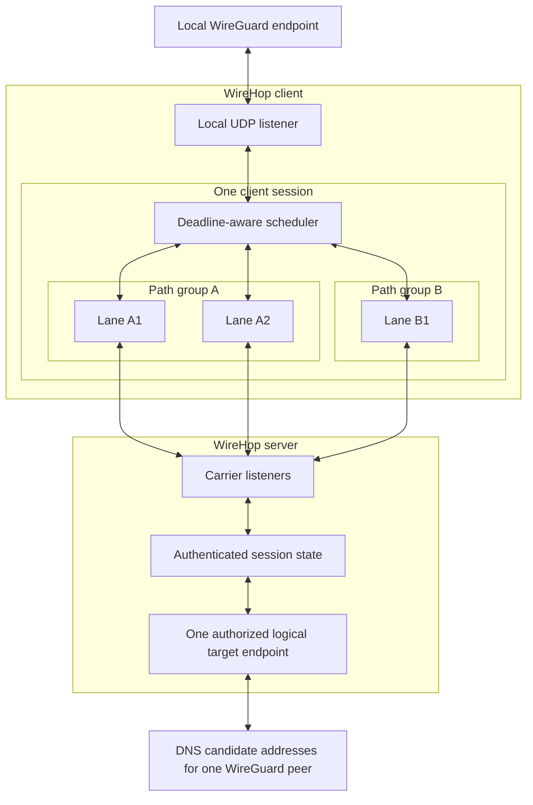
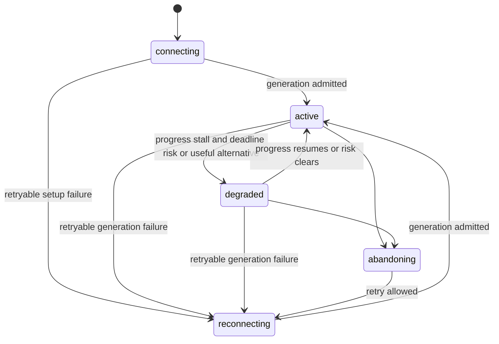
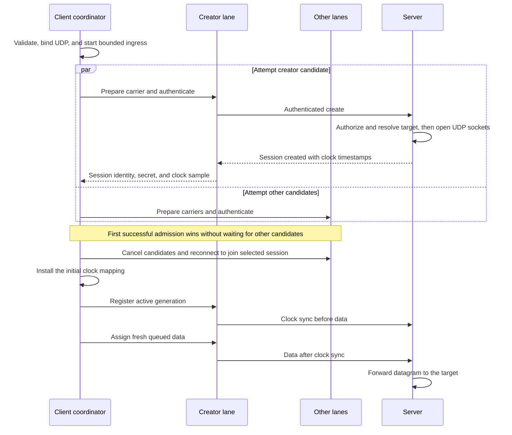
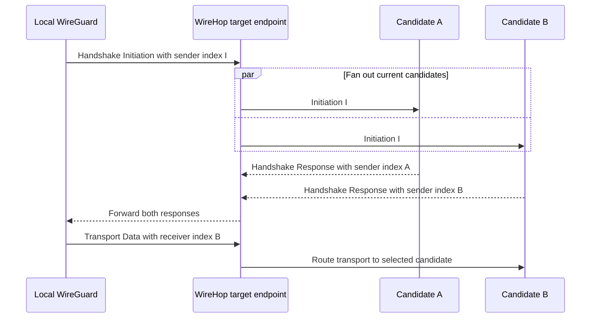

# WireHop product and technical design

## Overview

WireHop is a multipath relay that carries WireGuard UDP packets over TCP-based carrier lanes. It is designed to maximize
useful goodput, reduce latency under load, and improve path resilience on networks where native UDP is blocked,
unstable, or rate limited.

> A multipath relay for WireGuard over TCP-based transports.

WireHop combines WireGuard-aware packet handling with independently measured carrier lanes. The design targets:

- WebSocket or TLS TCP reachability when native UDP is unavailable or performs poorly
- Concurrent lanes across different addresses, IP families, or carrier types
- Independent connections to one carrier endpoint for measured selection and recovery
- Continued forwarding and bounded recovery when one lane stalls or fails

## Design boundary

WireHop remains transparent to WireGuard cryptography. It inspects the outer WireGuard packet type and public structural
fields without decrypting or authenticating WireGuard cryptographic content. Complete datagrams are preserved unless the
client or direct forwarder is configured to translate the public three-byte reserved field at its local UDP boundary.

WireHop is an application-layer packet relay rather than a WireGuard peer or VPN implementation. Each relay session
carries WireGuard packets for exactly one remote WireGuard endpoint. The direct forwarding mode connects one local UDP
listener to one logical target without creating a WireHop session.

## Supported scope

The CLI supports these carrier schemes:

| Scheme | Role | Production use |
| --- | --- | --- |
| `tcp://` | Insecure raw TCP stream | No, trusted networks and benchmarks only |
| `tls://` | Raw TCP stream protected by TLS | Yes |
| `ws://` | Insecure WebSocket stream | No, local tests and trusted networks only |
| `wss://` | WebSocket over TLS | Yes |

UDP ingress accepts only WireGuard-looking datagrams at the client listener, server target endpoint, and forward
listener. The message type is the first byte. The following three reserved bytes are opaque to classification. Datagrams
that fail public WireGuard type and length classification are dropped before scheduling or direct forwarding. Each
client session binds one local listener to one logical remote WireGuard endpoint through one or more carrier lanes.

The `forward` command provides a separate direct UDP path for deployments that need WireGuard packet filtering, target
resolution, or reserved field translation without a TCP-based carrier. It accepts the same WireGuard-looking datagrams
as a client, connects one local listener to one logical target, and uses no WireHop framing, lane, session, or
authentication state.

## Basic architecture

The end-to-end topology is:


```mermaid
flowchart TB
  subgraph Client["WireHop client"]
    ClientUDP["Local UDP listener"]

    subgraph ClientSession["One client session"]
      Scheduler["Deadline-aware scheduler"]

      subgraph PathGroupA["Path group A"]
        LaneA1["Lane A1"]
        LaneA2["Lane A2"]
      end

      subgraph PathGroupB["Path group B"]
        LaneB1["Lane B1"]
      end

      Scheduler <--> LaneA1
      Scheduler <--> LaneA2
      Scheduler <--> LaneB1
    end

    ClientUDP <--> Scheduler
  end

  subgraph Server["WireHop server"]
    CarrierListeners["Carrier listeners"]
    ServerSession["Authenticated session state"]
    TargetEndpoint["One authorized logical target endpoint"]
    CarrierListeners <--> ServerSession
    ServerSession <--> TargetEndpoint
  end

  LocalWG["Local WireGuard endpoint"] <--> ClientUDP
  LaneA1 <--> CarrierListeners
  LaneA2 <--> CarrierListeners
  LaneB1 <--> CarrierListeners
  TargetEndpoint <--> TargetWG["DNS candidate addresses for one WireGuard peer"]
```

The path groups and lanes are illustrative. Each lane-to-listener edge is an independent full-duplex carrier stream.
Forward and reverse proxies may appear on that edge without changing the session topology.

Direct forwarding uses the simpler topology `Local WireGuard <-> forward listener <-> target endpoint`. The target
endpoint retains the DNS candidate and WireGuard index affinity behavior described below, but the two UDP directions
otherwise forward synchronously without a queue or scheduler.

## Lane model

A lane is one authenticated, long-lived carrier connection slot. A connected lane owns exactly one current carrier
connection, while a disconnected or connecting lane may own none. Every carrier connection belongs to exactly one lane
and one session.

Every supported carrier maps one lane to one underlying TCP connection:

| Scheme | Carrier stack | TCP connections per lane |
| --- | --- | --- |
| `tcp://` | WireHop over TCP | 1 |
| `tls://` | WireHop over TLS over TCP | 1 |
| `ws://` | WireHop over WebSocket over TCP | 1 |
| `wss://` | WireHop over WebSocket over TLS over TCP | 1 |

One full-duplex TCP connection carries both directions of a lane. WireHop does not create separate upstream and
downstream connections. It does not multiplex multiple lanes or multiple sessions over one TCP connection.

The client supervisor retains the canonical carrier URL, optional fixed resolution, stable lane identifier, path group
identifier, connection generation, and reconnect backoff for each configured lane. Each direction of the scheduler
independently tracks the lane's smoothed round trip time, estimated delivery rate, retained byte backlog, and
deadline-risk state.

Lane states:

| State | Meaning |
| --- | --- |
| `connecting` | The carrier connection is being established |
| `reconnecting` | The lane has no current connection and has a retry scheduled or in progress |
| `active` | The generation is admitted, connected, and available to the scheduler |
| `degraded` | The lane remains connected but receives no new packet assignments while existing work may recover |
| `abandoning` | The lane is being closed without waiting for its outstanding data to drain |
| `rejected` | The lane received a terminal security, policy, or protocol rejection |
| `closed` | The lane or containing session was closed and the lane is no longer scheduled to reconnect |

Retryable and abandonment transitions are:


```mermaid
stateDiagram-v2
  state "connecting" as Connecting
  state "reconnecting" as Reconnecting
  state "active" as Active
  state "degraded" as Degraded
  state "abandoning" as Abandoning

  [*] --> Connecting
  Connecting --> Active: generation admitted
  Connecting --> Reconnecting: retryable setup failure
  Reconnecting --> Active: generation admitted
  Active --> Degraded: progress stall and deadline risk or useful alternative
  Degraded --> Active: progress resumes or risk clears
  Active --> Abandoning
  Degraded --> Abandoning
  Active --> Reconnecting: retryable generation failure
  Degraded --> Reconnecting: retryable generation failure
  Abandoning --> Reconnecting: retry allowed
```

A lane enters `degraded` or `abandoning` according to the connection abandonment policy.

A terminal security, policy, or protocol rejection moves a lane from `connecting`, `reconnecting`, `active`, or
`degraded` to `rejected`. Closing the lane or its containing session moves any nonterminal state to `closed`. Both
terminal states end the current supervisor and never reconnect within that session. A replacement session starts new
supervisors from the complete configured lane set.

An `active` lane is not necessarily scheduling-eligible because eligibility also depends on the path-group limit,
retained-store capacity, deadline risk, and abandonment state.

## Path group model

A path group is an internal scheduling scope for lanes that are known or conservatively expected to share the same
configured carrier endpoint and a substantial part of the same network bottleneck. It prevents WireHop from assuming
that two TCP connections automatically provide two independent paths or twice the capacity.

Repeated occurrences of the same canonical URL and fixed resolution belong to the same path group. They remain
independent lanes with independent TCP sequence spaces, congestion windows, retransmission queues, measurements, and
lifecycle state. Different fixed resolutions belong to different path groups even when their logical URLs are identical.
A normally resolved URL and an explicitly resolved declaration also belong to different groups.

Canonicalization lowercases DNS names, normalizes IP literals and decimal ports, fills omitted `ws://` and `wss://`
ports with `80` and `443`, uppercases percent-escape digits, and uses `/` for an omitted WebSocket path. Raw `tcp://`
and `tls://` URLs require an explicit port. Canonicalization does not decode path-significant escapes or infer that two
different hostnames or fixed IP addresses reach the same bottleneck.

Carrier URLs reject user information, query parameters, and fragments. Raw `tcp://` and `tls://` URLs cannot contain a
path. WebSocket URLs use their canonical escaped path as an exact admission endpoint.

The client assigns an opaque session-scoped path group identifier to every configured group and authenticates it during
lane creation or join. The server accepts and returns that identifier, binds it to the stable lane identity, and rejects
a reconnect generation that proposes a different group.

Different path groups may still share access links, radio resources, proxies, or server bottlenecks. A path group is a
conservative scheduling and observability boundary, not proof that groups are physically disjoint.

The path group identifier participates in same-group lane eligibility and WireGuard control-packet duplication across
groups. RTT, delivery rate, retained backlog, and deadline risk remain lane-local rather than being merged into a
synthetic group estimate.

## Lane lifecycle

Lanes are long-lived. Their lifecycle is event-driven rather than age-based, which avoids unnecessary handshakes, packet
reordering, and scheduling instability.

A lane has a stable lane identifier and a connection generation that starts at 1 and increases within one relay session.
Reconnecting replaces the old underlying TCP connection with a new generation. Frames and delivery reports identify the
generation so that stale reports from a previous connection cannot modify current scheduler state. A replacement session
resets the generation namespace. Generation values never wrap, and exhausting the 64-bit space requires replacing the
session before that stable lane can reconnect.

For each stable lane identifier, the server accepts only a higher generation. When the admitted generation registers
with the scheduler, it replaces the previous scheduler generation and closes the old carrier. Before discarding the old
scheduler state, the server applies the bounded migration policy to eligible transport packets. The same or a lower
generation is rejected.

An abandoning lane receives no new packets and closes its carrier specifically to discard TCP-buffered data that is no
longer worth waiting for.

The client reconnects a retryable lane after any of these generation-ending conditions:

- Carrier read, write, TLS, or WebSocket operation fails
- Ping timeout occurs
- A carrier write exceeds its operation deadline
- The scheduler abandons a generation whose retained work can no longer arrive usefully
- The peer requests generation-specific lane abandonment

Certificate, authentication, protocol, and policy rejections close only the affected lane unless a machine-readable
error received on an admitted lane has session scope.

## Client startup and availability policy

The client validates its complete local configuration before creating any sockets. It requires every lane declaration,
carrier scheme, local UDP listener, target, authentication input, TLS option, proxy selection, and insecure-carrier
opt-in to be valid. A fixed resolution must be a single unbracketed IP without a port or zone, and its URL must contain
a hostname. One invalid declaration makes the invocation fail even when another lane could connect. Repeated identical
declarations are valid and remain independent lanes.

Network reachability is not part of local configuration validation. An unreachable lane does not invalidate another
correctly configured lane.

After validation, the client binds the local UDP listener before dialing carrier lanes. A bind failure is terminal. Once
bound, the listener starts receiving WireGuard datagrams immediately, including while the first carrier is still being
established. These datagrams enter the bounded session ingress queue with deadlines derived from their arrival times.

### Session bootstrap coordination

Carrier preparation starts concurrently across all configured lanes. DNS resolution and first-hop TCP connection
establishment race for every normally resolved carrier. A fixed-resolution lane bypasses DNS and uses the same IP on
every reconnect generation. A `tls://` lane also completes its TLS handshake during preparation. WebSocket lanes using a
SOCKS proxy complete tunnel negotiation during preparation. HTTP Upgrade, HTTPS proxy TLS, HTTP CONNECT negotiation, and
any target-side WSS TLS handshake remain part of authenticated creation or join. One slow or unreachable lane therefore
cannot block later declarations.

Authentication nonces, wall-clock timestamps, and the monotonic admission-request field are generated only after carrier
preparation completes. Raw TCP and TLS lanes use that monotonic field as `t1`, excluding DNS, TCP connect, and TLS setup
from the four-timestamp sample. WebSocket lanes sample their clock-bootstrap `t1` separately when the HTTP transport
reports that it has written the Upgrade request headers. First-hop DNS, TCP connect, proxy TLS, CONNECT or SOCKS tunnel
negotiation, and target TLS therefore finish before that clock sample. The earlier monotonic request field remains part
of admission encoding and join authentication. The later `t1` is sent in the first clock-sync frame.

Local validation enforces the configured per-session lane limit before this concurrent work begins. Carrier preparation
is therefore concurrent across the accepted configuration while remaining bounded by explicit resource policy.

Each prepared lane immediately attempts authenticated session creation, without waiting for another candidate's
admission response. Each candidate independently retries recoverable preparation and creation failures with full-jitter
backoff. Its next attempt does not wait for other candidates to finish, and each attempt receives its own preparation
and admission deadline. The coordinator selects the first successful result and cancels all remaining creation attempts
and retry waits. No candidate sends in-session frames before selection. Only the selected session receives clock sync
and WireGuard data. Slow TLS, proxy negotiation, admission, or target resolution on another candidate cannot delay that
selection or a healthy candidate's retry.

Concurrent admission may temporarily allocate several candidate sessions and target sockets. These allocations count
against the server's existing admission and session limits. A candidate becomes eligible for reconnect retention only
after a lane receives a valid first clock-sync frame. An abandoned unconfirmed creator releases its session immediately
instead of retaining unused target sockets for reconnect grace. Each accepted lane must supply its first clock-sync
frame within the handshake timeout.

Other lanes wait for their canceled candidate attempts to finish, then establish fresh connections and join the selected
session concurrently. Candidate connections are not reused for joins because they may already have sent a creation
request or expired during admission. Cleanup of other candidates does not gate forwarding on the selected lane.
Background ping timers use stable lane-based phase offsets so concurrent lane startup does not create a synchronized
control burst.

### Data-plane activation

WireHop starts useful forwarding as soon as one lane is safely usable. It never waits for every configured lane, a
second lane, a timing interval, or a final connected-lane count.

The initial data-plane gate requires all of the following:

- Complete local validation and a bound local UDP listener
- An authenticated and accepted creator lane
- Successful target authorization, initial server-side resolution, and creation of at least one target UDP socket
- An initial session clock mapping
- One client-to-server clock-sync frame ordered before the first data frame on the creator generation

The `session-created` response means that authentication, target authorization, initial resolution, and target socket
creation have completed. It includes the timestamps needed for the client to derive the initial session clock mapping.
The client then sends exactly one clock-sync frame as the generation's first in-session frame. Fresh queued data can
follow in the next carrier write. Clock synchronization requires no acknowledgement and adds no extra round trip before
the first data packet.

The successful bootstrap and earliest data-plane activation path is:


```mermaid
sequenceDiagram
  participant C as Client coordinator
  participant A as Creator lane
  participant N as Other lanes
  participant S as Server

  C->>C: Validate, bind UDP, and start bounded ingress

  par Attempt creator candidate
    C->>A: Prepare carrier and authenticate
    A->>S: Authenticated create
    S->>S: Authorize and resolve target, then open UDP sockets
    S-->>A: Session created with clock timestamps
    A-->>C: Session identity, secret, and clock sample
  and Attempt other candidates
    C->>N: Prepare carriers and authenticate
  end

  Note over C,N: First successful admission wins without waiting for other candidates
  C->>N: Cancel candidates and reconnect to join selected session
  C->>C: Install the initial clock mapping
  C->>A: Register active generation
  A->>S: Clock sync before data
  C->>A: Assign fresh queued data
  A->>S: Data after clock sync
  S->>S: Forward datagram to the target
```

Other lanes join as they become ready and send a clock-sync frame first on each generation. Their preparation and
admission never gate forwarding on the creator lane. Each accepted generation becomes `active` immediately after this
gate with conservative RTT and delivery-rate estimates. It does not wait for a timing request.

### Availability behavior

Recoverable creation failures retry without an overall startup or recovery deadline. Each lane has at most one creation
attempt in progress. The coordinator aggregates retry warnings through one rate-limited notice, so concurrent failures
do not multiply log volume. The process exits with a nonzero status when local validation fails or all candidates finish
with terminal rejections. Failures identify the configured lane occurrence and declaration that supplied the cause.

After a session has existed, retryable lane failures reconnect independently. If all current generations are down, the
client remains alive while their supervisors retry. The already-bound UDP socket and bounded ingress queue remain in
place. Fresh packets may survive a short outage. Expired packets are discarded on dequeue and reclaimed under capacity
pressure before they can make the queue reject fresh ingress. If the retained session is gone, its replacement uses the
same independent candidate retries without an overall recovery deadline.

A single terminal lane rejection never terminates a client that still has another active or retryable lane. A client
with no remaining lane supervisor exits because the session can no longer make progress. When another lane preserves the
session's viability, the terminal rejection produces one degradation warning for the disabled lane.

### Error classification

Every connection, handshake, and control-plane failure maps to one stable error class:

| Class | Examples | Behavior |
| --- | --- | --- |
| `configuration` | Malformed URL, unsupported scheme, missing token, invalid TLS option | Fail before network startup |
| `retryable` | DNS failure including missing records, network failure, timeout, clock skew, HTTP 408, 429, or 5xx | Reconnect with backoff |
| `lane_rejected` | Certificate validation failure, authentication rejection, incompatible protocol | Reject that lane |
| `session_gone` | Join refers to an unknown, closed, or expired session | Coordinate session replacement |
| `session_rejected` | All viable endpoints reject the credentials, target, or protocol | Terminate the client |

A rejection from one endpoint is lane-specific until the client has evaluated other viable candidates. This prevents a
misdirected or incorrectly configured URL from turning its own authentication failure into a false session-wide failure.
Before session establishment, the client treats a remote `session_rejected` response as evidence for that candidate and
promotes it to a process-level terminal result only after every viable candidate has failed terminally. An in-session
`session_rejected` control received on an admitted lane and scoped to the current session is terminal immediately.

A `session_gone` response from a lane that was previously admitted to the current session invalidates the shared session
and starts coordinated replacement immediately. Waiting for every other lane supervisor could block recovery
indefinitely when another carrier path is unreachable and remains in retryable backoff. When a configured lane receives
`session_gone` on its first join while another lane already preserves the session, the client disables only that lane. A
never-admitted endpoint has not established authority over the existing session, but its failure still initiates
replacement if it becomes the final configured lane.

A terminal creation rejection stops that lane's creation attempts while other candidates continue. Once a session is
selected, other lanes attempt authenticated joins using its credentials. A rejected join or established-lane supervisor
is disabled for that session and does not participate in reconnect backoff. Session replacement evaluates the configured
lanes again. A client that terminated after all candidates were rejected requires a restart after its configuration or
remote deployment is corrected.

Raw-stream responses, WebSocket rejections, and in-session error frames carry machine-readable error classes. A
WebSocket rejection that follows successful request parsing carries an authenticated binary rejection in the
`WireHop-Rejection` response header. Its signed class and scope override the HTTP status for client lifecycle decisions.
An unsigned or invalid response retains status-based handling for intermediary-generated errors. Retry behavior never
depends on free-form diagnostic text. The `lane_rejected` class always has lane scope. The `session_gone` and
`session_rejected` classes always have session scope. A `retryable` error may use either scope according to the resource
that failed. A lane-scoped retryable error reconnects only that stable lane identity. A session-scoped retryable error
replaces the complete session after bounded backoff. An in-session `session_rejected` or session-scoped `retryable`
error received on an admitted lane applies to the complete session rather than only its carrying lane. Raw servers
return an HMAC-authenticated terminal rejection when the client hello uses an unsupported WireHop version.

### Reconnection policy

Each retryable lane reconnects independently with exponential backoff and full jitter. Backoff is capped and resets only
after the lane remains healthy for a stability interval. Independent jitter prevents all lanes and clients from
reconnecting in synchronized bursts after a shared outage. Whole-session replacement uses the same backoff and
stability-reset rule, so a session that is repeatedly created and immediately invalidated cannot form a tight retry
loop.

When an active lane fails, WireHop immediately removes it from new scheduling decisions, applies the connection
abandonment and packet migration policy when relevant, increments its connection generation, and enters `reconnecting`.
Other active lanes continue forwarding without restarting their carrier connections or session state.

If all lanes fail at runtime but at least one failure remains retryable, the client enters `disconnected` instead of
exiting. The first accepted reconnect refreshes the session clock mapping and passes through the normal data-plane gate.
Later lanes register independently.

## Session lifecycle and recovery

A session binds one local UDP listener and one remote WireGuard target through one or more path groups and lanes. The
server tracks that authenticated session independently from the lifetime of any one lane:

| State | Meaning |
| --- | --- |
| `unconfirmed` | A candidate has prepared its target but no lane has supplied a valid first clock-sync frame |
| `attached` | A confirmed session has a connected lane or an accepted lane reservation is completing |
| `detached` | No lane is connected or completing an accepted reservation, but reconnect grace has not expired |
| `closed` | Session state, credentials, queues, resolver state, and target sockets have been released |

An unconfirmed creator's disconnection or clock-sync timeout releases its session without reconnect grace. Once
confirmed, an unexpected loss of the final lane moves the session to `detached` unless an authenticated join has
reserved lane capacity and is still completing. The server starts a bounded reconnect grace timer only after both active
lanes and accepted reservations reach zero. During that grace period it retains:

- Session identifier and ephemeral session secret
- Logical target, last successful DNS candidates, WireGuard index affinity, and per-family UDP sockets
- Path groups, stable lane identifiers, and highest accepted connection generations
- Direction-local packet ID, deduplication, and clock-mapping state
- Bounded session ingress queued from the target UDP sockets

Detached state does not suspend packet deadlines or queue limits. Retained packets and target replies continue to expire
and are dropped when they cannot be delivered usefully. A one-shot ingress expiry timer releases expired payloads and
their aggregate reservation even when no lane reconnects. The scheduler parks its periodic deadline-risk checks when no
pending or retained lane work needs them.

The client retains the session identifier, secret, path groups, lane generations, and direction-local packet ID,
deduplication, and clock-mapping state while it is `disconnected`. A reconnecting lane first attempts a normal
authenticated join with its next generation. A successful join returns the server session to `attached` without
replacing the target endpoint or resetting direction-local packet ID state.

Every reconnecting lane attempts an authenticated join independently. The first successful join preserves the old
session and activates through the clock-sync gate. A `session_gone` response on a previously admitted lane invalidates
that shared session, so the client erases the old secret and creates one replacement session through the normal
candidate-selection bootstrap. A configured lane that has never joined cannot invalidate a session still preserved by an
admitted lane. The replacement reuses the configured stable lane and path group identifiers, but resets the connection
generation, packet ID, deduplication, and clock-mapping namespaces.

A session-scoped retryable error or local exhaustion of a nonwrapping relay counter enters the same replacement path
after bounded backoff. Initial and replacement creation use independent candidate retries with bounded connection and
handshake deadlines. A permanent credential, certificate, protocol, or policy rejection still terminates the affected
lane or complete client according to its authenticated scope.

The scheduler returns any currently held control packet and preempted transport packet to the bounded ingress queue only
while each packet remains fresh and queue capacity is still available. Packets already admitted to an old lane
transmission store are not carried into the replacement session. Removing an old generation may apply its normal
one-time migration to another lane in the old session, but the replacement session never retransmits that packet.

An explicit session-close control received on an admitted lane, an unrecoverable session worker error, or reconnect
grace expiry moves the session to `closed`. Explicit client shutdown gives the close control up to 200 milliseconds to
complete a carrier write before closing its lanes. Connection loss alone is never interpreted as an explicit close.

Closing a session closes every remaining member lane, invalidates and erases its ephemeral secret, and releases its
target resolver state, UDP sockets, and retained packet state.

The default reconnect grace is 2 minutes, starting when the final active lane and accepted reservation disappear.
Attached, detached, and in-progress sessions share the same global session limit. At capacity, authenticated creation
may evict the oldest detached session. Attached lanes and accepted join reservations are protected. Grace is therefore
bounded best-effort retention rather than a guaranteed reservation. A join checks its protocol-clock grace deadline even
when a sleeping server's ordinary timer has not fired yet.

## WireGuard packet awareness

WireHop performs shallow WireGuard packet classification.

WireGuard packets begin with a one-byte message type followed by a three-byte reserved field:

| Type | Meaning | Length rule |
| --- | --- | --- |
| `1` | Handshake initiation | Exactly 148 bytes |
| `2` | Handshake response | Exactly 92 bytes |
| `3` | Cookie reply | Exactly 64 bytes |
| `4` | Transport data | At least 32 bytes |

Transport ciphertext is normally padded to a 16-byte boundary, but WireGuard caps that padding at the interface MTU. A
full-MTU packet can therefore produce a transport datagram whose length is not a multiple of 16.

Standard WireGuard sends a zero reserved field:

```text
01 00 00 00
02 00 00 00
03 00 00 00
04 00 00 00
```

WireHop treats this as "WireGuard-looking" classification, not validation. It cannot prove that a packet is valid
without WireGuard keys. Classification uses only the first byte for the message type. The three reserved bytes may be
nonzero and do not change packet lengths or public sender and receiver index offsets.

The real WireGuard endpoint remains responsible for authentication, MAC checks, decryption, replay protection, and peer
selection.

Classification drives datagram admission in every mode and drives control priority, duplication, packet lifetime, and
control-versus-transport scheduling in relay sessions.

### Reserved field handling

When `--reserved` is omitted, the data path treats the complete three-byte reserved field as opaque and preserves it in
both directions. A local WireGuard implementation that already applies a nonzero reserved value must therefore leave
`--reserved` unset. The server never assigns, validates, clears, or otherwise interprets the value.

The client and direct forwarder optionally translate one fixed nonzero value at their local UDP boundary. The remote
endpoint must apply the inverse translation outside standard WireGuard cryptographic processing. The value is configured
as the canonical Base64 encoding of exactly three bytes and is not carried separately in the WireHop wire protocol.
Translation follows these rules:

- A locally produced packet has byte offsets 1 through 3 overwritten before scheduling or direct upstream delivery
- A returning packet must carry the configured value or it is dropped as an invalid target datagram
- A matching returning packet has byte offsets 1 through 3 cleared for synchronous local UDP delivery
- The original returning payload is restored after the UDP write, preserving caller ownership

The local endpoint wrapper adds no per-packet allocation. Read payloads are caller-owned and inbound UDP writes are
serialized, so both transformations run in place while preserving ownership. Translation does not change a datagram
length. In a relay session it also does not change WireHop framing overhead, packet ID, deadline, or scheduling class.

The CLI rejects an explicitly configured all-zero value because it would have no effect. The fixed-value adapter
intentionally does not model per-peer, per-direction, negotiated, or rotating reserved schemes. Local peers that need
different fixed values require separate client sessions or direct forwarder processes.

## Multipath scheduling

The scheduler keeps one transport primary per session direction. It discovers capacity with bounded padding instead of
relying on inner traffic to saturate every path. A healthy full primary waits for feedback rather than spilling unique
transport packets onto another path with a different arrival time. Handshake and cookie packets retain their separate
policy of at most two copies, preferring distinct path groups.

Each usable lane direction maintains its smoothed RTT, minimum RTT, delivery rate, feedback return delay, and queued and
retained encoded bytes. Observations and preferred-lane state are direction-local. The shared session clock mapping does
not merge their capacity estimates.

For a frame of size `F`, the deadline prediction is:

```text
queued_time = (unsent_bytes + F) / delivery_rate
retained_time = (retained_bytes + F) / delivery_rate
feedback_delay = report_delay + feedback_carrier_minimum_rtt / 2
predicted_delay = max(smoothed_rtt / 2 + queued_time, max(0, retained_time - feedback_delay))
```

An initial or failed primary is selected by RTT and stable lane identity, including temporarily full paths. A measured
alternative can replace a healthy primary when its delivery rate exceeds the primary estimate by more than 25 percent
and it can meet the current packet deadline. A change from an existing primary holds that choice for at least two
seconds and four estimated RTTs, capped at eight seconds. The first assignment does not delay a proven capacity
improvement. This hold does not suppress failure recovery. A primary that cannot meet the deadline permits a timely
alternative. If no eligible lane can meet the deadline, the packet is dropped. A full primary retains the pending
ingress item until feedback, expiry, or a lifecycle transition permits another decision. WireGuard controls can still
preempt that pending transport item. An initial empty 32-byte WireGuard keepalive uses predicted delivery without fixing
the bulk-data primary or restarting idle capacity discovery.

Each committed transmission records its send time, send-interval anchor, and the preceding cumulative delivered byte
count and time. Valid feedback samples the bytes since that anchor over the longer corresponding send and feedback
interval. New flights exclude idle time. Samples need at least 4 KiB and an interval no shorter than one millisecond.
The data lane's Ping RTT does not bound a sample because feedback can return over another carrier. The interval includes
the newly acknowledged transmission's actual feedback latency and is bounded by its corresponding send interval. The
estimate uses the maximum of the last five valid samples to permit immediate startup growth while aging out old peaks.
An increase replaces the estimate immediately. A decrease uses a seven-to-one moving average and requires queued work or
at least half the hard packet limit or estimated byte window to be occupied before acknowledgment. The first valid
sample replaces the provisional 1 MB/s estimate, including when it is lower. Duplicate, stale, and invalid reports do
not alter the sampling anchors. Earlier receive timestamps release valid prefixes without moving the time anchor
backwards.

A session with at least two healthy distinct path groups starts bounded discovery at admission, before real transport
traffic chooses a primary. An active discovery period continues within its original deadline and byte cap after primary
promotion. Later periods start only on alternatives. Discovery uses the reserved zero-ID Data form described below, so
padding cannot reach UDP or alter relay deduplication. It shares the ordinary writer, transmission store, process
retention budget, cumulative feedback, and rate estimator.

Each discovery period lasts four seconds or eight estimated RTTs, capped at eight seconds, and admits at most 2 MiB of
encoded padding per lane direction. Unknown capacity retains at most one unreported 4101-byte sample frame within the 16
KiB startup window. A measured path with less than half a probe frame per unloaded feedback cycle also keeps at most one
unreported probe. The normal byte window still leaves useful-traffic headroom. Other measured paths use eight feedback
cycles plus one real-data sampling allowance while no real packet is pending. Useful traffic is scheduled before
padding. A pending packet restores the normal window and reserves its maximum encoded size and one packet slot before
probe admission. A round-robin lane cursor prevents one training path from monopolizing discovery work. Another period
is eligible 30 seconds after the preceding period ends, and only while real transport traffic has been scheduled within
the last second. Single-path and same-group configurations send no padding. Padding deadlines do not themselves justify
generation abandonment. Padding bytes still count in the carrier prefix preceding any useful datagram. Stalled
probe-only progress can temporarily degrade a lane so it cannot block initial traffic on a healthy alternative. It does
not abandon the generation, and validated progress restores eligibility.

The feedback event identifies its incoming carrier separately from the generation whose progress it reports. Return
correction combines report-construction delay with the incoming carrier's minimum observed half RTT. Duplicate and
wholly stale reports preserve that correction. Deadline-risk assessment always includes the full retained prefix.
Existing progress guards, generation removal, one-time transport migration, and exact aggregate ownership still govern
failure recovery. Padding never migrates.

Timing requests remain small liveness and clock-mapping messages. They do not estimate capacity. First timing requests
are phase-spread across the first quarter of the active interval, and idle timing backs off to 15 seconds. Admission's
four timestamps initialize RTT without an extra exchange. The first usable timing sample replaces 100 ms directly, and
later RTT samples use a seven-to-one moving average.

This policy favors stable bulk throughput after capacity discovery. It does not guarantee capacity aggregation, optimal
interactive latency, or fairness between independent kernel TCP connections. A capacity change can temporarily stale an
estimate, and a primary change can still reorder in-flight packets. Different path groups can share a physical
bottleneck. Measure each path separately and the combination using the actual workload in both directions. WireHop
cannot infer inner flow semantics from encrypted WireGuard transport packets.

## Lane count policy

More lanes are not always better.

Benefits of more lanes:

- Continue around a stalled stream
- Select a path with a higher measured delivery rate
- Use multiple carrier paths
- Use IPv4 and IPv6 when they behave differently
- Improve failover speed

Costs of more lanes:

- More TLS and WebSocket state
- More CPU and memory use
- More packet reordering
- More contention on the same bottleneck
- More bufferbloat risk
- More proxy and NAT state

Transport uses one primary at a time. Initial selection uses RTT and stable lane identity. Deadline fallback retains
deterministic delivery prediction and same-group preference. Measured capacity promotion can select any healthy timely
lane. Other connected lanes remain available for controls, feedback, bounded capacity discovery, and failure recovery.
Recovery considers every eligible lane rather than limiting the alternatives to the ordinary selection rank.

Two configured lanes in one path group isolate TCP sequence spaces and permit progress around one stalled stream. They
do not prove that the underlying path has additional bandwidth. Large numbers of parallel TCP connections are not a
supported strategy for taking an unfair share of a shared bottleneck.

WireHop cannot portably couple congestion windows managed by independent kernel TCP implementations and does not claim
the bottleneck fairness guarantees of a transport with native coupled congestion control. Every configured connection
also retains its own ping, session-lifecycle control, and delivery-feedback activity. Operators must account for all
configured lanes when evaluating shared-bottleneck contention and resource cost.

One lane is the default when reachability and capacity are sufficient. Two repeated declarations in one path group are
recommended when isolating a single TCP stream stall matters. Additional path groups are useful only when measurements
or independent failure domains justify their resource cost.

## Packet duplication policy

WireHop duplicates selected handshake and cookie packets rather than every packet. Proactively duplicating transport
data would waste bandwidth, compete at a shared bottleneck, and make congestion worse.

Packet duplication policy:

- Duplicate handshake initiation on up to two deadline-eligible lanes
- Duplicate handshake response on up to two deadline-eligible lanes
- Duplicate cookie reply on up to two deadline-eligible lanes
- Do not proactively duplicate transport data during normal scheduling
- Permit one migration attempt for an unexpired transport packet when its original connection generation ends

The first control-packet copy uses the eligible lane with the earliest predicted arrival. The second copy prefers an
eligible lane in another path group. When none is available, it uses the next eligible independent lane in the same
group so one TCP stream stall does not delay both copies.

The receiver deduplicates direction-local packet IDs before writing to its WireGuard-facing UDP socket. The same
mechanism suppresses proactive control-packet copies, uncertain copies caused by delayed reports, and transport packets
migrated from an abandoned connection.

Each session direction serializes writes to its UDP socket. This preserves the per-operation write deadline because Go
socket deadlines are connection-wide, while the kernel would serialize writes to the same socket in any case. A packet
waiting for the write slot is checked against the latest clock mapping again before delivery.

Packet deadlines govern eligibility at the start of a UDP batch submission. Every new increasing-ID run and retry after
a partial per-datagram failure rechecks the remaining packets against the protocol clock. The independent 1-second UDP
operation deadline bounds local submission and is also capped by the caller's deadline. Packet lifetime is not a
guarantee that submission or remote delivery completes before the mapped packet deadline.

Deduplication uses a bounded direction-local sliding window. Its size must cover the configured reordering and migration
budgets. A packet ID enters the window only after its UDP write completes successfully. A failed write leaves that
packet ID available to a waiting duplicate or later migrated copy and cannot advance the retained window. Packets older
than the retained window are dropped rather than causing unbounded identifier history.

WireGuard itself can handle duplicate packets, but WireHop suppresses unnecessary duplicates to reduce load and noise.

WireHop's packet-ID window is independent from WireGuard's encrypted transport counter window. Successful relay UDP
submission cannot prevent WireGuard from rejecting a packet that arrives too far behind newer authenticated counters,
even when the relay deadline remains valid. A larger relay retention or deduplication budget therefore does not widen
WireGuard's tolerance for cross-path reordering. The kernel receiver enforces this in its
[counter validation](https://git.zx2c4.com/wireguard-linux/tree/drivers/net/wireguard/receive.c).

## Queue and deadline policy

Each direction has a bounded session ingress queue before lane assignment, and each lane has a bounded transmission
store after assignment. The client session ingress queue also holds datagrams received while the client is `starting` or
`disconnected`. It remains bounded by bytes, packets, and packet deadlines throughout startup and runtime outages. A
shared process budget additionally caps retained packets and bytes across ingress queues, scheduler-held work, and
transmission stores, so opening more sessions or lanes cannot multiply retained packet memory without bound. A packet is
charged at its payload size in ingress and at its complete encoded Data-frame size after lane assignment. Moving a
packet between those states transfers and resizes the same reservation without an unaccounted gap.

Scheduler maintenance retries a held ingress packet when another session releases shared retention through feedback,
queued expiry, or generation drain. This does not require new ingress or local lane progress. A lane whose hard byte
limit cannot fit a capacity probe can still forward ordinary frames that fit.

Each packet carries an absolute deadline in the sender's process-relative monotonic clock. Runtime calculations use
microseconds. The wire deadline rounds up to milliseconds, extending it by at most 999 microseconds. The sender computes
the initial deadline at UDP ingress from the packet-class lifetime, rounded up to whole microseconds. Ingress rejects an
absolute deadline above the largest representable millisecond timestamp before admitting any prepared batch. Queueing
and scheduling use the same deadline and clock through a local time representation. The receiver maps the protocol
deadline into its own protocol clock and drops the packet only when the complete clock-uncertainty interval proves that
the deadline has expired.

The wire protocol permits at most five minutes of packet lifetime. A receiver rejects a deadline when its earliest
plausible mapped value is more than five minutes plus the 999-microsecond rounding allowance in the future. A deadline
that cannot be translated without timestamp overflow is also a protocol violation. Expired but otherwise valid data is
silently dropped after being counted as parsed carrier progress.

Each lane direction has one bounded transmission store for queued and sent-but-unreported data. Retention preserves the
packet metadata and payload needed for possible migration. A queued entry that expires before entering carrier order is
reclaimed when it reaches the write-order head, under capacity pressure, or by periodic scheduler maintenance. A sent
entry cannot be removed from the middle of an ordered TCP stream. Its deadline does not prove that the carrier has
failed: the peer may already have delivered it while a parsing report is returning. Maintenance releases its expired
payload reference while preserving its packet kind, original payload size, delivery snapshot, and exact ordered
accounting. The descriptor remains charged against the store's packet and byte limits until parsing is reported or the
generation closes. Returned buffers can be reused or collected after all other owners release them. This does not
discard bytes already buffered in TCP or TLS.

Before exposing any bytes to a potentially partial carrier write, the writer moves the complete batch into the sent
prefix. The active write holds an independent packet-buffer reference until encoding and carrier I/O finish, so draining
an abandoned generation cannot recycle payload memory still in use. Neither the ownership transition nor local write
success releases retained capacity.

Queued expiry reclaims its retained capacity. Once an entry enters the sent prefix, only a valid cumulative delivery
report or complete generation drain can release its retained capacity. The transmission store is therefore also a
per-lane feedback window. Sustainable throughput is bounded by that packet and byte window divided by the report return
time. Reports trigger at 256 Data frames or 256 KiB, with an adaptive interval bounded by 25 milliseconds. Report
workers use one-shot timers only while progress or a retry remains pending.

The default hard limits are 65,536 packets and 32 MiB per lane direction. Startup retention is additionally bounded to
16 KiB. Once capacity is observed, the byte window covers four feedback cycles plus 4 KiB, with a 4 KiB floor and the
configured hard byte limit as its ceiling. A cycle is the larger of minimum RTT and half minimum RTT plus feedback
return delay, with 25 milliseconds of reporting headroom. Minimum RTT prevents queue growth from increasing its own
allowance. An empty store can admit one larger datagram when the hard limits permit it. The packet ceiling protects
small-packet workloads, and the shared process budget also charges every padding transmission.

An emptied transmission deque retains at most 512 metadata slots. This accommodates one 256-packet report batch plus
in-flight progress without repeated allocation and copying under steady traffic. Larger historical capacities still
shrink as occupancy falls. Retained metadata is separate from the charged packet payload and frame bytes.

The scheduler also drops a packet before assignment when no eligible lane predicts delivery before its deadline. It does
not enqueue work that is already expected to arrive stale.

Each queued priority deque and the sent-payload deque maintains a conservative earliest-deadline bound to skip expiry
scans before any retained entry or payload can have expired. Partial dequeues may leave an earlier stale bound, which a
due scan refreshes. Appending migrated work lowers the bound when its deadline precedes newer queued entries. A sent
prefix with every payload released clears its bound on the due scan, and appending new sent payloads rearms it even
while old descriptors remain. The ingress expiry timer derives its next wakeup from its queued bounds without another
full queue traversal. Complete deadline-risk traversal is reserved for lanes whose outstanding carrier progress has
exceeded the path-aware stall guard. Scheduler maintenance still reclaims overdue unsent work on progressing lanes.

Before rejecting fresh ingress for local or shared retention pressure, the queue reclaims its expired entries. A fresh
control packet may evict the oldest unassigned transport packet to obtain local or shared capacity, or preempt one
not-yet-assigned transport packet held by the scheduler. A lane transmission store never evicts admitted work for a
newer packet.

### Default resource and timing limits

The command uses these packet and resource limits:

| Resource | Default |
| --- | ---: |
| Configured lanes per client session | 16 |
| Stable lane IDs per server session | 16 |
| Retained plus in-progress server sessions | 1024 |
| Pending unauthenticated admissions across all listeners | 512 |
| Creation replay nonces | 65,536 |
| Join replay nonces per session | 4096 |
| Session ingress queue per direction | 1024 packets and 4 MiB |
| Combined transmission store per lane direction | 65,536 packets and 32 MiB |
| Aggregate retained relay work per client process | 131,072 packets and 256 MiB |
| Aggregate retained relay work per server process | 262,144 packets and 256 MiB |
| Deduplication window per session direction | 1,048,576 packet IDs, up to 128 KiB allocated on demand |
| Internally generated controls per lane direction | 64 pending frames |
| Scheduler events per session direction | 256 pending events |
| Client TLS session cache | 64 entries scoped by carrier role, scheme, and socket endpoint |

The command uses these time and traffic limits:

| Policy | Default |
| --- | ---: |
| Authentication timestamp skew | 2 minutes |
| First-hop DNS and TCP connection establishment | 30 seconds |
| TLS handshake, HTTP CONNECT, and SOCKS tunnel preparation | 10 seconds per stage |
| Raw request writing, raw joins, and HTTP request writing | 10 seconds |
| HTTP header reading and first clock-sync frame | 10 seconds |
| Authenticated creation response including target preparation | 30-second target lookup plus 10-second response budget |
| WebSocket first admission frame after Upgrade | 10 seconds |
| Session creation attempt per candidate lane | 2 minutes, covering dial, target lookup, and six handshake budgets |
| Server listener preparation, shared across all listeners | 30 seconds |
| Initial and runtime target DNS lookup | 30 seconds |
| Initial DNS backoff for server listeners and forward targets | 1 second initial ceiling, 5 seconds maximum ceiling, full jitter |
| Preparation failure reporting | 30-second quiet window, then at most one warning per minute on failed attempts |
| Detached-session reconnect grace | 2 minutes, subject to capacity eviction |
| WireGuard handshake and cookie packet lifetime | 5 seconds |
| WireGuard transport packet lifetime | 5 seconds |
| UDP delivery operation | 1 second |
| Delivery-report trigger | 256 Data frames, 256 KiB, or RTT/4 clamped to 1 to 25 milliseconds |
| Deadline-risk abandonment check while work exists | 25 milliseconds |
| Ping interval and timeout | 1 second active, idle backoff to 15 seconds, and 10-second receive inactivity timeout |
| Complete carrier write operation | 10 seconds |
| WebSocket control-frame read or write | 5 seconds per operation, enforced by the WebSocket library |
| Maximum clock-sample uncertainty | 5 seconds |
| Resume clock-gap tolerance | 1 second |
| Pending preparation resume check | 1 second, only while dialing or admitting |
| Initial lane RTT and delivery rate | 100 milliseconds and 1,000,000 bytes per second |
| Reconnect backoff and stability reset | 100 milliseconds initial, 5 seconds maximum, reset after 30 seconds healthy |
| Graceful client session-close attempt | 200 milliseconds |
| TCP keepalive | Disabled on carrier sockets. WireHop owns lane liveness |

The ping timeout starts after the request is written. Valid data and control frames extend its receive inactivity budget
while the matching Pong waits behind earlier TCP data or retransmissions. A delayed Pong still has to match the
outstanding identifier and send timestamp before updating the clock mapping. Once receive progress stops, the pending
ping expires within ten seconds. The write budget bounds the complete operation, and partial byte progress does not
renew it. This permits multi-second retransmission and slow batches while keeping failure detection bounded. Packet
freshness remains independent of connection tolerance. These defaults are operating policies, not guarantees that every
recoverable network outage completes within ten seconds.

WireHop Ping and Pong are binary application frames. WebSocket protocol Ping, Pong, and Close frames are handled by the
WebSocket library, which bounds each control-frame read and write to five seconds. A reverse proxy's WebSocket Ping can
therefore encounter a shorter failure budget than WireHop's application liveness policy. A control timeout remains a
recoverable carrier failure. Reverse-proxy idle and read/write limits are independent deployment policies.

Raw TLS handshakes finish before the server starts a fresh request-reading budget. Client WebSocket preparation has
separate limits for proxy TLS, CONNECT or SOCKS tunneling, origin TLS, HTTP request writing, response headers, and the
first admission frame. Response-header timing starts after the request is written. Creation permits 40 seconds for
response headers or a raw creation response, while joins permit 10 seconds. A WebSocket attempt also has a combined cap
covering its actual stages. The slowest supported creation route, WSS through an HTTPS proxy, fits the 2-minute
candidate cap including the first-hop dial. Faster routes retain their smaller phase-derived cap. Successful request
write deadlines are cleared before handing the upgraded connection to the relay.

DNS and TCP dialing use the standard resolver and dialer, preserving configured nameserver fallback and dual-stack
connection racing. Their budgets are independent of the short protocol-handshake limit. A five-second total lookup
deadline could expire just as a resolver begins trying its second nameserver. The lookup budget permits common fallback
sequences, but does not guarantee completion for arbitrary resolver configurations. Server listener lookups are bounded
by their shared preparation deadline instead of receiving a fresh budget for each listener.

Unauthenticated raw requests, HTTP headers, and TLS handshakes retain their short limits. Only after authentication,
replay checks, and target authorization does the server extend the raw connection or HTTP response deadline for target
preparation. The client likewise allows this longer creation response. Joins do not resolve a target and retain the
ordinary admission budget. An abandoned HTTP request cancels its target preparation. During raw-stream preparation, a
dedicated reader detects creator disconnection or premature data before the creation response. The reader is stopped and
joined before normal frame reading begins. Attempt contexts bound preparation work without becoming the lifetime of a
successful connection, listener, or retained target endpoint.

### Time units

Go duration literals use the largest standard `time` unit that represents the value with an integer multiplier. A
multiplier of one is omitted. For example, use `2 * time.Minute`, `time.Minute`, `66 * time.Second`, and
`1500 * time.Millisecond`. Derived budgets retain their meaningful arithmetic, such as the dial budget plus six
handshake budgets. This is a project readability convention, not a change to timeout values or precision.

Protocol timing samples and runtime packet deadlines use unsigned integer microseconds. Encoded Data deadlines use
unsigned integer milliseconds rounded up from runtime deadlines. Authentication timestamps remain Unix seconds.
Conversions at these boundaries name the required unit explicitly, such as `uint64(5 * time.Minute / time.Microsecond)`.
Wire-format test vectors retain exact integer values. External tools use their documented input units, including seconds
for `sleep`, `timeout`, and `iperf3`. Documentation uses readable units, with full unit names in policy tables and
explicit units in formulas.

## Connection abandonment and packet migration

TCP cannot remove one stale application frame after its bytes have entered the stream. When a lost TCP segment blocks
the stream, the only way to discard all bytes trapped behind that loss is to close the carrier connection.

WireHop first requires cumulative parsing progress to stall for a path-aware guard. The guard is the greater of 250
milliseconds or the longer of two estimated feedback cycles and serialization of a 16 KiB startup flight, plus two
delivery report intervals and serialization of the first unreported frame. A feedback cycle is the greater of the lane
RTT or half its RTT plus the observed report return delay. Including the flight time protects healthy low-rate carriers
even when their first unreported frame is small. Sent-but-unreported packets may already be at their destination, so
their age alone cannot establish a stall. A valid advancing report immediately restores scheduling.

Once progress stalls, a lane becomes `degraded` when retained work is at deadline risk or a useful recovery alternative
exists. Prediction follows the sent FIFO, queued WireGuard control packets, and queued WireGuard transport packets in
transmission-store order. Bytes ordered after a frame cannot make that earlier frame appear late. Risk is recomputed
during periodic scans and queued expiry.

The progress guard starts no earlier than the first outstanding carrier write. Fully reporting that sent prefix resets
the outstanding interval. Time spent idle or holding only queued work cannot make the next fresh burst appear stalled.

WireHop abandons a stalled generation when an eligible alternative predicts delivery before both the earliest future
unmigrated transport deadline and a recovery estimate. The recovery estimate is the greater of the source's progress
guard and its observed time without progress. The alternative must not itself have stalled outstanding progress. Its
prediction uses a frame of the same encoded size as the earliest future-deadline unmigrated transport frame. Recovery
checks every healthy lane with capacity. Stalled higher-ranked members cannot exclude a healthy third or fourth lane in
the same path group. Expired sent entries retain their accounting and no longer block recovery of later useful entries.

Both the source and alternative must have measured delivery rates before this prediction can justify abandonment. A
provisional rate does not establish that either path can deliver faster. A padding-only estimate can divert new work but
cannot justify closing the old generation. Before proactive abandonment, an eligible alternative must cumulatively
report parsing at least 4 KiB of actual transport payload. Controls and padding do not count. This bounded counter
saturates at 4 KiB and introduces no wire field. This avoids reconnect churn when several newly admitted lanes share a
low-rate bottleneck. Capacity observation does not gate initial forwarding or generation removal after an actual carrier
failure.

This decision does not depend on the stalled lane's previous capacity estimate predicting imminent expiry. Otherwise,
deadline risk and a slower alternative's salvage window may never overlap. Abandonment permits future traffic and
eligible migrations to continue immediately, but does not make an otherwise unduplicated control frame migratable.
Without a useful alternative, the generation remains subject to its independent ping and carrier write budgets. Neither
queued expiry nor sent-but-unreported expiry alone forces generation abandonment. Packet lifetimes allow ordinary TCP
retransmission and remain independent of carrier failure detection.

The abandonment sequence is:

1. Stop assigning new packets to the affected lane generation
2. Attempt to queue a lane-abandon control frame on another connected lane, preferring the earliest predicted delivery
3. Close the affected carrier connection without waiting for its outstanding bytes to drain
4. Drain queued and sent-but-unreported state from the abandoned generation
5. Requeue retained transport packets only when they are unexpired, have not migrated before, and can still meet their
   deadline on an eligible lane
6. Process eligible migrations by earliest deadline first
7. Preserve the direction-local packet ID on the migrated copy
8. Enter per-lane reconnect backoff, then start a replacement carrier connection with the next generation

Closing one full-duplex TCP connection affects both directions. The lane-abandon frame identifies the lane and
generation so both peers stop using it, process their own retained outbound packets, and ignore late state updates. If
the control frame cannot be delivered, connection closure triggers the same generation-specific cleanup.

Each transport packet can migrate at most once. Migration is opportunistic and deadline-bound. It does not promise
delivery, wait for an acknowledgment, retry repeatedly, or retain expired data. Delayed delivery reports can cause a
packet already parsed by the peer to be migrated conservatively, so direction-local packet deduplication remains
mandatory.

Generation removal and replacement check current parsing progress as well as cached degradation state when selecting a
migration destination. They reclaim queued expiry before checking destination capacity and exclude independently stalled
outstanding work. A removal processed before the next maintenance tick cannot spend a packet's single migration attempt
on a generation already stalled beyond its progress guard.

## Reordering policy

WireHop deduplicates packet IDs and forwards packets through a shared UDP write serializer without a global reorder
buffer. Enforcing packet ID order would let one slow lane delay fresher packets from faster lanes and recreate
head-of-line blocking.

Transport data may therefore reach the WireGuard endpoint out of order. Capacity-based primary selection and its bounded
hold interval limit unnecessary reordering, especially when WireGuard carries TCP, without changing UDP delivery
semantics. Control duplication and deadline-risk recovery can still use other lanes.

## Reliability policy

WireHop does not implement reliable retransmission for WireGuard transport data packets.

Reasons:

- WireGuard is UDP-based
- Inner TCP streams already handle retransmission
- Adding another reliable retransmission policy between WireGuard and the TCP carrier can create competing recovery
  loops
- Retransmitting stale encrypted packets can increase latency
- TCP carrier reliability is already present per lane

Delivery reports are scheduling feedback, not reliable application acknowledgments. A changed delivery snapshot remains
eligible for later report intervals until a carrier write completes. Carrier admission and failed lanes follow their own
retry and reconnect policies. Other individual in-session control frames are best-effort and are not covered by a
general control-message retransmission service. The one-time migration of an unexpired packet from an abandoned
connection is a bounded stale-queue escape mechanism, not a reliable delivery service.

## Target policy

The server is not an open UDP relay. It requires an explicit target allowlist, and a client can create a session only
for an allowed target.

The `client --target`, `server --allow-target`, and `forward --target` options accept an IP literal or ASCII RFC 1123
hostname with an explicit, nonzero UDP port. Hostnames are lowercased and a trailing DNS root label is removed. IP
literals and decimal ports use their canonical text forms. IPv4-mapped IPv6 addresses, unspecified addresses, multicast
addresses, the IPv4 limited broadcast address, IPv6 link-local addresses, and IPv6 zone identifiers are rejected.

A hostname consisting only of decimal digits and dots is rejected because it is ambiguous with noncanonical IPv4
notation. DNS lookups use the canonical hostname as an absolute name, so resolver search suffixes do not change the
authorized identity.

Authorization compares the complete canonical logical target, including its hostname and port, before any DNS lookup. It
never authorizes a hostname by comparing one transient resolution result with an IP-literal allowlist entry. CNAMEs and
returned addresses do not replace the authorized identity. Wildcards and service-name ports are not supported.

Authorizing a DNS target delegates address selection to the server's configured name service. A direct forwarder instead
delegates selection to its local name service without an allowlist. In either case, the operator must trust that
hostname's DNS authority and every returned address. All records must represent the same logical WireGuard peer. They
may reach one dual-stack server or multiple servers configured with the same WireGuard identity. This invariant is
required because WireHop may send one handshake initiation to every current candidate and later move transport affinity
between them.

Example target allowlist entry:

```text
wg.example.com:51820
```

## Target resolution and socket model

The server creates one target endpoint per session, while a direct forwarder creates one for its process lifetime. An
IP-literal target produces one candidate without invoking the resolver. A DNS target uses the server's resolver during
session creation or the forwarder's local resolver during startup. The result combines A and AAAA addresses, converts
IPv4-mapped results to canonical IPv4, removes duplicates and disallowed addresses, and retains at most 16 candidates in
resolver order. Target readiness requires at least one usable candidate and one usable UDP address family. A server
reports a resolution or socket setup error as a retryable creation failure. A direct forwarder applies the startup
policy below.

The direct forwarder binds its local UDP listener before resolving the target. Initial lookup failures, including
timeouts, missing records, and answers without usable addresses, retry until cancellation. Negative answers can change
and are not permanent configuration errors. Retries use full-jitter exponential backoff with the limits in the timing
table and honor system resolver caching. Invalid options and local bind failures are immediately fatal. If no required
address family can open a target UDP socket, the forwarder terminates and releases the local port. A usable family
permits forwarding even when another family cannot open its socket.

While target preparation is pending, the forwarder drains and discards local packets instead of accumulating a startup
queue. Once the target is prepared, it switches to direct bidirectional batch forwarding without readiness checks in the
steady-state loop. Readiness requires both the local bind and target preparation. Cancellation interrupts an active
lookup or backoff, closes the local socket, and waits for forwarding workers to exit.

Each target endpoint owns at most one unconnected IPv4 UDP socket and one unconnected IPv6 UDP socket. Candidates in the
same family share the endpoint's source socket and port. Replies are accepted only from the current DNS candidates, the
current transport candidate, candidates retained by unexpired WireGuard index affinity, or recently replaced candidates
completing an in-flight handshake. The recent-candidate grace is 15 seconds. Removed addresses are excluded from
discovery fan-out, while a confirmed target still receives pinned rekeys. Multiple WireHop sessions and forwarder
processes may use the same logical target without sharing target sockets or routing state.

The standard resolver does not expose DNS TTL values. WireHop therefore refreshes a DNS target when a WireGuard
handshake initiation or a concrete UDP network error arrives, with at most one lookup every five seconds and one lookup
in flight per target endpoint. A lookup has a 30-second deadline. Successful resolution atomically replaces the
handshake fan-out set. Failure retains the last successful set and established affinity, so a temporary resolver outage
does not break an otherwise usable path.

Target address changes remain internal to the target endpoint. They do not replace a WireHop session, reset packet IDs
or deduplication state, reconnect carrier lanes, or restart a direct forwarder.

Each successful DNS answer is authoritative for subsequent handshake fan-out. WireHop does not accumulate a union of
rotating answers because doing so would retain addresses deliberately removed from DNS. Answer reordering or a changed
subset does not move established transport traffic. Existing public-index affinity remains attached to its recorded
source candidate. Routine rekeys first use the confirmed target, including when DNS has removed it. An unanswered
handshake permits discovery from the latest answer on retry after five seconds. A direct forwarder uses one unconnected
UDP socket per address family rather than one connection per candidate, so this selection does not incur an upstream
connection teardown.

## WireGuard candidate affinity

WireHop uses only WireGuard's public routing fields. It does not authenticate or decrypt WireGuard messages. Target-side
UDP handling preserves complete messages, including the reserved field. The endpoint keeps separate bounded maps for
sender indexes learned from remote handshake initiations and handshake responses. Each entry expires after three
minutes, matching WireGuard's maximum key lifetime, and each map retains at most 1024 entries.

Routing follows these rules:

- Initial local Handshake Initiations discover the current DNS candidates until the local WireGuard peer confirms one
- Subsequent local Handshake Initiations use the confirmed candidate first, including during routine rekeying
- An unanswered handshake allows fan-out to the latest DNS candidates on a retry after five seconds
- A remote Handshake Initiation records its sender index and source candidate, but an unsolicited initiation from an
  alternate candidate is ignored while the confirmed target has not entered handshake failover
- A local Handshake Response uses its receiver index to return to the recorded initiator candidate
- A local Cookie Reply uses its receiver index to return to either the recorded initiator or responder candidate
- A remote Handshake Response records its sender index and source candidate, and every candidate response is forwarded
  to the local WireGuard implementation
- A local Transport Data packet uses its receiver index to select the candidate whose initiation or response established
  that index
- Transport Data with no retained index route uses the current candidate and is never fanned out

The local WireGuard implementation emits Transport Data only after authenticating the corresponding handshake exchange.
When the client or forward UDP listener is restricted to that implementation or another trusted boundary, its receiver
index provides WireHop with an indirect selection signal grounded in WireGuard authentication without exposing any key
material. Multiple candidates may answer one initiation, but the first candidate whose response the local peer accepts
gains transport affinity. Each index can confirm a selection only once, and an older route cannot replace a newer
confirmed selection. Old-key transport, delayed duplicate responses, and cookies do not move the preferred target or
cancel a pending handshake retry. An unanswered handshake can still select a reachable alternative after the retry
interval, whether or not the previous target remains in DNS.

Successful UDP writes do not prove target reachability. A silent failure can leave transport traffic on the previous
candidate until the local WireGuard implementation initiates another handshake. Recovery therefore depends on WireGuard
handshake timers and candidate reachability, not only on DNS refresh timing. Sharing a WireGuard identity across
backends does not replicate their NAT or application connection state.


```mermaid
sequenceDiagram
  participant L as Local WireGuard
  participant W as WireHop target endpoint
  participant A as Candidate A
  participant B as Candidate B

  L->>W: Handshake Initiation with sender index I
  par Fan out current candidates
    W->>A: Initiation I
  and
    W->>B: Initiation I
  end
  A-->>W: Handshake Response with sender index A
  B-->>W: Handshake Response with sender index B
  W-->>L: Forward both responses
  L->>W: Transport Data with receiver index B
  W->>B: Route transport to selected candidate
```

## UDP endpoint behavior

The client and direct forwarder track the local UDP source address that sent packets to their listener and write replies
back to that address. An unchanged WireGuard peer endpoint normally uses a stable source address and port, but the
process tolerates a source address change after a local WireGuard restart. Because the latest structurally valid local
packet selects that return address, binding the listener to loopback or another trusted local network boundary is an
operational security requirement. A target reply received before any valid local packet establishes this return address
is dropped. Each local listener therefore serves one active WireGuard UDP source at a time. Concurrent WireGuard devices
require separate client or forward instances and listen addresses. The shared WireHop server can still serve their
independent sessions.

The direct forwarder runs one synchronous worker in each UDP direction. It has no intermediate packet queue and bounds
each UDP write to one second. A per-datagram drop does not stop forwarding. Cancellation or a terminal endpoint read or
write failure closes both endpoints, waits for both workers, and terminates the command.

While a session is detached, the server continues draining its target sockets so their kernel receive buffers cannot
grow without bound. It drops replies that cannot meet a packet deadline because no lane is available. On either UDP
side, per-datagram ICMP refusal, reset, route rejection, network unavailability, message-size, buffer-pressure, and
deadline errors drop the affected datagram without destroying the reusable endpoint. Linux `prohibit` and `blackhole`
routes return `EACCES` and `EINVAL`, respectively, even when the socket remains usable. Windows Winsock and completion
errors are normalized before applying this policy. A target-side network error also requests a rate-limited DNS refresh.

## Authentication model

WireHop authenticates every lane. A long-term token authorizes session creation. The server then issues a 128-bit random
session identifier and a 256-bit random ephemeral session secret, which authorizes additional and reconnecting lanes
through a session-bound HMAC.

The server keeps both session values valid while the session is attached or detached within its reconnect grace period.
It invalidates them when the session closes and never writes the secret to logs.

The long-term token uses the RFC 6750 `b64token` character set and is limited to 4096 bytes so the same value is valid
in raw-stream HMACs and WebSocket authorization headers. Deployments should generate a high-entropy random value rather
than a human password.

Each configured lane maintains an authentication-only estimate of its server's Unix time. Before receiving an
authenticated sample, it uses the local wall clock. A signed response supplies the server time and echoes the request
nonce. After verifying both, the client advances that sample with local wall-clock elapsed time for later admission
timestamps. This includes time spent suspended. A backward local-clock adjustment temporarily freezes the estimate
rather than moving it backward. A later authenticated response replaces the sample, so an authentication-time mismatch
can be corrected without widening the acceptance window. This estimate never changes the operating-system clock and is
not used for TLS certificate validation, packet deadlines, RTT, logging, or the session clock mapping.

Each server instance also keeps an authentication-only high-water mark for Unix seconds. Timestamp validation and signed
admission responses use that same nondecreasing value. A backward server wall-clock adjustment freezes it until the wall
clock catches up. Clients can refresh their estimate through signed `clock_skew` responses, including further
corrections during a prolonged freeze. The acceptance window is not widened. Replay caches serialize expiration against
their latest observed admission time, so an earlier concurrent sample cannot reopen an expired window after its nonce
was removed. A request whose window expires while waiting for the cache receives retryable, lane-scoped `clock_skew`.
Nonce state and the high-water marks belong to the server instance and are not persisted across restart.

### Authentication for TCP and TLS lanes

For `tcp://` and `tls://`, WireHop needs its own binary client hello.

The client hello contains:

- Magic value
- Protocol version
- Mode: create session or join session
- 96-bit random client nonce
- Unix timestamp in seconds
- Client monotonic send timestamp
- Lane identifier
- Connection generation
- Proposed path group identifier
- Session identifier when joining
- Target when creating
- Authentication tag

For session creation:

```text
auth_tag = HMAC_SHA256(token, canonical_client_hello_without_auth_tag)
```

For lane join:

```text
auth_tag = HMAC_SHA256(session_secret, canonical_lane_join_without_auth_tag)
```

The server authenticates creation responses and pre-session rejections with the long-term token. Once a join resolves an
existing session, its acceptance or rejection uses that session's secret. An unknown-session `session_gone` rejection
uses the long-term token because the server has no retained session secret. The client accepts that fallback only for a
`session_not_found` code with session-gone class and session scope. Every response echoes the request nonce and supplies
the server Unix time under the same HMAC.

This avoids sending the long-term token directly over insecure raw TCP. It does not provide the same protection as TLS,
but it is better than a plaintext token. The returned session secret and all later control frames remain visible and
modifiable on `tcp://`, so raw HMAC admission does not turn the carrier into a secure channel.

The server accepts timestamps only within a bounded clock-skew window and keeps the nonce in a replay cache for that
window. A timestamp outside the window returns a retryable `clock_skew` response before the nonce enters the cache. A
nonce already retained by the cache returns terminal `replay`. Clock correction never weakens replay protection.

### Authentication for WebSocket lanes

For `ws://` and `wss://`, authentication occurs in HTTP headers during the WebSocket handshake.

The lane that creates a session uses:

```text
Authorization: Bearer <token>
WireHop-Target: <host:port>
WireHop-Lane-ID: <lane-id>
WireHop-Lane-Generation: <generation>
WireHop-Path-Group-ID: <path-group-id>
WireHop-Nonce: <nonce>
WireHop-Timestamp: <unix-seconds>
WireHop-Monotonic-Send: <monotonic-microseconds>
```

Each lane that joins an existing session uses:

```text
WireHop-Session-ID: <session-id>
WireHop-Lane-ID: <lane-id>
WireHop-Lane-Generation: <generation>
WireHop-Path-Group-ID: <path-group-id>
WireHop-Nonce: <nonce>
WireHop-Timestamp: <unix-seconds>
WireHop-Monotonic-Send: <monotonic-microseconds>
Authorization: WireHop-HMAC <auth-tag>
```

Each nonce is a 96-bit random value. For a lane join, the HMAC covers the HTTP method, request path, session identifier,
lane identifier, connection generation, proposed path group identifier, nonce, Unix timestamp, and monotonic send
timestamp. A creation request relies on its bearer token and the carrier's security. Production creation requests
therefore require `wss://` rather than `ws://`.

The join HMAC input concatenates a one-byte method length, method bytes, a two-byte path length, escaped path bytes,
session ID (16 bytes), lane ID (`uvarint`), generation (`uvarint`), path group ID (`uvarint`), nonce (12 bytes), Unix
timestamp (`u64`), and monotonic send time (`u64`). Fixed-width lengths and timestamps use network byte order.

Clients encode session IDs, nonces, and HMAC tags as fixed-width lowercase hexadecimal. Receivers accept either
hexadecimal case. Lane and path group IDs are positive unsigned 64-bit selectors encoded in canonical decimal without
leading zeroes. The client assigns them in configuration order and preserves them across reconnects. They are not
credentials. Generations, Unix timestamps, and monotonic microsecond values also use canonical decimal without signs or
leading zeroes. Generations and Unix timestamps must be positive. Only monotonic send time may be zero. Unix timestamps
fit signed 64-bit integers, and the remaining numeric headers fit unsigned 64-bit integers. Both creation and join
parsers enforce these rules before authentication or session reservation. The creation target uses its canonical logical
`HOST:PORT` form.

WebSocket admission uses HTTP `GET`. Lane URLs and admission requests use an exact path with no query component,
including an empty trailing query marker. The canonical escaped path is limited to 8 KiB so it fits the direct server's
16 KiB request-header budget together with the bounded token and admission fields. It also fits the authenticated join
encoding. These rules keep the endpoint identity identical to the path covered by join authentication.

The server validates the WireHop authentication, target, lane, generation, path-group, nonce, and timestamp fields
before accepting the WebSocket upgrade. It applies a bounded clock-skew window to creation and join requests and caches
each nonce until the complete inclusive timestamp-validity window has elapsed. A nonce present in the cache is rejected
as a replay.

The direct server uses a 16 KiB request-header budget, and the client limits relay or proxy response headers to 16 KiB
during the WebSocket handshake.

After successfully parsing an admission request, the server represents every rejection with the same signed server hello
used by raw-stream carriers. It writes the unpadded base64url encoding into one `WireHop-Rejection` response header. The
header is limited to 768 characters, derived from the 576-byte maximum server hello. Decoding rejects CR, LF, padding,
and nonzero unused trailing bits. An explicit CR/LF check is necessary because Go
[Base64 strict decoding](https://pkg.go.dev/encoding/base64#Encoding.Strict) still ignores those characters. Creation
rejections use the long-term token. Rejections for a retained session use its session secret. An unknown-session
rejection uses the long-term token because no session secret remains. The signed response includes the request nonce,
server Unix time, error code, class, scope, and bounded diagnostic.

Authentication and clock-skew rejections use HTTP 401, target denial uses 403, replay and generation conflicts use 409,
an unknown session uses 410, admission rate limiting uses 429, and temporary server failures use 5xx.

The client trusts this metadata only after verifying the HMAC and exact request nonce. A valid `clock_skew` rejection is
lane-scoped and retryable. It refreshes the lane's authentication clock before the next attempt. Authentication failure
and nonce replay remain terminal. Missing, malformed, incorrectly signed, or request-mismatched metadata cannot alter
the authentication clock.

The client does not follow HTTP redirects during WebSocket admission. A lane URL is an exact admission endpoint, and
forwarding bearer or join headers to a redirected URL would weaken that boundary. For an unsigned intermediary response,
HTTP 408, 429, and 5xx are retryable. Every other unsigned non-upgrade HTTP response permanently rejects only that lane
candidate. In particular, HTTP 410 triggers session replacement only when its rejection metadata authenticates a
`session_gone` result.

## TLS policy

WireGuard payload encryption does not protect WireHop authorization material, target metadata, lane joins, session
controls, or scheduling feedback. TLS provides confidentiality and integrity for this carrier-level state.

Plaintext carriers require the explicit `--allow-insecure` CLI flag and a trusted network path.

Neither `tcp://` nor `ws://` provides carrier confidentiality or integrity. In particular, `ws://` exposes the bearer
token directly in the HTTP request, while `tcp://` exposes the returned session secret after its HMAC-authenticated
creation hello.

Clients using `tls://` or `wss://` validate the server certificate chain and hostname. A fixed lane resolution changes
only the socket destination, so the URL hostname still supplies the TLS SNI and certificate identity.
`--tls-server-name` remains an explicit global override for deployments whose URL itself must use an IP address. It does
not disable certificate validation. Both sides require TLS 1.2 or later.

The client shares one bounded 64-entry TLS session cache across reconnect generations. Cache keys separate HTTPS proxy
TLS from target TLS, separate raw TLS from WSS, and include the connected socket endpoint when it is observable. Direct
lanes and HTTPS proxy first hops therefore retain independent tickets for different IP addresses behind one hostname. A
tunneled WSS target uses its logical address because the proxy does not expose the upstream socket. HTTPS proxy TLS and
WSS use only HTTP/1.1 ALPN. Raw TLS does not claim an HTTP application protocol.

## Security considerations

WireGuard protects its payload, not the WireHop control plane or exposed relay resources. The security boundary is:

| Threat | Mitigation |
| --- | --- |
| Unauthorized relay or lane access | Long-term token, per-lane authentication, and session-bound join HMAC |
| Replay of admission requests | Random nonces, bounded timestamp skew, and replay caches |
| Forged authentication time correction | HMAC-authenticated server time bound to the exact request nonce |
| Stale or forged lifecycle feedback | Admission-bound controls, TLS in production, and identity and generation checks |
| Unauthorized target selection | Canonical logical target allowlist checked before server-side resolution |
| DNS target rebinding or compromise | Explicit operator trust in the allowed hostname and WireGuard authentication at every candidate |
| Flooding an allowed target | Authentication, bounded ingress, and deployment-level rate limits when required |
| Injection through a client or forward UDP listener | Bind to loopback or another trusted local interface |
| Direct target traffic entering its local WireGuard tunnel | Forward socket mark or explicit target and DNS routes |
| Direct target overlapping its local listener | Keep every target candidate outside the listener's bound address and port |
| Token, metadata, or control exposure | TLS in production and explicit opt-in for plaintext carriers |
| Connection and admission exhaustion | Global bounds plus deployment admission rate limits when required |
| Packet-retention exhaustion | Per-queue limits, shared process budgets, deadlines, and one migration per packet |
| Detached-session exhaustion | Reconnect grace and detached sessions counted in the global session limit |
| Reconnect storms | Capped exponential backoff with full jitter |

The WireGuard reserved field is public header metadata. Its value is neither a secret nor an authentication mechanism.
Reserved translation does not replace WireGuard peer authentication or, when a carrier relay is used, the WireHop
admission token.

## Data-path I/O

### Carrier writes

All carrier implementations prioritize bounded latency over maximizing bytes accepted by local socket buffers.

Fast-path behavior:

- Enable `TCP_NODELAY` on every carrier TCP connection
- Use binary WebSocket messages without text encoding or base64
- Schedule each WireGuard datagram independently
- Allow one socket write or WebSocket message to contain several already-scheduled complete WireHop frames
- Coalesce only frames already available to the writer, with no batching timer
- Bound one data batch to 16 frames and 25 milliseconds of estimated capacity, clamped to 1 to 64 KiB before the final
  admitted frame. Startup uses the 1 KiB target, and a single larger frame remains indivisible
- Keep application queues and unconfirmed retention bounded independently from kernel socket buffers
- Use an abortive TCP close for an abandoned generation so unacknowledged stale bytes are discarded
- Bound each WebSocket binary message to two maximum encoded frames, or 131,112 bytes, on receipt

Socket write success only means that the local kernel or TLS stack accepted bytes. It never counts as peer delivery or
as permission to release retained backlog and packet state.

### UDP batching and buffer ownership

Each UDP reader waits for one datagram, then opportunistically drains up to 15 additional ready datagrams on Linux with
`recvmmsg`. Writers submit ready datagrams with `sendmmsg` and combine compatible same-destination runs with
`UDP_SEGMENT` when supported. Other platforms and sockets without batch access use scalar UDP I/O. Neither path waits
for a batch to fill.

A GSO size rejection retries only the unsent datagrams without segmentation, preserving ordinary UDP fragmentation
behavior. It does not disable GSO for later batches. An offload capability failure disables GSO on that socket and
retries its unsent datagrams with `sendmmsg`. Per-datagram failures after fallback follow the normal UDP error policy.
Interrupted batch syscalls retry only their unfinished operation. A successful prefix is preserved, so interruption
neither closes the endpoint nor resends datagrams that were already accepted. Each retry re-enters the socket poller to
retain deadline and close handling.

Linux 7.0 before 7.0.11 and Linux 7.1 release candidates before rc5 receive an equal-tail GSO workaround. Batches
smaller than eight datagrams use `sendmmsg` without GSO. Larger batches append a one-byte invalid WireGuard datagram to
an otherwise equal-sized GSO run, avoiding the kernel's final-segment length defect. This extra datagram is not relay
data and does not enter WireHop packet or delivery counters.

Accepted UDP payloads are copied into reference-counted buffers. Queue admission, control duplication, carrier writes,
and migration transfer or retain explicit ownership. A buffer returns to its pool only after the final owner releases
it. Size classes retain buffers up to 32 KiB, and larger payload allocations are not pooled.

Linux receive staging uses a process-wide pool of 15-datagram vectors. Its capacity is chosen from `GOMAXPROCS` at
initialization, with a minimum of two vectors and a maximum of 16. At the maximum, payload storage occupies 15 MiB plus
vector metadata. A reader that cannot borrow a vector continues with scalar reads. TCP and TLS carriers borrow complete
frames from a fixed 32 KiB buffered reader and use one reusable owned frame buffer for fragmented or larger frames.
WebSocket carriers own the first frame and copy already-buffered batch tails into one contiguous allocation bounded by
32 KiB. Only the first frame can refill the read buffer. Payloads remain valid until the next carrier read, and UDP
submission consumes them synchronously. A nonempty read that passes its initial cancellation check discards exceptional
owned first-frame capacity above 32 KiB. Larger encoding buffers are discarded after writing. WebSocket decoding remains
incremental within a message without retaining a complete message allocation. These scratch buffers, size-class
overhead, and kernel socket buffers are separate from the retained relay-work budget.

### WebSocket transport

Each WebSocket lane uses a separate HTTP/1.1 Upgrade and TCP connection. WireHop does not multiplex lanes over one
HTTP/2 connection. A reverse proxy may terminate the client-side connection and create a new upstream connection, but
WireHop measures the complete carrier instance as one lane. The server marks every admission response
`Cache-Control: no-store`.

The reverse proxy must preserve the exact request path and WireHop admission headers, forward the HTTP/1.1 Upgrade and
selected subprotocol, pass the `WireHop-Rejection` response header, permit a long-lived full-duplex upgraded stream, and
use timeouts compatible with the intended lane lifetime. It must not cache, intercept, or replace WireHop admission
responses. Redirects and path rewriting are incompatible with authenticated lane joins. TLS termination at the proxy is
allowed. The WireHop listener scheme must match the proxy-to-server connection, so a plaintext `ws://` upstream still
requires `--allow-insecure` even when the client-facing URL is `wss://`.

The client offers and the server requires the `wirehop.v1` WebSocket subprotocol. A missing or different negotiated
subprotocol rejects the lane.

WebSocket compression is disabled because encrypted WireGuard payloads are effectively incompressible.

WebSocket control frames are handled by the carrier library. Direct write deadlines are cleared after each operation so
an idle lane can still answer WebSocket Ping frames.

WebSocket lanes honor `HTTP_PROXY`, `HTTPS_PROXY`, and `NO_PROXY`. Proxy selection maps `ws://` to HTTP policy and
`wss://` to HTTPS policy. Secure WebSocket lanes use CONNECT through selected HTTP or HTTPS proxies. Selected `socks5`
and `socks5h` proxies use their native TCP tunneling behavior.

Rejected HTTP proxy tunnels preserve their numeric CONNECT status. Authentication or policy rejection, including HTTP
407 and 403, disables that lane. HTTP 408, 429, and 5xx remain retryable. These decisions use the same status policy as
WebSocket upgrade failures and never depend on a proxy's reason phrase, response headers, or body.

Raw `tcp://` and `tls://` lanes dial their declared or fixed-resolution destinations directly and do not consult these
proxy variables.

A fixed-resolution WebSocket lane requires direct access because a forward proxy could resolve the logical hostname
independently. If proxy selection returns an HTTP, HTTPS, SOCKS5, or SOCKS5H proxy for such a lane, client validation
fails before binding the local UDP socket. Operators use `NO_PROXY` to select direct access.

## Frame protocol

WireHop uses version 1 of its binary framing protocol inside each carrier lane.

Protocol development may replace incompatible layouts and semantics in place while retaining version `1` and the
`wirehop.v1` subprotocol. Older layouts need no negotiation, decoder fallback, or compatibility path. Protocol changes
must update both peers and their tests together.

The carrier provides a byte stream or WebSocket message stream. WireHop frames provide packet boundaries and control
messages.

### Admission messages

Raw stream carriers exchange the client and server hellos below before in-session framing begins. After a WebSocket
Upgrade, the server instead sends session-created or lane-accepted as the first WireHop frame. Both forms carry the
accepted path group and clock-bootstrap timestamps defined by their layouts below. A creation response also carries the
new session credentials. A lane carries no data before receiving its corresponding successful admission response.

Session-close and lane-abandon are in-session lifecycle controls. A client-to-server session-close is bound to its
session by the carrier context. Lane-abandon explicitly identifies the stable lane and connection generation.

An error response contains a stable machine-readable code, error class, scope, and printable-ASCII diagnostic. The scope
identifies the session or lane generation when applicable. The error class distinguishes `retryable`, `lane_rejected`,
`session_gone`, and `session_rejected` outcomes. Free-form diagnostics never determine retry or exit behavior.
Successful admission responses carry no diagnostic.

When a lane detects a protocol violation in an in-session frame, it attempts to queue a lane-scoped protocol-violation
error through the normal single writer. If the bounded control queue accepts it, the lane waits at most 200 milliseconds
for the write-completion callback before closing. Transport failures and local UDP failures close through their own
lifecycle paths and are not mislabeled as peer violations.

Raw-stream admission responses use exact protocol codes and classes. WebSocket admission carries the same signed
rejection as an unpadded base64url `WireHop-Rejection` response header because rejection occurs before the upgrade. Its
HTTP status remains a conventional summary for intermediaries. In-session error frames carry the full code, class,
scope, optional lane generation, and bounded diagnostic.

Admission messages use an eight-byte preface followed by a bounded authenticated body. The preface contains four magic
bytes, a big-endian `u16` version, and a big-endian `u16` body length. The body length includes the HMAC tag and
excludes the preface. Readers reject an unknown preface or an out-of-bounds body length before reading or allocating the
body. Fixed-width timestamps use network byte order. Lane IDs, generations, and path group IDs use canonical `uvarint`
encoding as defined below. Raw rejection error codes use one byte.

The raw client hello has this layout. `V` is the combined size of its three variable integers, and `N` is the
mode-specific suffix length:

| Offset | Size | Field |
| ---: | ---: | --- |
| 0 | 4 | Magic `WHOP` |
| 4 | 2 | Protocol version `1` |
| 6 | 2 | Authenticated body length |
| 8 | 1 | Mode: `1` create or `2` join |
| 9 | 8 | Unix timestamp in seconds |
| 17 | 8 | Client monotonic send time in microseconds |
| 25 | 12 | Nonce |
| 37 | V | Lane ID, generation, and path group ID as three `uvarint` values |
| 37 + V | N | Canonical target text for create, or 16-byte session ID for join |
| 37 + V + N | 32 | HMAC-SHA256 tag |

The target is canonical ASCII `HOST:PORT` text, limited to 259 bytes. Create omits the unused session ID. Join carries
exactly its session ID and no target. A hello occupies `69 + V + N` bytes, with an absolute maximum of 358 bytes. An
ordinary join with single-byte lane, generation, and group values occupies 88 bytes. The HMAC covers every byte before
the tag, including the preface and body length.

The raw server hello starts with the following common prefix. `U(x)` denotes the shortest unsigned LEB128 size of `x`:

| Offset | Size | Field |
| ---: | ---: | --- |
| 0 | 4 | Magic `WHOR` |
| 4 | 2 | Protocol version `1` |
| 6 | 2 | Authenticated body length |
| 8 | 1 | Result: `1` created, `2` accepted, or `3` rejected |
| 9 | 12 | Echoed request nonce |
| 21 | 8 | Server Unix timestamp in seconds |
| 29 | Variable | Result-specific suffix |
| After suffix | 32 | HMAC-SHA256 tag |

The suffix contains exactly the fields belonging to its result:

| Result | Suffix | Complete size |
| --- | --- | --- |
| Created | Receive and send times (two `u64`), session ID (16 bytes), session secret (32 bytes), path group ID (`uvarint`) | `125 + U(group)` |
| Accepted | Receive and send times (two `u64`), session ID (16 bytes), path group ID (`uvarint`) | `93 + U(group)` |
| Rejected | Error class (`u8`), error scope (`u8`), error code (`u8`), remaining diagnostic | `64 + diagnostic length` |

An ordinary creation response occupies 126 bytes, and a lane-accepted response occupies 94 bytes. A rejection omits
unused credentials, path group fields, and monotonic bootstrap timestamps. Its diagnostic is bounded to 512 bytes,
giving the exact maximum server hello size of 576 bytes. Error codes are the defined one-byte enumeration, and unknown
values are rejected.

Every client hello requires a positive Unix timestamp, nonzero nonce, lane ID, generation, and path group ID. Create
mode requires a zero session ID and a valid target. Join mode requires a nonzero session ID and a zero target.

A created response requires nonzero session ID, session secret, and path group ID with zero error fields. An accepted
response requires nonzero session and path group IDs with a zero session secret and zero error fields. A rejected
response requires valid error fields and zero session ID, session secret, and path group ID. Every response requires a
positive server Unix timestamp and the request nonce being answered. Successful responses also require server receive
time no later than server send time. Rejections omit these monotonic timestamps and use only the authenticated Unix time
for admission-clock recovery. An unsupported-version rejection may use a zero request nonce because the server cannot
trust an unknown request layout. Diagnostics are optional printable ASCII and are limited to 512 bytes.

### Framed messages

Every WireHop frame, including successful WebSocket admission responses and all post-admission traffic, uses this
envelope:

| Order | Encoding | Field |
| ---: | --- | --- |
| 1 | `uvarint` | Packed header: `(content_length << 4) | frame_type` |
| 2 | N bytes | Type-specific payload |

In framed messages, `uvarint` is shortest-form unsigned LEB128. Each byte contributes seven value bits,
least-significant group first, and its high bit indicates another byte. Zero occupies one byte. A `uint64` occupies at
most ten bytes, and the tenth byte can contain only bit 0. Nonminimal encodings, overflow, and values outside a field's
semantic bounds are protocol violations. Integers must be complete within their containing frame or WebSocket message. A
stream that ends partway through a header or payload fails with unexpected EOF. These rules apply to every `uvarint`
field, including content lengths. Admission hellos use the explicitly mixed fixed-width and variable-width layouts
above.

The low four bits of the packed header carry the frame type, and the remaining bits carry the content length. Types zero
and 11 through 15 are invalid. The content length excludes the common header and cannot exceed 65,553 bytes. The packed
header occupies one byte through content length 7, two bytes through 1023, and three bytes thereafter. The maximum
encoded frame is 65,556 bytes. A reader validates the bounded header before allocating content storage. Data content
contains:

| Order | Encoding | Field |
| ---: | --- | --- |
| 1 | `uvarint` | Direction-local packet ID |
| 2 | `uvarint` | Absolute deadline in sender monotonic milliseconds, rounded up |
| 3 | Remaining bytes | WireGuard packet |

Let `U(x)` be the shortest unsigned LEB128 length of `x`, and let `P` be the WireGuard datagram length. Data content
length is `L = U(packet_id) + U(deadline_millis) + P`. Its complete encoded length is `U((L << 4) | 1) + L`, and its
per-datagram overhead is `U((L << 4) | 1) + U(packet_id) + U(deadline_millis)`. For valid WireGuard datagrams, the
overhead ranges from 4 to 21 bytes. For example, a 1452-byte datagram with a five-byte packet ID and five-byte deadline
has 13 bytes of overhead. The maximum occurs with a ten-byte packet ID, an eight-byte representable deadline, and a
three-byte packed header.

A generic frame parser can skip or reject a complete frame without interpreting Data fields. A separate WireGuard packet
length is unnecessary because the packet occupies the rest of the Data content after the two integers. The lane
handshake binds every frame to a session, so data frames do not repeat the session identifier.

WireGuard class and duplicate or migration state are not transmitted. Both peers derive the class from the public
WireGuard packet structure. The sender keeps migration state locally, while copies share the same packet ID.

Protocol version 1 frame types and phase constraints are:

| ID | Frame | Payload size | Allowed use |
| ---: | --- | ---: | --- |
| 1 | Data | 34 to 65,553 bytes | Both directions after admission |
| 2 | Ping | 2 to 20 bytes | Both directions after admission |
| 3 | Pong | 4 to 40 bytes | Both directions after admission |
| 4 | Clock sync | 4 to 40 bytes | Client to server, first post-admission frame |
| 5 | Delivery report | 5 to 50 bytes | Both directions after admission |
| 6 | Session created | 51 to 78 bytes | Server to client, first WebSocket create response |
| 7 | Lane accepted | 19 to 46 bytes | Server to client, first WebSocket join response |
| 8 | Session close | 1 byte | Client to server after admission |
| 9 | Lane abandon | 2 to 20 bytes | Both directions after admission |
| 10 | Error | 5 to 535 bytes | Both directions after admission |

In the client-to-server direction, no other in-session frame may precede the generation's clock-sync frame. The
server-to-client direction may carry in-session frames immediately after admission.

A valid pong must match the sole outstanding ping ID and original send timestamp on the carrying lane. Session-created
and lane-accepted are valid only in their first-response positions and never on an admitted lane. Any recognized frame
used outside its allowed phase or direction is a protocol violation.

Control payload fields appear in the following order:

- `Ping`: ping ID (`uvarint`), send time (`uvarint`)
- `Pong`: ping ID (`uvarint`), echoed ping send time (`uvarint`), receive time (`uvarint`), send time (`uvarint`)
- `Clock sync`: client send, server receive, server send, and client receive times (four `uvarint` values)
- `Delivery report`: lane ID, generation, cumulative Data-frame count, latest parsed Ping ID, and report delay in
  microseconds (five `uvarint` values)
- `Session created`: session ID (16 bytes), session secret (32 bytes), path group ID (`uvarint`), server receive time
  (`uvarint`), and server send time (`uvarint`)
- `Lane accepted`: session ID (16 bytes), path group ID (`uvarint`), server receive time (`uvarint`), and server send
  time (`uvarint`)
- `Session close`: close reason (`u8`)
- `Lane abandon`: lane ID and generation (two `uvarint` values)
- `Error`: code (`uvarint`), class (`u8`), scope (`u8`), lane ID (`uvarint`), generation (`uvarint`), and remaining
  diagnostic bytes, limited to 512 printable-ASCII bytes

Integer fields retain their full unsigned 64-bit value range where their semantics permit it. Payloads with a fixed
field sequence must end after their final field. Data and Error consume their remaining content as explicitly specified
above. The table's Data minimum includes the shortest recognized WireGuard packet.

Ping and pong IDs are nonzero. Ping ID counters start at 1 for each connection generation and never wrap. Exhausting the
counter ends that generation. Delivery reports and lane-abandon frames require a nonzero lane ID and generation.
Session-created requires nonzero session ID, secret, and path group ID. Lane-accepted requires nonzero session and path
group IDs. Encoded receive and send timestamp pairs must not run backward.

Version 1 control enums are:

| Enum | Value | Name |
| --- | ---: | --- |
| Error code | 1 | `malformed` |
| Error code | 2 | `unsupported_version` |
| Error code | 3 | `authentication` |
| Error code | 4 | `replay` |
| Error code | 5 | `target_denied` |
| Error code | 6 | `session_not_found` |
| Error code | 7 | `stale_generation` |
| Error code | 8 | `lane_limit` |
| Error code | 9 | `session_limit` |
| Error code | 10 | `protocol_violation` |
| Error code | 11 | `unavailable` |
| Error code | 12 | `rate_limited` |
| Error code | 13 | `internal` |
| Error code | 14 | `clock_skew` |
| Error class | 1 | `retryable` |
| Error class | 2 | `lane_rejected` |
| Error class | 3 | `session_gone` |
| Error class | 4 | `session_rejected` |
| Error scope | 1 | `lane` |
| Error scope | 2 | `session` |
| Session close reason | 1 | `client_shutdown` |

Unknown enum values are protocol violations. In an Error frame, lane scope requires a nonzero lane ID and generation,
while session scope requires both fields to be zero. After lane admission, a lane-scoped Error must identify the
carrying lane and its current generation. The `clock_skew` code is valid only in an admission rejection and is invalid
in an in-session Error frame.

The Data codec requires two complete canonical integers. Ordinary datagrams require nonzero packet IDs and absolute
deadlines. The relay additionally requires a recognized WireGuard packet of at least 32 bytes. ID zero is reserved for a
capacity probe. It requires a zero deadline and exactly 4096 padding bytes. Padding contents are opaque and discarded.
This form occupies 4101 encoded bytes, counts in cumulative Data-frame feedback and byte thresholds, and never enters
UDP, deduplication, or transport migration. Every other zero-ID form is a protocol violation. Protocol version remains
1.

The WireHop protocol accepts at most 65,535 bytes of UDP payload for one datagram. UDP ingress reserves one additional
receive-buffer byte and drops any larger datagram, so an unsupported IPv6 UDP jumbogram cannot be truncated into an
apparently valid frame.

### Clock mapping and liveness

The creation exchange bootstraps the session clock mapping with four monotonic timestamps:

```text
t1 = client request send
t2 = server request receive
t3 = server response send
t4 = client response receive

server_minus_client_offset = ((t2 - t1) + (t3 - t4)) / 2
offset_span = abs((t4 - t1) - (t3 - t2))
initial_uncertainty = ceil(offset_span / 2)
```

The client derives the initial mapping, then sends all four timestamps in a clock-sync frame. This is the first
in-session frame sent from the client on that accepted connection generation, and it occurs exactly once per generation.
Carrier ordering guarantees that the server parses it before any following data frame. Fresh data can follow in the next
carrier write or WebSocket message without an acknowledgement or extra round trip.

Ping and pong frames refresh the session clock mapping and provide lane-local RTT observations. A sample is usable only
when its uncertainty is at most five seconds. Every usable join or ping sample replaces the current session mapping.
Keeping an older, more precise sample indefinitely would ignore subsequent clock drift. A matching Pong with excessive
uncertainty still proves receive liveness but updates neither the mapping nor RTT. An unusable initial clock sample
fails admission as a recoverable timing failure. Mappings are not averaged across lanes. Path delay and delivery-rate
estimates remain lane-local. A joining lane's usable admission sample refreshes the shared mapping immediately, while
lane-specific RTT and delivery-rate observations continue in the background. For WebSocket admission, the client send
timestamp is sampled when HTTP headers are written, after proxy and TLS preparation. Preparation delay does not enter
that clock sample.

Every accepted join produces the same four-timestamp sample, and the client sends exactly one clock-sync frame first on
the new generation. An additional lane updates the mapping without blocking traffic on existing active lanes. The server
never sends a clock-sync frame to the client. Later bidirectional clock updates use ping and pong. The receiver maps the
sender's absolute deadline into its local protocol clock and drops an expired frame before writing its payload to UDP.

Each lane permits one outstanding ping. A valid pong echoes both its ID and original send timestamp. A queued request
cannot accept a pong until the carrier writer has generated that timestamp. Zero is a valid timestamp, so a separate
state records whether the request has been built. A matching pong can arrive before the local write-completion callback,
and a late callback cannot restore a completed request or change a newer request. The inactivity timeout starts only
after the complete ping frame is written to the carrier. While the pong remains pending, valid received frames extend
the budget. Ten seconds without receive progress fails the generation. Timing requests use a 1-second interval during
real data transfer and exponential idle backoff capped at 15 seconds, which bounds idle traffic without delaying
active-path measurements.

Each lane reserves a separate one-slot Pong queue, so ordinary control queue pressure cannot drop a timing response. The
single writer prefers a ready Pong at the start of each eight-frame control burst, then prefers ordinary controls in the
remaining budget. Continuous timing requests therefore cannot starve queued reports or local Pings. A peer cannot issue
its next Ping until it receives the previous Pong. That response has already left the reserved queue, even if the local
carrier write has not returned. An additional Ping while that queue is occupied violates the one-outstanding-request
rule and fails the generation instead of silently discarding a response.

Clock samples are measurements rather than authorization data. The estimator rejects reversed spans and values outside
safe signed arithmetic. Deadline checks use the latest edge of the mapped uncertainty interval, so asymmetric delay does
not make the receiver drop a packet earlier than the sample supports.

Linux protocol clocks use `CLOCK_BOOTTIME`, and Darwin protocol clocks use `CLOCK_MONOTONIC_RAW`, so packet deadlines
and clock samples advance across system suspend on both platforms. Ingress, scheduling, migration, and lane retention
use the same protocol clock for local deadlines. Wall-clock adjustments cannot extend packet retention or prematurely
expire fresh packets. On other platforms, suspend behavior follows the platform clock used by Go. These local deadline
values have an arbitrary epoch and are never compared with wall time or passed to socket deadline APIs.

Go runtime timers and socket deadlines can use a clock that pauses during system suspend. At normal Ping scheduling
wakes, a lane compares protocol elapsed time with runtime elapsed time. A gap exceeding one second aborts the old
generation and discards its unacknowledged TCP bytes. Pending client preparation checks the same gap once per second and
cancels an obsolete attempt. These comparisons allow scheduling delays inside a clock sample. When both clocks advance
during suspend, ordinary expired budgets provide recovery instead. This is not an OS network-change callback. Detection
waits for the next scheduled wake, which can be up to the 15-second idle Ping interval after resume on a platform whose
runtime timers pause. Process suspension, background execution restrictions, and display-off behavior are separate from
system suspend. WireHop does not provide a native Android or iOS lifecycle integration.

### Delivery feedback and packet identity

Each direction reports the lane identifier, connection generation, cumulative number of parsed Data frames, latest
parsed Ping ID, and report-construction delay. Counts start at zero for each generation and never wrap. A parsed Ping
requests immediate feedback, including over an alternate lane, so the same small timing request tests both carrier
liveness and the cross-lane feedback path. Capacity padding uses the same Data counter and retained FIFO. Ping traffic
does not estimate capacity.

The receiver still accumulates exact encoded Data bytes internally for its 256 KiB trigger. It reports after 256 newly
parsed Data frames or 256 KiB. The first change after idle is eager. Sustained smaller changes wait at most the shorter
of 25 milliseconds and one quarter of the latest usable RTT, with a 1-millisecond minimum timer interval. The timer
stops when all progress is reported. A pending snapshot retries after four current report intervals if no copy
completes. The delay field measures time from the newest parse in that snapshot to its construction by the carrying
lane's writer. It includes report timer and control queue delay, but excludes the following carrier write and network
propagation.

A consecutive received Data batch, including any capacity probes, is fully validated before its packet and encoded-byte
totals enter the progress accumulator under one lock. Feedback can observe the previous prefix or the complete validated
batch. Counter overflow rejects the complete batch without changing progress or submitting packets to UDP. This adds no
batch collection wait.

A report may travel over any connected, non-abandoning lane in the session, including a degraded lane. Outbound deadline
risk must not suppress reverse-direction parsing feedback or prevent two degraded peers from recovering. Reports
acknowledge carrier parsing and do not promise UDP submission or WireGuard authentication. The sender reconstructs
acknowledged bytes from its exact retained FIFO prefix, so a redundant cumulative byte field is unnecessary. A future
Data count or a Ping ID not yet exposed to the target generation's writer is a protocol violation. Data and Ping
progress must advance monotonically together. A mixed regression and advance is invalid, while a duplicate or wholly
stale snapshot is ignored without changing capacity, timing, or ownership.

The single carrier writer gives internally generated controls priority in bursts of at most eight frames. It coalesces
only already-queued controls by nonblocking dequeue, without a collection timer, and caps each batch by the burst's
remaining frame budget. When WireGuard data is ready after such a burst, the writer sends one data batch before another
control burst. Fairness counts frames rather than carrier writes.

Ping, Pong, ClockSync, SessionClose, LaneAbandon, and Error end the current control batch. A boundary frame at the head
is sent alone. A boundary frame after ordinary controls is the last frame in their batch. Ordinary control queue order
is preserved, while the reserved Pong queue has priority at the start of a control burst. Builders sample timestamps at
the writer, and success callbacks run in queue order only after the complete carrier write succeeds. Ping exposure is
published before writing because feedback can return on another lane before local completion. A rejected queue admission
does not consume a Ping ID. A builder or carrier failure ends the generation and does not imply per-frame transactional
completion.

Each control batch retains the carrier stall deadline. WebSocket receivers expose each complete WireHop frame as it
arrives, without waiting for the remaining WebSocket message or its closing fragment. A later malformed frame cannot
undo a valid prefix already delivered. An incomplete frame at a normal WebSocket message boundary is a protocol
violation. A transport disconnection before that boundary is a recoverable carrier failure. TLS still must receive and
authenticate a complete record before exposing its contents. Coalescing can therefore change receive latency even
without a collection timer. The frame budget and timing boundaries bound this effect.

A changed report snapshot is offered to its target lane and the best alternate lane when connected and not abandoning.
Each writer constructs its own delay value for that same cumulative snapshot. The first completed carrier write marks
the snapshot reported, and duplicate callbacks are coalesced. If no copy completes, the snapshot becomes eligible again
after four report intervals. Only valid matching-generation progress or complete generation drain releases the sent
FIFO. Reports from an obsolete generation are ignored.

New packet IDs start at 1 and increase strictly within each session direction. The scheduler sizes the next candidate ID
before selecting eligible lanes and commits it only after at least one copy enters a lane transmission store. Every
proactive duplicate or migrated copy preserves that ID. Exhausting the 64-bit identifier space requires session
replacement rather than zero-value reuse.

### Carrier mapping

For WebSocket lanes, one nonempty binary message carries one or more complete WireHop frames. A WireHop frame does not
span WebSocket messages. Text messages, empty messages, incomplete frames, and trailing partial frame bytes are protocol
violations. Decoding is incremental within a message, and cancellation belongs to the current read call rather than the
call that opened that message. Clock-sync admission reads enforce their phase deadline independently of lane
cancellation. The lane owner controls teardown, preserving abortive close when a generation must discard old stream
bytes. For TCP and TLS lanes, length-prefixed frames are read directly from the ordered byte stream.

## Protocol and performance review

### Optimization objective and current architecture

The review treats incompatible changes as available within version 1. Compatibility is not a reason to retain a field,
frame, carrier adapter, or scheduling policy. A replacement still has to improve a measured workload while preserving
the desired packet freshness, resource bounds, authentication, and recovery behavior.

There is no workload-independent best configuration. Bulk inner TCP goodput, interactive tail latency, independent-path
aggregation, idle overhead, and recovery time can favor different decisions. The current policy favors stable inner TCP
goodput and bounded retention. Its ordinary transport traffic uses one primary per direction, even when several lanes
are healthy. Capacity discovery and control duplication use additional lanes. A full healthy primary waits for feedback
instead of distributing unique packets across every available lane. Therefore, multiple lanes currently provide
selection and resilience without a guarantee of simultaneous bandwidth aggregation.

The main implementation boundaries are:

| Layer | Current mechanism | Principal cost or constraint |
| --- | --- | --- |
| Admission | Raw authenticated hellos or HTTP WebSocket headers, then an initial clock sample | Connection, TLS, proxy, DNS, and target preparation latency |
| Data framing | Packed type and length, packet ID, absolute millisecond deadline, complete datagram | Small integer decoding and payload copies |
| Feedback | Cumulative parsed Data count, Ping progress, and construction delay for a lane generation | Reverse-path delay, report scheduling, and retained FIFO state |
| Scheduling | Capacity-selected primary, bounded probes, deadline prediction, and one-time migration | Estimator convergence, primary changes, and actual path diversity |
| UDP boundary | Structural filtering, deduplication, synchronous delivery, and opportunistic Linux batching | Syscalls, buffer ownership, socket limits, and the real UDP path MTU |
| Carrier | Independent ordered TCP streams, optionally TLS and WebSocket | TCP loss recovery, ordered delivery, kernel buffering, and record or message overhead |

Shrinking the frame header cannot remove a TCP lane's ordered-delivery constraint. TCP provides an ordered byte stream
and can segment application writes independently of WireHop frames, as described in
[RFC 9293](https://www.rfc-editor.org/rfc/rfc9293.html#section-3.7). Independent lanes and bounded migration provide an
escape from a stalled stream. Larger batching or another WireHop retransmission loop cannot make bytes behind a missing
TCP segment arrive sooner on that same stream.

### Wire overhead and possible replacements

The following examples use a five-byte packet ID and a five-byte deadline. They exclude TCP, IP, TLS, and WebSocket:

| WireGuard datagram | WireHop header | Complete frame | Header divided by datagram |
| ---: | ---: | ---: | ---: |
| 32 bytes | 12 bytes | 44 bytes | 37.50% |
| 128 bytes | 12 bytes | 140 bytes | 9.38% |
| 1452 bytes | 13 bytes | 1465 bytes | 0.90% |
| 65,535 bytes | 13 bytes | 65,548 bytes | 0.02% |

For the 1452-byte example, eliminating every WireHop header byte would increase payload per carrier byte by only about
0.90 percent before other overhead. Saving one byte saves about 0.07 percent of the datagram size. Small packets can
benefit much more, but their total carrier cost must also include packet rate, writes, records, and feedback. These
figures are arithmetic bounds, not measured throughput gains.

| Candidate | Potential benefit | Assessment |
| --- | --- | --- |
| Fixed-width length and metadata | Fewer variable-integer branches | A two-byte content length cannot represent the current maximum. A three-byte length adds a byte to ordinary frames. Full-width IDs and deadlines increase typical overhead |
| Packed type and length, implemented | Save one envelope byte for content lengths 0 to 7, 128 to 1023, and 16384 upward | Never increases envelope size. Ordinary 1452-byte datagrams retain a three-byte envelope |
| Implicit Data type with a control escape | Reserve one tag bit for Data versus control, saving another byte on ordinary Data | Requires a second control-header layout or tighter control bounds and type-dependent frame sizing. Compare complete codecs and real forwarding before replacing the uniform envelope |
| Batch base IDs and deadlines with per-packet deltas | Amortize repeated high bits | Promising for sustained small-packet traffic. Priority selection and migration can make IDs nonmonotonic within a lane. A signed delta or absolute escape is needed. Partial-batch parsing and exact cumulative accounting must remain possible |
| Session-relative or truncated timestamps | Reduce deadline width in long-lived processes | Requires a shared epoch or unambiguous wrap handling across idle time, suspend, reconnect, and delayed old frames. A 32-bit millisecond clock wraps in about 49.7 days |
| Relative TTL on receipt | Remove cross-peer deadline mapping | Starts a new lifetime after TCP transit and can admit stale traffic. It does not implement the current freshness contract |
| Reuse WireGuard transport counters as relay IDs | Remove a second sequence number | Counters belong to WireGuard keypairs and do not cover handshake or cookie packets. Rekeying and multiple public receiver indexes need additional identity state |
| Remove the frame length on WebSocket | Use the outer message length | Prevents the current multi-frame message format or requires another subframe format. One message per datagram can increase writes and WebSocket overhead |
| Compress or add another payload cipher | Transform the datagram | WireGuard ciphertext offers no useful general compression. Another cipher does not address carrier ordering and duplicates established secure-carrier work |

The WireGuard protocol defines the transport counter as a cryptographic nonce and replay value for its current keys,
while handshakes have different layouts. Its authenticated replay window also does not replace relay-side deduplication
before UDP submission. These constraints follow from the [WireGuard protocol](https://www.wireguard.com/protocol/).
Increasing WireHop's bitmap cannot extend the receiving WireGuard peer's authenticated replay window. A slow copy can
still become unusable after sufficiently many newer transport packets overtake it.

WebSocket client frames carry a four-byte masking key in addition to their common header. An unfragmented binary message
of 1465 bytes therefore adds eight WebSocket header bytes from client to server and four in the reverse direction.
Coalescing sixteen WireHop frames into one unfragmented message would amortize those bytes to 0.5 and 0.25 bytes per
datagram. Actual fragmentation can increase that cost. Fragment boundaries cannot serve as WireHop packet boundaries,
and receivers must handle interleaved control frames, as specified by
[RFC 6455](https://www.rfc-editor.org/rfc/rfc6455.html#section-5.4). Existing opportunistic coalescing and incremental
decoding already address this without a batch-collection timer.

### State that remains useful

Cumulative Data counts exploit each lane's ordered stream. The sender already has the exact sent FIFO, so it can
reconstruct acknowledged bytes without transmitting byte totals, packet-ID lists, selective ranges, or per-frame lane
sequence numbers. Counts include expired, duplicate, and probe frames that were successfully parsed. Removing an expired
sent entry before its cumulative acknowledgment would destroy that correspondence. Packet storage is released only by
validated progress or generation drain.

Reports need an explicit lane ID and generation because they can return on another lane. Implicitly binding them to the
carrying connection would remove the alternate feedback path. Generation checks also prevent delayed reports from
releasing a replacement connection's packets. Ping progress tests that path even when no real datagram is outstanding.
The report's construction delay distinguishes delayed reporting from network transit for deadline prediction.

Ping and Pong provide a four-timestamp clock observation as well as liveness. The initial ClockSync orders the server's
mapping before client data without another round trip. Removing clock synchronization requires a replacement freshness
model. It does not follow from TCP reliability or from a fixed packet lifetime. Likewise, global delivery ordering would
let a stalled lane delay fresh packets from another lane and change the current UDP semantics.

The delivery-rate estimator uses the longer corresponding send and feedback intervals and avoids reducing capacity from
an unconstrained application-limited sample. This follows the measurement principles described in the
[BBR congestion-control draft, section 4.1](https://datatracker.ietf.org/doc/draft-ietf-ccwg-bbr/06/#section-4.1), an
Internet-Draft rather than an RFC. WireHop's userspace observations include carrier buffering, parsing, and the feedback
path. They are not the kernel TCP congestion controller's packet acknowledgments, and they should not be presented as an
implementation of BBR. Cross-lane report timing and capacity changes still need workload-level validation.

The default deduplication bitmap grows as successful UDP deliveries observe new ring positions, up to 128 KiB per
inbound session direction. An unused receiver retains only the descriptor. A first observation at ID one allocates an
eight-byte bitmap word. The logical 1,048,576-ID horizon is unchanged. At the server's 1024-session limit, fully grown
bitmaps can still occupy 128 MiB, independently of the 256 MiB retained-packet budget. Socket buffers, scratch storage,
and session metadata add separate costs. Memory optimization should measure full attached and detached sessions instead
of treating the aggregate packet budget as a process-memory ceiling.

Admission now uses mode-specific and result-specific suffixes. A create request saves 16 zero bytes, an ordinary
lane-accepted response saves 35 bytes, and every rejection saves 65 bytes. Successful responses preserve authenticated
clock bootstrap, and rejections preserve the authenticated Unix time used for admission-clock recovery. Ping and Pong
retain their original four-timestamp format after the timing simplification experiment described below.

### Current-source feedback and freshness audit

A source review on 2026-10-08 identified several limits that are independent of frame-header compatibility. These are
properties of the implementation at `4bf361d`, rather than proposed changes to the wire format.

The configured five-second lifetime bounds local queue eligibility and transport migration. Receiver expiry uses the
latest edge of the estimated clock-offset interval. If the true fixed offset is `theta`, the estimated center is `m`,
and uncertainty is `u`, then:

```text
theta is in [m - u, m + u]
actual_receiver_deadline = sender_deadline + theta
accepted_receiver_deadline = sender_deadline + m + u
additional_expiry_slack = m + u - theta, between 0 and 2 * u
```

This bound assumes that the offset remains within the measured interval. Drift between samples needs a separate bound.
Millisecond wire rounding adds less than one further millisecond. At the currently accepted maximum uncertainty of five
seconds, conservative receiver expiry can allow ten additional seconds beyond the actual sender deadline. A temporary
test overlay reproduced this with synthetic timestamps representing ten seconds of forward delay and zero reverse delay.
The mapping had a five-second center and five-second uncertainty. A sender deadline of fifteen seconds remained
unexpired at receiver time 24.999999 seconds and expired at twenty-five seconds, although the actual clock offset was
zero. No production clock or deadline policy changed for this audit.

Therefore, five seconds is not a strict end-to-end freshness guarantee. Tightening the accepted uncertainty or aging and
combining offset intervals would change the tradeoff between stale delivery and premature drops. Prefer fresh low-delay
observations only with an explicit drift allowance and tests for asymmetric paths, idle periods, suspend, and reconnect.
Keeping the historically best sample forever is still insufficient. Clock estimation and interval aging are distinct
from the lane-local capacity estimator. The distinction also appears in the offset and dispersion mechanisms in
[RFC 5905](https://www.rfc-editor.org/rfc/rfc5905.html#section-8).

The sender's application feedback window includes queued and sent-but-unreported encoded bytes. It therefore depends on
the complete parsing-feedback cycle, even when kernel TCP has already acknowledged those bytes. A hard window `W` and
feedback cycle `T` impose an approximate sustained ceiling of `W / T`. The default 32 MiB lane cap would correspond to
about 224 Mbit/s at a 1.2-second feedback cycle before framing and other costs. The adaptive window can be lower. The
initial 16 KiB window corresponds to only about 0.44 Mbit/s at a 300-millisecond cycle until measurements allow growth.
These are window arithmetic, not measured goodput or proof that one particular test reached this limit.

Queue packet counts matter independently of byte caps. At 1452 bytes per datagram, the default 1024-packet ingress limit
holds at most 1.42 MiB of payload, below its nominal 4 MiB cap. At 32 bytes it holds only 32 KiB. Changing the byte cap
without observing packet occupancy can therefore leave the effective queue unchanged. On arm64, a retained transmission
also occupies 136 bytes of descriptor storage, including a 32-byte delivery snapshot, before its payload buffer and
slice spare capacity. Neither descriptor storage nor the receive deduplication bitmap, which can grow to 128 KiB, is
covered by the encoded packet-byte budget.

Sent expiry cannot remove an entry from the cumulative-count FIFO. The retained implementation now releases expired
payloads while retaining the size, kind, delivery snapshot, and accounting descriptor needed for subsequent feedback.
The writer keeps independent buffer ownership, and an original payload-length field preserves real-transport recovery
proof after a late report. On arm64 that field occupies existing descriptor padding and keeps the descriptor at 136
bytes. Smaller descriptors remain memory experiments. The allocation follow-up below implements growing bitmaps for
quiet session directions without lowering deduplication capacity.

All inbound lanes share one receiver UDP write slot. An endpoint write can hold it for up to the UDP write budget while
other lane readers wait. Each reader acknowledges its validated batch before this wait, but cannot parse its following
data or controls until delivery returns. A separate bounded UDP delivery worker could shorten this coupling, at the cost
of copying borrowed carrier payloads, queue ownership, additional retention, and another expiry boundary. Measure actual
UDP blocking and the extra copy before introducing that worker.

Linux socket observations are useful for separating userspace retention, unsent TCP bytes, acknowledged carrier bytes,
and receiver parsing progress. The per-socket `TCP_NOTSENT_LOWAT` option can limit admission of unsent write buffers, as
documented by the [Linux networking documentation](https://docs.kernel.org/networking/ip-sysctl.html#tcp-notsent-lowat).
It cannot remove bytes already transmitted, preempt an earlier TLS record, or prove parsing at the remote WireHop peer.
Across a terminating reverse proxy, kernel TCP acknowledgments concern only that TCP leg. Neither `TCP_INFO` nor a
smaller socket buffer directly replaces the current application delivery reports.

### Current-source Linux profiling

The unchanged `4bf361d` source was measured on 2026-10-08 with Go 1.27.1, Linux arm64, kernel `7.0.12-linuxkit`, and
Docker on an Apple M4 Pro. The existing `BenchmarkRelayPipeline` ran each carrier sequentially for five two-second
repetitions. Its 128-request window carries structurally valid 1452-byte datagrams through a client, server, and UDP
echo target in one isolated container. A separate temporary overlay changed only the benchmark payload to 32 bytes.
Values below are medians:

| Carrier | 1452-byte ns/op | 1452-byte MB/s | 1452-byte B/op | 32-byte ns/op | 32-byte MB/s |
| --- | ---: | ---: | ---: | ---: | ---: |
| TCP | 2979 | 487.38 | 16 | 2425 | 13.20 |
| TLS | 3010 | 482.40 | 24 | 2435 | 13.14 |
| WebSocket | 3867 | 375.45 | 18 | 2447 | 13.08 |
| Secure WebSocket | 3672 | 395.41 | 21 | 2423 | 13.21 |

The reported interval measures amortized throughput with concurrent requests, not datagram RTT. MB/s counts each payload
once although it travels in both directions. The echo target and benchmark driver also contribute CPU and syscalls.
These datagrams are not authenticated by a real WireGuard peer, and there is no inner TCP flow or impaired WAN path.
Consequently, the table does not establish production goodput, tail latency, or a performance ranking valid on other
hosts. The Go benchmark output rounds allocations per operation to an integer. A displayed zero does not imply that
feedback, admission, or the complete pipeline performs no allocations.

Separate ten-second CPU profiles placed 61.33 percent of TCP samples and 60.83 percent of WSS samples at the Linux
syscall entry. Protocol package functions accounted for about 0.40 and 0.39 percent of flat samples respectively.
Payload copying, standard integer helpers, and I/O are attributed separately. Filtering a profile to protocol call
stacks can include the network read and TLS decryption beneath the frame reader. That cumulative time must not be
attributed to integer decoding. The result supports investigating syscall and scheduling costs before another header
rewrite, without proving which relay change will improve this synthetic pipeline.

Allocation profiles identified a concrete avoidable cost. The session-close callback captured the whole 248-byte
`schedulerEvent` by reference. Go therefore moved the parameter to a 256-byte heap allocation on every `applyEvent`
call, including ordinary delivery reports and timing observations. In the TCP allocation profile, that function entry
accounted for 33.01 MiB, or 44.79 percent of sampled allocation bytes. Capturing only the result channel removes this
unconditional escape while preserving callback ordering, errors, and the wire protocol. The retained event benchmark
measures timing updates and a complete enqueue, send, and cumulative-feedback cycle. Compiler escape analysis confirms
that the callback now captures the eight-byte channel value and no longer moves the event itself to the heap.

Five sequential one-second repetitions of each event benchmark produced these medians. Baseline and candidate binaries
include the same benchmark. DeliveryReport includes store enqueue, carrier commitment, and cumulative acknowledgment,
not just the event dispatch:

| Event benchmark | Baseline ns/op | Candidate ns/op | Time change | Baseline/candidate B/op | Baseline/candidate allocs/op |
| --- | ---: | ---: | ---: | ---: | ---: |
| Timing | 40.550 | 7.311 | -81.97% | 256 / 0 | 1 / 0 |
| DeliveryReport | 193.600 | 164.800 | -14.88% | 256 / 0 | 1 / 0 |

The 1452-byte Linux pipeline then ran three alternating baseline/candidate pairs, with the middle pair reversing order.
Each carrier used two seconds per run. These are separate measurements from the earlier five-repetition baseline:

| Carrier | Baseline ns/op | Candidate ns/op | Time change | Baseline/candidate B/op |
| --- | ---: | ---: | ---: | ---: |
| TCP | 3169 | 3059 | -3.47% | 18 / 9 |
| TLS | 3065 | 3079 | +0.46% | 24 / 11 |
| WebSocket | 3828 | 3837 | +0.24% | 19 / 9 |
| Secure WebSocket | 3741 | 3776 | +0.94% | 22 / 12 |

All samples remain included. The first candidate WebSocket sample took 4465 ns/op versus its paired baseline's 3794
ns/op. The candidate DeliveryReport samples included 205.8 ns/op before the other four samples between 163.7 and 164.8
ns/op. The evidence establishes removal of the event allocation and lower pipeline allocation bytes. These short runs do
not establish a consistent carrier-throughput improvement or statistical confidence. No wire layout, version, deadline,
queue limit, discovery policy, or recovery threshold changed with this allocation fix.

Reproduce the focused benchmark with:

```sh
go test ./internal/relay -run '^$' -bench '^BenchmarkSchedulerApplyEvent$' -benchmem -benchtime=1s -count=5
```

Fresh real-kernel capacity-collapse checks used the original twenty-second flows, impairment schedule, and 25 percent
recovery requirement. The unchanged source ran first, followed later by the allocation candidate, once per scenario:

| Scenario and direction | Unchanged recovery | Candidate recovery |
| --- | ---: | ---: |
| Forward-only | 104.09% | 97.86% |
| Reverse-only | 105.06% | 76.13% |
| Bidirectional forward | 0.00% | 98.52% |
| Bidirectional reverse | 188.79% | 137.99% |

The unchanged binary failed its bidirectional verifier, and the candidate passed all three targeted verifiers. These
single runs do not establish that the allocation fix resolves recovery. The earlier failed historical samples and this
new unchanged-source failure remain part of the evidence. The full 65-case matrix and routed comparison matrix were not
rerun for this allocation change. Reliable capacity-collapse recovery remains a higher priority than another byte saved
in the ordinary Data header.

The candidate passed the complete shuffled race-enabled Go suite and `go vet` on Darwin arm64. Linux validation in this
review consists of the benchmarks and targeted kernel scenarios above, rather than a fresh full Linux unit-test matrix.

### Retained payload-expiry implementation and review

The follow-up implementation releases expired sent payload references during scheduler maintenance. It retains ordered
descriptors and all admission charges until cumulative acknowledgment or generation drain. Original payload lengths
preserve the existing parsed-transport counter after late feedback. The independent writer reference remains valid
through expiry, acknowledgment, and drain. No wire layout, protocol version, clock policy, queue limit, scheduling
policy, or dependency changed.

An initial implementation reused the generic deque append helper and increased Linux local and aggregate store-cycle
medians by 16.96 and 17.51 percent. Compiler analysis showed that this helper was not inlined. The retained
implementation initializes the sent expiry bound in the existing empty-prefix branch and keeps the direct sent append.
Nonempty prefixes lower or rearm the bound as needed. The queued-deque implementation remains unchanged.

Three fresh alternating pairs then compared the retained implementation with the earlier allocation-only implementation
on the same Linux arm64 environment. The middle pair reversed execution order. Pipeline samples used two seconds per
carrier and event/store samples used one second. No other tests, builds, or network benchmarks ran concurrently, and all
samples remain included:

| Benchmark | Allocation-only reference ns/op | Retained implementation ns/op | Change |
| --- | ---: | ---: | ---: |
| Pipeline TCP | 3389 | 2946 | -13.07% |
| Pipeline TLS | 3532 | 3029 | -14.24% |
| Pipeline WS | 4095 | 4270 | +4.27% |
| Pipeline WSS | 3975 | 3807 | -4.23% |
| Timing event | 5.362 | 5.332 | -0.56% |
| Delivery-report event | 171.3 | 170.9 | -0.23% |
| Local store cycle | 146.7 | 140.4 | -4.29% |
| Aggregate store cycle | 148.8 | 145.8 | -2.02% |

All four retained event/store microbenchmarks measured zero bytes and allocations per operation. Pipeline medians were
9, 11, 13, and 12 bytes per operation. These short loopback samples do not establish a consistent carrier-throughput
improvement or statistical significance. In particular, WS was slower. The demonstrated memory change is release of
obsolete buffer ownership, not reduced steady-state allocation or guaranteed resident-memory reduction. Pooled buffers
can remain cached, and an active writer can still own a released store payload.

Six isolated runtime-policy experiments each ran the same six original kernel scenarios: forward, reverse, and
bidirectional capacity collapse, fixed 600-millisecond delay, single-lane 32 kbit/s, and shared-path 32 kbit/s. The
five-second fault start, seven-second impairment, twenty-second flow, carrier-stability checks, and 25 percent recovery
requirement were unchanged:

| Rejected experiment | Original acceptance failures |
| --- | --- |
| Set Linux `TCP_NOTSENT_LOWAT` to 16 KiB | Bidirectional forward recovery reached 14.0% |
| Use the newest constrained rate directly without peak history or downward smoothing | Reverse recovery reached 19.4%, and bidirectional forward recovery reached 6.9% |
| Reset a generation when its oldest unreported real frame expires, without a stall or alternative-path requirement | Forward recovery reached 0%. Single-lane 32 kbit/s opened eight TCP connections instead of three. Shared-path 32 kbit/s changed carrier identities |
| Increase the default transport lifetime from five to fifteen seconds | The first six-case set passed. Three subsequent capacity-collapse repetitions each failed, with zero recovery in forward, reverse, or bidirectional directions |
| Keep the five-second local lifetime but accept expired real frames at the receiver | Reverse recovery reached 0% |
| Reset a measured generation after both the path-aware guard and two seconds without parsing progress, with 4 KiB of prior real-transport proof and fresh salvageable work | Single-lane 32 kbit/s opened four TCP connections instead of three |

The socket, rate, unconditional-reset, and receiver-expiry experiments passed five, four, three, and five cases
respectively, but those passes do not outweigh the failures. The longer-lifetime repetitions were intended to alternate
with a reference, but the parent zsh did not split their order string. They executed candidate-only repetitions. These
are valid standalone rejection evidence, not paired comparisons. Later order-dependent scripts explicitly use POSIX sh.
No experiment is retained in production or in a selectable runtime mode. These observations do not prove a unique cause
of recovery failure.

The outbound-progress experiment passed its other five verifiers, including capacity recovery. Its extra low-rate
reconnect rejects the policy. The experiment's initial launch failed during overlay generation and binary setup. It did
not execute a valid candidate and is excluded from runtime results. The corrected executable ran all six original
scenarios in a separate result directory with shell fail-fast behavior enabled.

The implementation went through the following review rounds. The first ten preceded final performance and kernel
validation:

| Round | Review and resulting evidence |
| --- | --- |
| 1 | Re-read the protocol, timing, feedback, scheduling, and historical experiments against the current source |
| 2 | Implemented payload release and corrected rearming when expired descriptors remain ahead of new payloads |
| 3 | Reviewed independent writer ownership and expanded the state model to sixteen seeds per six configurations |
| 4 | Verified four deliberately faulty temporary variants fail runtime assertions rather than compilation |
| 5 | Checked cancellation, migration, control exclusion, late feedback, and aggregate charges with forty lifecycle race repetitions |
| 6 | Added sent-payload deadline-bound assertions and corrected an overly strict assertion about conservative stale bounds |
| 7 | Tested and rejected socket-buffer and immediate-rate policies against the original kernel fault checks |
| 8 | Detected and removed the generic-append hot-path regression |
| 9 | Re-read the retained diff and all call sites, and compiled relay, protocol, and clockmap tests for Linux 386 and Windows amd64 |
| 10 | Added post-maintenance release assertions and passed fresh complete macOS shuffled race and Linux execution suites, `go vet`, and four regenerated mutation checks |
| 11 | Completed three isolated alternating Linux benchmark pairs, retaining every sample and reporting the WS slowdown |
| 12 | Executed all 65 original kernel scenarios on the exact retained binary, preserving its failed forward-capacity result |
| 13 | Tested longer transport lifetime and receiver-expiry removal. Rejected receiver-expiry removal after reverse recovery failed |
| 14 | Corrected the repetition driver's zsh order handling and classified three failed longer-lifetime sets as candidate-only evidence |
| 15 | Re-read every retained production and test change, rechecked primary references, and rejected the final outbound-progress experiment after low-rate carrier churn |
| 16 | Executed the complete original 18-flow routed matrix. Preserved a failed HighCapacity combined sample, then independently checked the original LowCapacity and historical-baseline conditions |
| 17 | Ran nine unchanged-source HighCapacity control flows. All passed. Rechecked final ownership paths, documentation, formatting, artifact identity, and the two unresolved acceptance failures |
| 18 | Re-audited every changed production path and identified missing combinations of expiry, active writers, compaction, late reports, and close callbacks |
| 19 | Added pooled-buffer concurrency, expired active-write migration, large sent-prefix compaction, control fallback, deferred and synchronous callbacks, and close-cancellation coverage |
| 20 | Passed fifty targeted race repetitions on each of one and four CPUs. Two new deliberately faulty variants failed the intended runtime assertions |
| 21 | Passed fresh complete macOS race and Linux execution suites and `go vet`. Grouped related expiry scenarios and rechecked the final relay suites and file hygiene |
| 22 | Rechecked clock, ownership, priority, and numeric boundaries. Added maximum-payload and full-width counter coverage for expiry followed by partial late reports |
| 23 | Compared 320,000-operation observable traces with the original store twice per implementation. Verified trace sensitivity and two new runtime mutation failures |
| 24 | Passed fresh complete macOS race and Linux execution suites, one hundred directed race executions, and `go vet`. Compiled the current relay tests for Linux 386 and Windows amd64 |
| 25 | Re-read the final boundary fixture and evidence, checked documentation and file hygiene, and preserved both unresolved acceptance failures |

Each state-model execution now performs 960,000 operations across 96 seed/configuration combinations. Three consecutive
race-enabled model repetitions passed after correcting the conservative-bound assertion. Directed tests exercise expiry
equality, nonmonotonic deadlines, partial late reports, mixed controls and padding, unchanged retention charges, rearmed
sent-payload bounds, and writer references surviving store release. Temporary mutations remove transport proof, expiry
rearming, retained accounting, or writer ownership, and all four are detected by runtime test failures.

Follow-up directed coverage uses actual pooled UDP buffers while maintenance races with cumulative acknowledgment or
generation drain and a writer repeatedly retains its independent reference. Expiry followed by late feedback preserves
the original transport proof. An expired packet is excluded from migration while its active writer remains valid. A
2048-entry sent prefix is compacted and shrunk, partially consumed, expired at nonmonotonic deadlines, rearmed, and
finally acknowledged without losing accounting or saturated transport proof. The write-view fixture uses an injected
clock to separate its expiry boundary from UDP setup time.

Close lifecycle checks cover unavailable, rejecting, and abandoning lanes, fallback to another lane, reverse callback
completion order, synchronous completion, caller cancellation before a delayed callback, and cancellation while the
event queue is full. Two additional temporary faults clear the expiry bound during compaction or announce close success
before the carrier callback. The targeted tests reject both with their intended runtime assertions. Related expiry cases
share one top-level test. No further production change was needed, and none of these additional unit checks resolves or
replaces the two recorded kernel and routed-performance acceptance failures.

An additional expiry case combines a 65,535-byte payload, full-width packet IDs, the largest representable wire
deadline, and cumulative packet and byte counters ending at `MaxUint64`. Control priority remains intact. Expiry keeps
admission charges, duplicate and stale reports make no progress, and partial late reports preserve the original
encoded-byte samples and delivery snapshots. Only transport payloads contribute to saturated transport proof. Temporary
variants that truncate original payload lengths or erase delivery snapshots during expiry fail runtime assertions.

A temporary differential harness compared 32 seeds of 10,000 randomized operations per implementation. Each seed also
filled a 2048-entry sent prefix, acknowledged 1792 entries to exercise compaction, and expired the remaining alternating
deadlines at equality. Subsequent operations covered writes, mixed controls and probes, maximum payloads, expiry,
deadline assessment, valid and invalid reports, accounting, transport proof, and generation drain. The reference used
the original `4bf361d` store with only an unused test-compilation field and a maintenance-method rename. Two runs per
implementation produced identical normalized observable traces. Explicit deadline values avoid process-specific internal
clock pointers. The comparison excludes intentionally released expired payload contents and expiry bookkeeping. A
deliberately erased delivery snapshot changed the trace, confirming comparison sensitivity. These sampled traces do not
establish equivalence for every execution or validate routed throughput.

The complete Linux suite executed all 26 packages in isolated containers with route recovery and DNS fallback enabled.
The macOS suite enabled the race detector. Linux 386 and Windows amd64 checks compiled tests without executing them.
These reviews and tests establish concrete invariants and observed behavior, not absolute correctness across every
possible execution or a resolution of the historical capacity-collapse failures.

The retained binary subsequently completed all 65 original real-kernel scenarios. Sixty-four passed. Its SHA-256 was
`66ffd7084db5e18e72755524e185d090eaa8ba43d1dc944612e4c09fcac5fcdb`. Original capacity-recovery results were:

| Scenario and direction | Recovery relative to pre-fault throughput | Original verifier |
| --- | ---: | --- |
| Forward-only | 0.00% | Fail |
| Reverse-only | 96.69% | Pass |
| Bidirectional forward | 163.20% | Pass |
| Bidirectional reverse | 132.66% | Pass |

Every other original scenario passed, including rekey, route faults, controlled UDP traffic, IPv6, firewall marks,
carrier stability, mixed carriers, slow links, outages, and roaming. The original twenty-second capacity-collapse flows,
fault schedule, throughput windows, and 25 percent threshold were unchanged. This complete matrix therefore fails
acceptance. Payload release and allocation improvements do not resolve recovery, and later passing samples cannot
replace the failed forward result.

The same retained binary also completed all 18 original routed performance flows, using three repetitions and rotating
path order. No tests, builds, or competing network benchmarks ran concurrently. The original verifier failed because one
HighCapacity combined flow reached 36.932 Mbit/s, only 77.89 percent of the best standalone median. The other two
combined samples were 47.437 and 47.300 Mbit/s. Their median reached 99.76 percent of the best standalone median, which
does not compensate for the failing individual sample.

The original verifier stops at the first failed profile. Separate temporary diagnostic entry points therefore invoked
its unchanged LowCapacity checks and its unchanged six-path baseline comparison. Both passed. These diagnostics do not
make the complete matrix pass or replace its original exit status. Baseline values below use the preserved V1 baseline
archive documented in the round-53 section, rather than a fresh paired `4bf361d` run:

| Profile | Paths | Historical baseline Mbit/s | Retained implementation Mbit/s | Change |
| --- | --- | ---: | ---: | ---: |
| HighCapacity | Low | 8.167 | 8.161 | -0.06% |
| HighCapacity | High | 47.383 | 47.416 | +0.07% |
| HighCapacity | Both | 46.789 | 47.300 | +1.09% |
| LowCapacity | Low | 87.157 | 86.585 | -0.66% |
| LowCapacity | High | 6.732 | 6.466 | -3.95% |
| LowCapacity | Both | 86.539 | 86.705 | +0.19% |

LowCapacity combined median and lowest combined sample retained 100.14 and 99.85 percent of the better standalone
median. Evidence checks across all 18 candidate flows confirmed complete flows, expected TCP connection counts, stable
carrier socket identities, actual traffic through the configured router classes, and zero router-qdisc drops. These
median bounds do not establish uniform throughput improvement, and the failed individual HighCapacity sample remains
unresolved.

A subsequent control used the exact unchanged `4bf361d` binary, with build metadata confirming `vcs.modified=false`. It
ran the same nine HighCapacity flows with unchanged topology, durations, rotating order, evidence checks, and
thresholds. All passed. Its standalone medians were 8.169 and 47.446 Mbit/s, and its combined median was 47.531 Mbit/s.
The retained implementation's combined median was 0.49 percent lower. The control's lowest combined sample was 43.653
Mbit/s, whereas the retained implementation's lowest was 36.932 Mbit/s. Candidate sender intervals show slower startup
convergence before approaching the other samples' later rates. These sequential sets do not identify a unique cause or
establish statistical confidence. The passing unchanged-source control does not justify dismissing the candidate's
failed sample as environmental noise. Both full acceptance failures remain unresolved.

### Current-source allocation follow-up

The follow-up on 2026-10-08 and 2026-10-09 uses `141d2b2` as its unchanged reference and permits incompatible changes
while retaining V1. A fresh Linux arm64 ten-second TCP pipeline profile placed 60.82 percent of CPU samples at the
syscall entry and about 0.43 percent directly in protocol-package functions. The suspend-aware protocol clock accounted
for 5.69 percent cumulatively, including its syscall. The benchmark's UDP driver and echo target contribute to these
totals. These synthetic loopback results do not bound the benefit from removing scheduler state or entire I/O stages.

The reference allocation profile placed 22.31 percent of sampled bytes in `ObserveDeliveryReport`, 12.75 percent in
`queueDeliveryReport`, 10.62 percent in `SendDeliveryReport`, and 10.62 percent directly in `routeReport`. Three
retained changes address concrete allocation costs:

- Each serial carrier reader lazily creates one capacity-one report-result channel and reuses it for synchronous
  scheduler validation. Cancellation or a protocol error ends that reader. A delayed scheduler completion can occupy the
  retired channel without blocking the scheduler or reaching another generation. Client and server construct a new
  `Lane` for every generation. The internal observer API documents this ownership contract
- The report router applies `sync.Once` directly around successful carrier-write completion. If every queue rejects the
  report, no writer owns a callback and the router invokes failure completion directly. Multiple accepted writers still
  share one success callback. If no eligible lane exists, failure completes before callback state is allocated
- The deduplication bitmap grows geometrically as ring positions are observed, up to its original maximum size.
  Unallocated positions read as zero, clearing intersects only allocated storage, and growth preserves existing bits.
  Classification and zero-ID rejection do not allocate. The receiver records observations only after successful UDP
  submission. The logical capacity, sequence horizon, and duplicate classification remain unchanged

An untouched default window saves exactly 131,072 bitmap bytes, or 128 MiB across 1024 such server sessions. The first
observation at ID one allocates eight bitmap bytes and saves 131,064 bytes. A far first ring position can immediately
require the full bitmap. These figures exclude other session storage. Storage does not shrink after traffic stops, lanes
change, or a session detaches. Filling the first complete default window sequentially allocates 262,136 bitmap bytes
cumulatively across 15 arrays, compared with one 131,072-byte array in the reference. The final retained bitmap still
occupies 128 KiB. A reader similarly retains its one result channel until its generation is released.

Focused measurements used identical benchmark source on Go 1.27.1, Darwin arm64, and an Apple M4 Pro. Three alternating
pairs, with the middle pair reversed, supplied six half-second samples per variant. The reference overlay restores the
original window and scheduler implementations. It adapts the report method signature to accept and ignore the new
argument, while still creating the original per-request channel. Both sides use the updated Lane reader, including its
one-time channel allocation. Report routing retains and invokes the actual writer callbacks. The handoff benchmark uses
a minimal event responder and excludes full scheduler validation and carrier I/O:

| Operation | Reference B/op | Final B/op | Reference allocs/op | Final allocs/op |
| --- | ---: | ---: | ---: | ---: |
| Empty 1,048,576-ID window | About 131,120 | 48 | 2 | 1 |
| Window creation and first observation at ID one | About 131,120 | 56 | 2 | 2 |
| Creation and sequential fill of 1,048,576 IDs | 131,120 | 262,184 | 2 | 16 |
| Report validation handoff after first use | 128 | 0 | 2 | 0 |
| Single or duplicate report routing | 56 | 40 | 3 | 2 |
| Empty-lane report routing | 56 | 0 | 3 | 0 |
| Steady sequential or duplicate window observation | 0 | 0 | 0 | 0 |

The report handoff median changed from 234.55 to 198.30 ns, a 15.46 percent reduction in this focused benchmark. Before
the later empty-lane guard, single, duplicate, and unroutable routing medians fell by 12.73, 10.09, and 33.92 percent.
Steady sequential and sequential-plus-duplicate observations were 4.66 and 3.37 percent slower. Creating and filling a
complete default window changed from 3.884 to 4.045 milliseconds, a 4.13 percent increase. This trades extra initial
allocation and copying for much smaller untouched and sparsely observed sessions. These operation timings do not
establish packet latency or forwarding throughput improvements.

A later route audit found that the callback state was still allocated when no eligible lane existed. Moving that case
before callback creation reduced empty-lane routing from 40 bytes and two allocations to zero. Three consecutive
one-second samples per variant measured medians of 16.99 ns before the guard and 6.500 ns after it. Single and duplicate
routes retained 40 bytes and two allocations. These samples were not interleaved and do not establish a timing change
for the normal routes. The existing failure-completion regression now covers no lanes, two abandoning lanes, and two
rejected queues, and verifies one failure completion and the expected write attempts. These cases and the existing
duplicate-routing and control-order tests passed 100 race-enabled repetitions.

The final-candidate Linux arm64 pipeline comparison used three alternating pairs, two seconds per carrier, the existing
128-request window, 1452-byte structurally valid datagrams, and 1024-ID test windows. Every sample contributes to these
medians:

| Carrier | Reference ns/op | Final ns/op | Time change | Reference/final B/op |
| --- | ---: | ---: | ---: | ---: |
| TCP | 3101 | 3340 | +7.71% | 10 / 9 |
| TLS | 2781 | 3505 | +26.03% | 13 / 10 |
| WebSocket | 3977 | 4132 | +3.90% | 9 / 10 |
| Secure WebSocket | 3700 | 4248 | +14.81% | 12 / 10 |

The initial full-on-first-observation candidate also produced slower secure-WebSocket medians in separate short
comparisons: +11.11 percent on Darwin and +9.00 percent on Linux. These negative results remain part of the evidence.
The stronger isolated secure-WebSocket check rotated four variants through five six-second samples each:

| Variant | ns/op samples | Median ns/op | Median B/op |
| --- | --- | ---: | ---: |
| Reference window and scheduler | 3797, 3797, 3646, 3945, 3869 | 3797 | 10 |
| Full-on-first-observation bitmap, both report changes | 3781, 3758, 4213, 3856, 3654 | 3781 | 7 |
| Growing bitmap and callback change, per-report result allocation | 3877, 3978, 3833, 3758, 3934 | 3877 | 10 |
| Final growing bitmap and both report changes | 3831, 3782, 3881, 3868, 3791 | 3831 | 7 |

The final isolated median is 0.90 percent slower than the reference. This does not reproduce the earlier double-digit
secure-WebSocket difference and does not establish a throughput gain. A longer all-carrier check used the same three
alternating pairs with two three-second samples per carrier in each run, giving six samples per variant:

| Carrier | Reference ns/op samples | Final ns/op samples | Median time change | Reference/final median B/op |
| --- | --- | --- | ---: | ---: |
| TCP | 3396, 3337, 3035, 3419, 2886, 2912 | 3204, 3183, 3195, 3017, 2959, 3036 | -2.40% | 8 / 5 |
| TLS | 3140, 3077, 3479, 3466, 3072, 3016 | 3033, 3015, 2853, 2811, 3387, 3262 | -2.72% | 11 / 7 |
| WebSocket | 4019, 3974, 4303, 4222, 4197, 4006 | 3901, 3873, 3712, 3696, 3936, 3716 | -7.63% | 8 / 5.5 |
| Secure WebSocket | 4352, 4130, 4253, 4281, 3668, 3741 | 3895, 3852, 3643, 3623, 3839, 3850 | -8.28% | 10.5 / 7 |

The pooled longer medians favor the final candidate, while individual samples overlap and the separate secure-WebSocket
check differs. Comparing within each alternating pair also reveals slower final samples in the third pair: +3.40 percent
for TCP, +9.21 percent for TLS, and +3.78 percent for secure WebSocket. WebSocket favors the final candidate in all
three paired runs. These are laboratory samples with substantial scheduling variation, not confidence intervals or a
universal throughput guarantee. A displayed zero allocations per packet hides infrequent feedback allocations. Pipeline
measurements describe amortized synthetic throughput rather than packet RTT, first-packet latency, real WireGuard
authentication, or impaired-network inner TCP goodput.

Reproduce the focused final benchmarks with:

```sh
go test ./internal/dedup ./internal/relay -run '^$' \
  -bench 'Benchmark(NewWindow|WindowObserve|WindowFill|SchedulerObserveDeliveryReport|SchedulerRouteReport)$' \
  -benchmem -benchtime=500ms -count=6
```

A recovery experiment allowed an established carrier to reconnect without a proven alternative after two path-aware
progress guards, provided measured capacity, at least 4096 acknowledged real transport bytes, and useful unmigrated
transport remained. The first six original kernel scenarios passed: capacity collapse in all three directions, single
and shared-path 32 kbit/s, and fixed 600-millisecond one-way delay. Its first repeated bidirectional collapse then
recovered only 0.2 percent in one direction against the unchanged 25 percent requirement. The untouched reference
independently failed reverse recovery at 0.8 percent. The recovery change and its altered test invariants were removed.
Passing first samples do not resolve the repeated failure. The earlier allocation candidate completed 46 original
network cases before its run was stopped to test the refined bitmap. Its reverse-collapse result recovered only 10.4
percent. That incomplete run is not a passing full matrix.

Deterministic tests cover sparse ring positions, partial words, repeated wrapping, maximum-width sequence numbers,
maximum-int capacity, repeated report-channel use, cancellation before and after event queueing, delayed completion, and
generation replacement. An independent set-based oracle checks 1,300,000 operations across 260 capacities. The new
window fuzz target completed 4,970,450 executions, and the receiver batch target completed 465,691 executions. Seven
existing protocol fuzz targets also passed five seconds each. Existing tests cover concurrent duplicate writers, failed
writes, full queues, retry suppression, late callbacks, partial UDP submission, and pooled packet ownership.

The retained implementation passed the complete shuffled Darwin race suite, the complete shuffled Linux suite, Darwin
and Windows static checks, Linux 32-bit static checks for deduplication and relay, and 100 race-enabled repetitions of
report cancellation, replacement, and concurrent completion. The initial Linux fixture could not execute test binaries
from a nonexecutable temporary filesystem. The corrected executable-tmpfs fixture passed without source or
test-threshold changes. None of these changes alters wire encoding, cumulative report validation, report timing policy,
clock mapping, queue limits, discovery, primary selection, or migration policy.

Twenty full source-review passes covered the retained changes: ten for the initial candidate and ten after the final
bitmap refinement. Each pass restarted from the production diff and traced the relevant callers, failure paths, tests,
and documentation. The final ten examined construction and virtual bits, sparse clearing, integer limits, the
independent oracle, UDP ownership, report cancellation, wire/control boundaries, benchmark attribution, recovery
invariants, and the complete retained diff. Review fixes included benchmark metric arithmetic and resource/measurement
descriptions.

A subsequent audit on 2026-10-09 added a reader-to-scheduler regression test for serial feedback, validation errors,
malformed reports, and cancellation within a prefetched frame batch. All four cases passed 100 race-enabled repetitions.
Temporary source overlays confirmed that the test rejects continuing after validation failure and reallocating the
result channel for each report. An external bitmap harness checked all 2,813 reachable logical states for capacities one
through eight with IDs from zero through twice the capacity plus two, covering 48,889 transitions. A further translated
word-boundary check covered 1,524,832 transitions and 505,256,320 classifications at different word and ring offsets,
including IDs that reach the uint64 limit. Removing the bitmap history copy during growth made this independent model
fail. A separate synthetic handoff stressor ran ten race-enabled repetitions with 32 serial owners and 32,000 report
attempts per repetition. Tagged completions checked result ownership while cancellation and completion competed for the
same request. This stressor excludes full scheduler validation and carrier I/O. These finite domains supplement the
full-width sequence tests and fuzzing. The complete shuffled Darwin race suite and Darwin and Windows amd64 static
checks passed again. Linux 32-bit static checks for deduplication and relay also passed. An intervening restricted
relay-suite attempt could not bind its local TCP and UDP test listeners. Rerunning the full suite with local socket
permission passed. Those audits changed tests and documentation only. The later empty-lane routing guard changes
allocation on a detached or abandoning session. The two network acceptance failures below remain unresolved, and their
original binaries predate that guard.

A further receiver audit extended partial-UDP delivery coverage from one bitmap word to a 257-ID window. Its 56 cases
combine scalar or vector delivery, probes, bitmap growth, sequence numbers reaching the uint64 limit, per-datagram
drops, missing peers, endpoint failure, cancellation, and expiry. They verify the successful prefix, exact retry
payloads, and cumulative parsing counts. Eight concurrent receiver callers additionally submit rotated batches around
word and ring boundaries sixteen times each. All thirteen IDs remain within the logical horizon and must each reach the
endpoint exactly once. Both checks passed 100 race-enabled repetitions on each of one and four CPUs. A temporary variant
that discarded history during bitmap growth failed these tests through duplicate submissions, rather than a build error.
These fixtures exercise the real receiver and lane batch logic with in-memory endpoints. They do not replace carrier
network tests or resolve the performance failures below. After this extension, the complete shuffled Darwin race suite
and executable Linux arm64 suite passed again. Darwin and Windows amd64 static checks passed for all packages, and Linux
386 static checks passed for deduplication and relay. This extension changes tests and documentation only.

A separate receiver set model checks scalar and vector delivery against successful writes without using the production
bitmap or run-splitting logic. It varies deduplication capacities from 1 through 257, full-width sequence bases,
unsorted batches, duplicate IDs, per-datagram drops, missing peers, endpoint failure, clock advancement, expiry, and
retries. Each input contains up to 64 packets, submitted in batches of at most sixteen across three passes. The final
pass reverses packet order and refreshes deadlines to check whether unsuccessful earlier submissions remain eligible
under the current logical horizon. The model checks attempted writes, exact successful payload order, committed sequence
state, and temporary-buffer cleanup. Its initial zero-offset version passed ten race-enabled repetitions on each of one
and four CPUs for 144 seeds and completed 6,359,503 fuzz executions in 120 seconds. The current target also covers seven
clock fixtures with positive and negative offsets, timestamps beyond the signed range, upper unsigned boundaries,
maximum admitted uncertainty, and expiry exactly at the conservative deadline. During this extension, two timing
mutations initially passed because the seed's short-deadline packet duplicated an earlier successfully delivered ID and
was filtered before expiry mattered. Replacing that ID with a new one exposed both errors. All 1,008 final seeds passed
100 race-enabled repetitions on each of one and four CPUs, and a fresh 120-second fuzz run completed 4,542,280
executions without a mismatch. Temporary variants that ignored uncertainty, delayed expiry at equality, removed
non-increasing run boundaries, or committed an unwritten suffix failed runtime assertions. A separate temporary
arbitrary-precision oracle checked 202,592 deadline cases under the race detector, including translation overflow,
saturated bounds, and the quantized lifetime limit. The full shuffled Darwin race suite and executable Linux arm64 suite
passed all 26 packages with stronger pointer checks and `GOGC=20`. Darwin and Windows amd64 full static checks and Linux
386 deduplication and relay static checks passed again. These checks changed tests and documentation only. The receiver
model uses in-memory endpoints and fixed clock mappings. It does not exercise real carrier scheduling, kernel UDP
vectors, or network performance acceptance.

The final implementation completed all 65 original kernel WireGuard scenarios. The unchanged verifier passed 64 and
rejected forward capacity-collapse recovery: the sender reported zero interval bytes in the final five seconds, or 0.0
percent of the pre-fault rate, below the original 25 percent requirement. Reverse recovery reached 96.1 percent. The
bidirectional case reached 64.0 and 111.4 percent in its two directions. All remaining carrier, low-rate, loss, delay,
outage, roaming, IPv6, policy-routing, UDP-delivery, idle, and rekey checks passed. Both long-lived rekey cases observed
a fresh kernel handshake 120 seconds after flow start.

The untouched reference and initial allocation candidate also failed capacity-collapse checks in separate runs. This
establishes an existing unstable acceptance target, but does not identify a unique cause or prove the retained changes
free from timing regressions. The final failed sample remains unresolved.

The independent three-repetition routed matrix completed all 18 original flows. Receiver goodput samples in Mbit/s were:

| Capacity profile | Path | Three receiver-goodput samples | Median |
| --- | --- | --- | ---: |
| HighCapacity | Low | 8.164, 8.165, 8.160 | 8.164 |
| HighCapacity | High | 46.841, 47.674, 47.442 | 47.442 |
| HighCapacity | Both | 46.797, 47.946, 37.296 | 46.797 |
| LowCapacity | Low | 87.236, 87.039, 87.242 | 87.236 |
| LowCapacity | High | 6.730, 6.851, 6.617 | 6.730 |
| LowCapacity | Both | 86.909, 86.330, 87.198 | 86.909 |

The original verifier rejected the third HighCapacity combined flow. Its 37.296 Mbit/s retained only 78.61 percent of
the 47.442 Mbit/s best standalone median, below the unchanged 85 percent requirement. The combined profile median
retained 98.64 percent, which does not excuse that individual failure. The original verifier stops at this profile. A
supplemental driver reused its unchanged flow and evidence functions to check all 18 flows and both capacity profiles.
All connection-identity, routing, shaping, and no-drop evidence checks passed. LowCapacity retained 99.62 percent in its
combined median and at least 98.96 percent in every combined flow. The supplemental driver preserves sample order before
using the verifier's in-place median helper.

The failed combined flow's existing interval records contain zero inner TCP retransmissions. Its reported inner RTT
rises from approximately 304 milliseconds in interval zero to 933 milliseconds in interval three. Sender throughput then
remains between 10.45 and 31.46 Mbit/s in intervals three through seven, before its final five intervals reach 41.95 to
62.93 Mbit/s. The successful preceding combined flow reaches 62.93 Mbit/s in interval three. This narrows the observed
deficit to slow early progress accompanied by increased inner RTT. It does not establish which queue, probe, feedback
path, or scheduling transition produced that delay.

This routed run compares combined and standalone paths within the final implementation. It does not establish a
source-versus-reference throughput improvement. Capacity-collapse recovery and individual routed-flow stability remain
failed acceptance targets. No fault schedule, verification threshold, compatibility path, or recovery heuristic was
changed to turn these samples into passes. The retained benefits are lower report allocation and much smaller quiet
session bitmaps, with the measured growth cost and throughput uncertainty described above.

### Additional protocol candidates

The following incompatible candidates remain available within V1. They address different costs and need separate
acceptance targets:

| Candidate | Benefit to test | Required semantic or implementation decision |
| --- | --- | --- |
| Stateless implicit Data envelope | Save one byte on ordinary MTU-sized frames | Compare scalar and batch codecs. Saving one byte from a 1465-byte frame changes carrier byte efficiency by only about 0.07 percent |
| Batch bases with independent packet deltas | Amortize packet IDs and deadlines for dense small-packet traffic | Support priority-induced negative deltas, migrated IDs, immediate scalar writes, and incremental delivery without waiting for the complete batch |
| Elide a zero WireGuard reserved field | Save three payload bytes in the common case | Preserve arbitrary nonzero bytes with an explicit escape. This is reversible header coding rather than ciphertext compression |
| Combine timing replies with parsing progress | Reduce writes and control allocations on the same lane | Keep alternate-lane feedback and refresh report-construction delay at the actual writer. Waiting for the next Pong cannot delay normal feedback |
| One binary admission header before WebSocket Upgrade | Reuse the raw hello field codec and remove repeated textual selectors without an extra application round trip | Preserve the WebSocket method and escaped-path MAC context, writer-sampled clock bootstrap, strict base64url canonicality, header bounds, duplicate-header rejection, and pre-upgrade signed errors |
| One authenticated binary admission after WebSocket Upgrade | Remove duplicated raw and HTTP admission formats | Weigh a simpler state machine against unauthenticated upgraded connections, delayed HTTP rejection, and startup exchange timing |
| One-stream length-only tunnel | Establish a lower-complexity forwarding comparison | Removing deadlines, deduplication, reports, and migration changes freshness and recovery. Compare fault behavior as well as CPU before selecting this product model |

WireGuard replay limits are a separate constraint on aggregation. The inspected Linux implementation retains 8192
counter bits with an architecture-dependent redundant region, as defined in
[messages.h](https://git.zx2c4.com/wireguard-linux/tree/drivers/net/wireguard/messages.h). At roughly 86,000 packets per
second for 1 Gbit/s of 1452-byte payloads under one key, about 95 milliseconds of overtaking can exhaust an
approximately 8192-packet window. This is an illustration, not a universal threshold. Packet sizes, rates, keys, and
implementation details matter. A much larger relay bitmap cannot make the WireGuard peer authenticate a counter that is
already too old. Aggregation therefore needs explicit arrival-skew and replay-drop measurements, even if relay delivery
remains unordered.

### Additional codec boundary review

Overlap tests cover 324 combinations of generic frames and Data encoders, ordinary and full-width metadata, empty and
maximum payloads, both packed-header width transitions, destination prefixes, source offsets, and reuse versus forced
allocation. Expected encodings preserve the original source bytes and use the standard integer encoder. Rejection-header
regressions cover CR, LF, and CRLF at the beginning, middle, and end of a signed value. They fail against the previous
parser and pass after the explicit check. Three shuffled race repetitions and one million fuzz executions validate
canonical rejection-header round trips and the exact encoded size bound. This canonicality correction does not change
HMAC verification or imply an authentication bypass in the previous implementation.

### Measured admission encoding

Admission signing and encoding were compared with commit `9764416` on 2026-10-07 using Go 1.27.1 on Darwin arm64 and an
Apple M4 Pro. Each operation signs and then marshals one hello with the same short authentication key and field values.
Each case used six one-second repetitions, with baseline and candidate runs performed sequentially. Values are medians.
Client creation uses `127.0.0.1:51820` and single-byte selectors. Rejected responses have no diagnostic except for the
maximum-diagnostic case, which contains 512 ASCII bytes:

| Operation | Baseline ns/op | Current ns/op | Elapsed-time change | Baseline/current B/op | Baseline/current allocs/op |
| --- | ---: | ---: | ---: | ---: | ---: |
| Client create | 432.15 | 375.00 | -13.22% | 1072 / 832 | 19 / 17 |
| Client join | 291.90 | 286.95 | -1.70% | 736 / 736 | 9 / 9 |
| Server created | 301.50 | 293.15 | -2.77% | 880 / 832 | 9 / 9 |
| Server accepted | 300.95 | 282.85 | -6.01% | 880 / 736 | 9 / 9 |
| Server rejected | 301.45 | 257.05 | -14.73% | 880 / 640 | 9 / 9 |
| Server maximum diagnostic | 919.55 | 822.60 | -10.54% | 2720 / 2240 | 11 / 9 |

The client encoder reserves its complete mode-specific suffix before appending the three canonical selectors. This
avoids an extra unsigned-buffer growth in both create and join. Server responses reserve only their actual result's
fields. These are admission CPU and allocation measurements, not forwarding goodput or statistical confidence intervals.
Reproduce them with:

```sh
go test ./internal/protocol -run '^$' -bench 'Benchmark(Client|Server)HelloEncoding$' \
  -benchmem -benchtime=1s -count=6
```

### Measured packed-header implementation

The implemented layout was compared with commit `9764416` on 2026-10-07 using Go 1.27.1, Darwin arm64, and an Apple M4
Pro. Each case used six one-second repetitions. The table shows median elapsed times. Positive changes are slower, and
these microbenchmarks do not establish WAN goodput or statistical confidence intervals:

| Benchmark | Baseline | Packed header | Elapsed-time change |
| --- | ---: | ---: | ---: |
| Owned frame reader, 1420-byte content | 30.335 ns | 31.355 ns | +3.36% |
| Validated 16-frame sequence | 138.00 ns | 110.90 ns | -19.64% |
| Eight-frame Data encoding | 936.45 ns | 930.05 ns | -0.68% |
| Buffered 16-frame Data batch, 32-byte payloads | 275.95 ns | 263.05 ns | -4.67% |
| Buffered 16-frame Data batch, 1452-byte payloads | 557.15 ns | 582.45 ns | +4.54% |
| WebSocket loopback 1-frame message, background context | 1813.00 ns | 1844.00 ns | +1.71% |
| WebSocket loopback 1-frame message, cancelable context | 1719.50 ns | 1702.00 ns | -1.02% |
| WebSocket loopback 16-frame message, background context | 3907.00 ns | 3796.00 ns | -2.84% |
| WebSocket loopback 16-frame message, cancelable context | 3791.00 ns | 3538.00 ns | -6.67% |
| WebSocket buffered 1-frame batch | 60.665 ns | 60.420 ns | -0.40% |
| WebSocket buffered 16-frame batch | 555.85 ns | 546.30 ns | -1.72% |

The packed ordinary header uses three LEB128 groups where the previous separate length used two, despite the same
three-byte envelope. Its decoder specializes the bounded three-byte header to avoid the generic uint64 overflow loop.
Scalar owned reads and the large-payload buffered microbenchmark still show a small cost. Sequence validation and
small-packet buffered decoding improve, and batched WebSocket loopback medians do not show the rejected tail-borrow
experiment's regression. The retained benefit is a smaller canonical layout with no envelope-size increase and smaller
admission messages. It is not a claim that every workload becomes faster.

Reproduce the protocol cases with:

```sh
go test ./internal/protocol -run '^$' \
  -bench 'Benchmark(FrameReader|FrameSequence|BufferedDataBatch|DataBatchEncoding)$' \
  -benchmem -benchtime=1s -count=6
```

### Round-53 routed validation

The round-53 implementation, with original 4 MiB ingress and five-second packet lifetimes, completed a fresh 18-flow
matrix on 2026-10-08 using Go 1.27.1, Linux arm64, and kernel `7.0.12-linuxkit`. A separate router applied 5-millisecond
delay to one path and 150-millisecond delay to the other. HighCapacity assigned them 10 and 100 Mbit/s respectively.
LowCapacity reversed those rates. Each standalone and combined configuration used three fresh twenty-second inner TCP
flows, rotating case order between repetitions. Baseline and implementation ran sequentially with unchanged verifiers.
The exact binary passed both standalone/combined checks and all six baseline median bounds. Values are receiver medians
against the untouched `9764416` baseline:

| Profile | Paths | Baseline Mbit/s | Final Mbit/s | Change |
| --- | --- | ---: | ---: | ---: |
| HighCapacity | Low alone | 8.167 | 8.158 | -0.10% |
| HighCapacity | High alone | 47.383 | 47.544 | +0.34% |
| HighCapacity | Both | 46.789 | 47.319 | +1.13% |
| LowCapacity | Low alone | 87.157 | 86.618 | -0.62% |
| LowCapacity | High alone | 6.732 | 6.474 | -3.83% |
| LowCapacity | Both | 86.539 | 86.989 | +0.52% |

Combined medians reached 99.5 and 100.4 percent of the better standalone path. The lowest HighCapacity combined flow
retained 96.3 percent of its better standalone median. Original verification confirmed actual router traffic, zero
router-qdisc drops, stable configured carrier identities, and the expected inner TCP connection opens. HighCapacity
high-delay standalone samples were 47.588, 34.749, and 47.544 Mbit/s. The lower sample remains part of the evidence even
though the original median requirement passed. LowCapacity high-delay standalone median declined 3.83 percent. These
results establish the original regression bounds for this run, not identical startup convergence, universal optimality,
or statistical confidence. That binary also includes the rejection-header canonicality and ingress deadline-bound fixes.
Historical static-queue results below describe discarded runtime tuning and are not substituted for this matrix.

Reproduce the routed matrix with an existing integration image and a Linux binary:

```sh
CGO_ENABLED=0 GOOS=linux GOARCH=arm64 go build -o /tmp/wirehop-linux ./cmd/wirehop
sh test/performance/run.sh /tmp/wirehop-linux /tmp/wirehop-performance 3
go run test/performance/verify.go /tmp/wirehop-performance 3 /tmp/wirehop-baseline-performance
```

Build the baseline from `9764416` with the same Go version, architecture, and flags, and run it separately. The optional
baseline argument checks all six median regression bounds in addition to each matrix's standalone/combined checks.

### Round-53 kernel validation and remaining failures

The same exact round-53 binary completed all 65 original real-kernel scenarios once on 2026-10-08. Sixty-three passed
their original verifiers. Two failed the original throughput recovery requirement:

| Scenario | Original recovery requirement | Observed recovery | Result |
| --- | ---: | ---: | --- |
| Capacity collapse, forward | At least 25% | 99.62% | Pass |
| Capacity collapse, reverse | At least 25% | 0.00% | Fail |
| Capacity collapse, bidirectional | At least 25% in each direction | 28.80% forward, 0.00% reverse | Fail |

Capacity dropped at five seconds, stayed at 32 kbit/s for seven seconds, and returned at twelve seconds. Recovery uses
the original pre-fault intervals ending by 4.5 seconds and final intervals starting at 14.5 seconds. No failed flow was
replaced by a passing rerun. The matrix therefore does not pass complete kernel acceptance, and the implementation
cannot be described as defect-free or universally optimal. Earlier baseline and candidate variability, including the
rejected runtime policies below, remains relevant evidence rather than a resolution of these failures.

All basic carriers, asymmetric stalls, delay, loss, idle, routing, addressing, low-bandwidth completion, rekey, UDP,
outage, roaming, and remaining carrier-stall verifiers passed. Both 140-second rekey tests recorded new handshakes on
both peers at 120 seconds. Every controlled UDP flow received all offered bytes: 49,998,000 for native, TCP, and WSS,
and 49,999,200 for the direct forwarder. The fixed 600-millisecond delay flow reached 10.036 Mbit/s.

Completion and recovery checks do not establish uniform throughput. Compared with the historical 4 MiB protocol
revision, asymmetric-stall reverse and ordinary bidirectional reverse receiver samples declined 36.58 and 36.02 percent.
TLS outage declined 20.75 percent, and distinct-path 32 kbit/s declined 15.19 percent. Those are individual historical
comparisons, not alternating repetitions or evidence of a causal frame field. Ten passing low-bandwidth flows also had
zero bytes in their final five-second client-report window. Their original checks require completed transfers rather
than continuous final-window progress. These observations remain limitations even though the corresponding original
verifiers passed. No new queue policy, shorter lifetime, adaptive state, or altered verifier conceals them.

### Follow-up admission audit and recovery comparisons

A subsequent admission audit tightened WebSocket generation, Unix timestamp, and monotonic-send headers to the same
unsigned decimal spelling already used by lane and path-group selectors, with Unix time retaining its signed 64-bit
positive range. Creation and join now reject signs and leading zeroes. Only monotonic send time permits zero. This
removes alternate text encodings of the same authenticated values. It does not fix an authentication bypass or change
the canonical headers produced by clients. The correction adds no dependency, runtime policy, protocol version, or
compatibility path.

The numeric admission matrix covers 140 cases across both modes and all five numeric headers, including valid zero,
full-width bounds, nonminimal text, signs, whitespace, line breaks, and overflow. Sixteen rejection cases failed against
the previous implementation and pass after the correction. Six server-handler regression cases also fail with the
previous parsers and pass with the corrected parsers. They verify HTTP 400 without a signed rejection, DNS resolution,
session retention, admission-slot retention, or creation-nonce consumption. Independent fuzzing compares both parsers
with ASCII decimal grammar and lexical magnitude bounds rather than the production parsing or formatting functions.

Before this admission-only change, the preserved round-53 binary and untouched baseline completed three alternating
repetitions of each previously failed capacity-collapse scenario. The middle repetition reversed execution order. All
faults, twenty-second durations, throughput windows, and original 25 percent recovery checks remained unchanged:

| Scenario and direction | Baseline recovery percentages | Round-53 recovery percentages |
| --- | --- | --- |
| Reverse-only | 51.26, 58.02, 0.00 | 97.01, 100.64, 61.60 |
| Bidirectional forward | 101.09, 52.97, 93.52 | 126.46, 66.27, 113.25 |
| Bidirectional reverse | 106.82, 122.30, 118.67 | 99.43, 125.94, 111.04 |

The baseline passed five of six original verifiers and the round-53 implementation passed six of six. The baseline's
zero-recovery sample confirms that recovery failure also occurs without the packed framing or compact admission changes.
These diagnostic repetitions do not replace the two failed original matrix samples, isolate one causal mechanism, or
establish reliable recovery across all workloads. The later numeric-header correction affects malformed WebSocket
admission and cannot resolve these TCP recovery failures. Round-53 matrices above describe their recorded binary, not a
fresh complete matrix after that correction.

The corrected source passed two fresh full shuffled race repetitions, `go vet`, 1,000,027 grammar-fuzz executions, and
test compilation of all seven relevant packages for Windows amd64 and Linux 386. Its new exact Linux arm64 binary then
ran ten original kernel scenarios once each. WebSocket, WSS, mixed TCP/WSS lanes, both WebSocket stall variants, and
both 32 kbit/s WebSocket variants passed. Capacity-collapse reverse recovery reached 66.24 percent, and bidirectional
recovery reached 73.42 percent forward and 112.51 percent reverse. Forward-only recovery reached 10.41 percent and
failed the original 25 percent requirement. This targeted run therefore passed nine scenarios and failed one. Neither
the six successful earlier diagnostic repetitions nor the two successful later recovery directions resolve this failure.
Complete kernel acceptance remains unestablished. The exact complete and targeted matrices, binary identities, and
failures remain distinct in the recorded evidence.

### Additional validation boundaries

The unchanged production code passed a further race-enabled state-machine audit using 768 distinct seeds across 128
groups and six queue configurations, with 10,000 operations per configuration. Its 7,680,000 operations exercised
ordinary and control packets, capacity probes, local and shared budgets, expiration, partial and invalid cumulative
acknowledgments, and generation drain. The temporary test overlay varied the existing model's seed without modifying
production code or retaining an additional runtime path.

A separate shuffled race audit ran 63 boundary tests twenty times each with one CPU and twenty times each with four
CPUs. All 2520 top-level executions passed. Coverage included partial carrier reads and writes, borrowed and owned
payload lifetimes, cancellation, valid prefixes before malformed tails, partial UDP delivery, deduplication retries,
clock synchronization, packet expiry, and malformed WebSocket admission. These stress checks do not replace the failed
kernel recovery checks or establish that every possible execution has been tested.

Protocol validation also includes six frame, buffered-frame, admission, control, and carrier fuzz targets with one
million executions each. Final hello and restored control layouts passed additional million-execution runs. Frame-header
checks exercise all 2,097,152 canonical values representable by a three-byte packed header, including invalid types and
oversized lengths, against the standard LEB128 encoder. Five independent literal hello/HMAC vectors cover one-byte reads
and writes, every truncation, byte tampering, preservation of the following frame, failed write prefixes, and
no-progress writes. Directed checks reject zero, nonminimal, overflowing, and overlong selectors at every client
selector position and in both successful server results, with valid declared lengths and HMACs. Foreign test binaries in
these earlier checks were compiled rather than executed.

A subsequent full suite actually executed on Linux arm64 in isolated Docker namespaces with route faults and DNS
fallback enabled. All 26 packages passed, including 554 top-level test executions. The unsupported-firewall-mark test
was skipped because Linux supports that option. Linux UDP batching, interrupted system calls, GSO fallback, route
recovery, and stack-growth clock reads also passed 400 top-level executions with strict pointer checking, `GOGC=20`, and
one or four CPUs. These Linux runs did not enable the race detector or rerun the kernel throughput matrix.

An independent arbitrary-precision clock model passed 716,093 cases under the race detector on macOS. It checked signed
averaging, four-timestamp estimates, invalid samples, translation overflow, saturated deadline bounds, representable
inverse mappings, and conservative bounds for physical exchanges with known offsets. This temporary test overlay made no
production change and does not resolve the capacity-collapse recovery failures.

A later audit found that the rejection-header fuzz fixture used a direct `http.Header` map key with noncanonical
capitalization. Go's `Header.Values` could not find that key, so the earlier million-execution rejection fuzz run only
exercised missing-header rejection. It does not count as decoder or canonicality coverage. The corrected target uses
`Header.Set` and requires both known-valid seeds, including the maximum diagnostic, to be accepted. Adding that
requirement to the previous fixture fails both seeds. The corrected target passed one million executions, and the
retained source passed a fresh full shuffled race suite and `go vet`. This changes the test fixture without changing
production header parsing. Other fuzz fixtures were reviewed for the same input-construction defect.

A subsequent replay audit found that a delayed time sample or server wall-clock rollback could admit a previously
expired nonce after another request purged it. Directed tests reproduced both cache cases and all four raw/WebSocket
creation/join paths. The fix serializes cache time advancement, uses one nondecreasing server authentication time for
validation and signed responses, and preserves retryable classification when a window expires during admission. It
changes no packet deadline, queue policy, wire layout, protocol version, or dependency. Repeated race checks also cover
concurrent authentication-time samples, signed clock correction, fresh corrected requests, and terminal nonce reuse. All
throughput matrices above predate this authentication fix and do not establish exact-source performance acceptance of
the final source. The previously recorded capacity-collapse failures remain unresolved.

Independent replay-cache models subsequently passed 524,288 sequential operations and 2,000 concurrent six-call
histories. Arbitrary-precision comparisons passed 200,441 timestamp and replay-expiry cases. Six deliberately faulty
cache or timestamp variants failed these assertions. Live clients on TCP, TLS, WebSocket, and secure WebSocket passed
100 reconnects across repeated server and client clock steps in 20 macOS/Linux scenarios, retaining their sessions and
completing 120 UDP round trips. A server variant that permitted authentication time to retreat failed the live recovery
check. macOS checks enabled the race detector. Linux checks executed without it. These temporary overlays changed no
production source. An initial live-test fixture inherited a one-second session grace and a connection wait shorter than
the maximum reconnect backoff. Its session replacements and timeouts remain recorded as failures. The subsequent fixture
uses the unchanged production two-minute session grace and waits through the maximum backoff. Neither fixture changes
the original throughput verifiers or resolves their recorded failures.

### Capacity-collapse mechanism and limits

Historical forty-second socket diagnostics sampled both the untouched baseline and a protocol revision during the same
five-second start, seven-second impairment, and twelve-second restoration. Inner TCP smoothed RTT rose from tens of
milliseconds to several seconds. Sampled retransmission timeouts reached 8.950 seconds in the baseline and 7.782 seconds
in the protocol revision. The latter's cumulative inner TCP ACK counter did not advance between the sampled twelve- and
seventeen-second observations, despite restored outer capacity. Both flows eventually resumed. These are TCP socket
observations, not WireHop delivery reports or receiver application-throughput measurements.

TCP derives retransmission timeouts from smoothed RTT and RTT variation and backs off the timer after expiry, as
specified in [RFC 6298](https://www.rfc-editor.org/rfc/rfc6298.html#section-2). Delayed inner acknowledgments and
timeout state are therefore a plausible contributor to slow recovery after outer capacity returns. The diagnostics do
not identify a unique causal frame field or prove the mechanism of every failed sample. Their longer duration and older
binaries also prevent treating eventual completion as passing the current twenty-second acceptance window.

An isolated scheduler candidate allowed generation reset without a healthy alternative when the oldest sent real
transport packet expired, the path-aware progress guard elapsed, capacity was measured, and at least 4096 real transport
bytes had previously been acknowledged. Its first six original kernel cases passed: all three capacity-collapse
directions, single and shared-path 32 kbit/s traffic, and fixed 600-millisecond delay. The next forward-collapse
repetition recovered 0 percent against the unchanged 25 percent requirement, despite one new client connection beyond
iperf's control and data connections. This counter alone does not identify which scheduler branch closed a generation or
isolate the failed flow's cause. The candidate was rejected, its remaining conditional gates were not run, and no
scheduler or transmission-store change was retained. The first passing samples do not establish reliable recovery or
replace the failed repetition.

Further diagnostics on 2026-10-09 used the retained allocation changes with temporary scheduler logging and socket
sampling every 250 milliseconds. The three original twenty-second capacity-collapse directions passed the unchanged
verifier, but the forward sender still recorded ten consecutive zero-byte one-second intervals before resuming in the
interval starting at fifteen seconds. Its sampled inner TCP RTO reached 12.334 seconds. The inner ACK counter stayed at
838,945,982 bytes from approximately eleven through fourteen seconds, across the recorded capacity restoration at twelve
seconds. At approximately thirteen seconds, the scheduler had no queued frames and retained metadata for 622 sent,
unreported frames totaling 907,291 bytes. Its last report counter had not advanced since approximately ten seconds. The
inner socket still had about 2.8 MB awaiting acknowledgment. At the same time, the outer data socket retained 885,760
send-queue bytes, including 718,884 unsent bytes, with a 4.471-second RTO. The peer outer socket had received
895,386,144 bytes in both its approximately twelve- and thirteen-second snapshots. By approximately fifteen seconds,
that counter had advanced to 896,292,961 and the sender outer queue was empty, while the inner ACK counter still had not
advanced. Times are relative to the fixture's second-resolution start marker. This sample therefore includes stalled
outer progress after capacity restoration, followed by a remaining inner recovery delay. It cannot be attributed solely
to either the scheduler queue or the inner TCP timeout. Instrumentation changes timing, and these passing runs do not
resolve the earlier failed sample. These three runs preceded the empty-lane guard.

Three separately instrumented HighCapacity combined flows included the empty-lane guard and measured 47.495, 46.720, and
46.733 Mbit/s with zero inner TCP retransmissions. The unchanged flow-completion and topology-evidence helpers accepted
all three, including carrier identity, router traversal, and absence of qdisc drops. The high-capacity lane was primary
from the first sampled transport assignment in each flow and did not change afterward. These runs did not reproduce the
earlier 37.296 Mbit/s failure or establish its cause. Only the combined HighCapacity path was sampled, so this is
neither a replacement 18-flow matrix nor a paired source-versus-reference comparison. No queue limit, lifetime, fault
schedule, or acceptance threshold changed during these diagnostics.

### Rejected queue and lifetime changes

The current implementation retains the original 4 MiB ingress cap and five-second packet lifetimes. Smaller queues and
shorter deadlines change burst retention, inner TCP loss, and latency. Their isolated recovery improvements did not
establish acceptable behavior across the tested healthy paths and fault repetitions:

| Discarded candidate | Favorable observation | Rejection evidence |
| --- | --- | --- |
| 256 KiB ingress, five-second lifetime | One complete 18-flow routed matrix and one 65-case kernel matrix passed | A later recovery control reached 0%. Paired asymmetric-stall forward and combined medians declined 43.35% and 14.38% |
| 512 KiB ingress, five-second lifetime | Five capacity-collapse repetitions passed | Asymmetric-stall forward and combined medians were 24.825 and 94.904 Mbit/s, below 85% of the 45.769 and 112.517 Mbit/s reference medians |
| One-second transport lifetime | Five original-window recovery repetitions passed | High-delay standalone median retained only 23.9% of baseline. The 600-millisecond delay flow reached 0.066 Mbit/s versus 9.934 Mbit/s before tuning |
| Two-second transport lifetime | Recovery and some routed comparisons passed | Repeated combined startup failures remained. The 600-millisecond delay flow reached only 0.728 Mbit/s |
| Adaptive transport lifetime | Five recovery repetitions and all directed scenario verifiers passed | A separate delay-step guard did not establish required final progress or the receiver-window comparison |

The 256 KiB comparison also produced a 25.56 percent lower median for shared-path 128 kbit/s traffic. Instrumented
queues in those low-bandwidth flows stayed below 90,024 bytes without a full-queue observation, so their variation
cannot be attributed directly to the reduced byte cap. Passing repetitions and sample means do not erase lower medians,
failed recovery, or uncertainty about causality.

The adaptive candidate used the original 4 MiB ingress cap and limited transport lifetime to the lesser of its
configured value and one second plus four times the slowest minimum observed RTT. Unknown paths and controls retained
configured lifetimes. Paired asymmetric-stall median changes were +9.96 percent forward, -13.50 percent reverse, and
-5.11 percent combined. Fixed 600-millisecond delay goodput reached 9.393 Mbit/s versus 8.456 Mbit/s in its reference.
However, when delay increased from 5 to 600 milliseconds five seconds into a separate forty-second flow, both variants
had zero sender bytes in their final five-second windows. Buffered server logs did not establish receiver intervals. The
candidate was removed. No adaptive arrival metadata, policy helper, or experimental fixture remains.

### Rejected timing, discovery, and receive changes

The original Ping/Pong fields, admission-time bounded discovery, and WebSocket buffered-tail copy remain. Their
alternatives passed correctness checks but did not demonstrate the required workload benefit:

| Discarded candidate | Observation and decision |
| --- | --- |
| Omit Ping's local send timestamp and its Pong echo | Routed high-delay standalone and combined samples fell to 23.610 and 20.797 Mbit/s. Restoring fields and original framing also produced startup outliers, so no unique field was isolated. No demonstrated workload benefit justified the change |
| Delay discovery until real traffic | A combined flow reached 29.873 Mbit/s against a 47.383 Mbit/s standalone baseline, below the unchanged 85% requirement. Later passing samples did not replace that failure |
| Stop primary padding after real assignment or feedback | Combined samples reached 39.206 and 39.284 Mbit/s and failed their original per-flow bounds. Both experiments were removed |
| Borrow WebSocket buffered tails | A parser-only batch median improved 13.23%, but loopback batch medians regressed 4.10% and 4.71%. An alternating comparison regressed 4.61%. Correctness and six kernel cases passed without demonstrating a performance gain |

Demand-triggered discovery can move sampling and primary changes into inner TCP startup. The failed flow showed slow
congestion-window growth during its first twelve seconds with no router-qdisc drop. Delay-sensitive startup is a
plausible contributor, not a proven cause. No demand-gating timestamp remains. Discovery still uses its original
four-to-eight-second period, 2 MiB cap per lane direction, and thirty-second cooldown.

Compare both carrier benchmark families when evaluating another receive change. The buffered benchmark measures
decoding, while loopback includes a concurrent sender and network reader. Neither establishes WAN goodput:

```sh
go test ./internal/carrier -run '^$' -bench 'BenchmarkWebSocketConnRead(Frames|BufferedFrames)$' \
  -benchmem -benchtime=1s -count=6
```

### Optimization priorities

Further work should follow these priorities:

1. Resolve unreliable capacity-collapse recovery with observations of local queue occupancy, TCP unsent bytes, parsing
   progress, feedback timing, and inner TCP timeout state. Keep the existing fault schedule and recovery windows. A
   passing rerun or allocation improvement cannot replace a failed acceptance sample
2. Extend the loopback profiles above to actual WireGuard forwarding, including packet rate and total session memory.
   Compare scalar traffic, ready batches, large fragmented frames, and detached sessions. A parser-only benchmark cannot
   establish end-to-end goodput
3. Measure capacity discovery against useful offered load, including admission without traffic, short flows, metered
   paths, shared bottlenecks, and changing capacity. Each lane direction can send at most 2 MiB in one discovery period.
   Sixteen lanes in both directions have a theoretical 64 MiB ceiling per simultaneous period. A lane that reaches its
   cap every four-second period plus thirty-second cooldown averages about 493 kbit/s of padding. Slow paths normally
   send less. Demand-triggered discovery was rejected after a routed startup failure. A tighter budget tied to useful
   bytes still needs comparison against startup convergence
4. Evaluate aggregation as an explicit scheduling change. Compare same-group and independent paths, symmetric and
   heterogeneous RTTs, single and concurrent inner TCP flows, and UDP. Measure reordering and receiver replay drops as
   well as goodput. The current primary policy does not become aggregating by adjusting its switching margin
5. Prototype batch metadata only if small-packet profiles show a material framing cost. Preserve immediate scalar
   forwarding, control preemption, incremental receive delivery, and generation-specific cumulative feedback
6. Continue evaluating admission and low-frequency controls when their complexity or reconnect cost is measurable.
   Unifying binary and WebSocket admission after Upgrade trades fewer formats against delayed rejection and another
   application exchange

Multipath TCP illustrates that actual aggregation involves scheduling, connection-wide identity, receive buffering,
retransmission policy, and congestion-control interactions, rather than just more sockets. Its reliable-byte-stream
service differs from WireHop's deadline-bound datagrams, as described in
[RFC 8684](https://www.rfc-editor.org/rfc/rfc8684.html#section-3.3). Importing its global ordering or retransmission
semantics would be a product change. Per-inner-flow scheduling would also require access to flow identity that encrypted
WireGuard payloads do not reveal.

[QUIC DATAGRAM](https://www.rfc-editor.org/rfc/rfc9221.html) provides congestion-controlled unreliable datagrams without
retransmitting lost application payloads. It is a plausible alternative when UDP to the relay is usable. It does not
solve the current TCP-only reachability requirement when that UDP path is blocked. Its datagrams must fit a QUIC packet
and the path MTU, so carrying today's largest accepted payloads would require a smaller limit or application
fragmentation. Such a comparison should include native WireGuard and direct forwarding before adding another encrypted
transport layer.

The routed performance harness currently checks that combined lanes retain at least 85 percent of the better standalone
result. Passing that check establishes a regression bound, not aggregation or optimality. An aggregation experiment must
add a positive gain target relative to the better path and the measured usable sum, with tail-latency, loss, probe-byte,
and competing-flow limits. No codec change should be described as best-performance without those workload measurements.

## CLI model

WireHop receives runtime configuration from command-line flags. The client and server read authentication tokens from
the `WIREHOP_TOKEN` environment variable so that they do not need to appear in process arguments. Direct forwarding does
not use the WireHop admission protocol and therefore does not read a token.

`wirehop version` and `wirehop --version` write the binary's version, or `devel` for an unversioned local build, to
standard output and exit with status `0`.

Client flags:

- `--listen` local UDP address
- `--target` remote WireGuard endpoint
- Repeatable `--lane` carrier declaration
- Optional `--reserved` canonical Base64 value for client-side reserved field translation
- Optional `--tls-server-name` override when connecting by IP address
- Optional Linux `--fwmark` for carrier route exclusion
- `--allow-insecure` when a plaintext lane is configured

Server flags:

- Repeatable `--listen` carrier URL
- Repeatable `--allow-target` WireGuard endpoint
- `--tls-cert` and `--tls-key` for TLS listeners
- `--allow-insecure` when plaintext carriers are enabled

Every configured listener must have a distinct canonical bind address. Different schemes or WebSocket paths cannot
declare the same local address as separate listeners.

The server validates all options, loads the TLS key pair when required, and binds every configured listener before
serving any of them. All listeners share one startup deadline. Listener hostname lookup failures, including missing
records, use the bounded initial DNS retry policy. Each lookup is also limited by the remaining shared budget. Local
bind failures such as an occupied port, insufficient permissions, or an unavailable local address fail immediately.
Failure or cancellation during preparation closes all sockets already prepared. Once serving, a terminal listener
failure stops the remaining listeners and the server process. One configured TLS key pair serves all `tls://` and
`wss://` listeners. Listener URLs may omit the host to bind a wildcard address, but they still require an effective
nonzero port. Shutdown cancels and waits for active raw-stream and hijacked WebSocket handlers before the command
returns.

Forward flags:

- `--listen` local UDP address
- `--target` remote WireGuard endpoint
- Optional `--reserved` canonical Base64 value for local reserved field translation
- Optional Linux `--fwmark` for upstream target and DNS route exclusion

Every configuration option other than `--lane`, server `--listen`, and `--allow-target` may appear at most once.

The client and forward `--listen` values are IP-literal endpoints with an explicit port. Port `0` requests a dynamic
port. IPv4-mapped IPv6 and multicast listen addresses are rejected. The `client --target`, `server --allow-target`, and
`forward --target` values use the canonical logical target policy and may contain an IP literal or ASCII hostname with
an explicit, nonzero port. The client and forward `--reserved` values decode to exactly three bytes, must not be all
zero, and affect only the local UDP boundary.

A lane declaration is either a carrier URL or a structured fixed-resolution declaration:

```text
wss://relay.example.com/_wirehop
url=wss://relay.example.com/_wirehop,resolve=203.0.113.10
```

IP literals used as client lane destinations or fixed `resolve` results must be unicast addresses. Unspecified,
multicast, and IPv4 limited broadcast addresses are rejected before startup.

The structured form is one CSV record containing exactly one `url` field and one `resolve` field in either order. CSV
quoting permits a URL field to contain a comma. `resolve` accepts one unbracketed IPv4 or IPv6 address without a port or
zone. IPv6 link-local addresses are not accepted as fixed results because they require a zone. Every client lane URL
requires a nonempty host. A structured declaration requires that host to be a hostname, and its effective port remains
the socket destination port. The fixed IP does not replace the HTTP Host, TLS SNI, certificate hostname, scheme, or
WebSocket path.

The client and server require `WIREHOP_TOKEN` in their environment. Repeating `--listen` on the server enables multiple
carrier listeners. Every `--lane` occurrence creates an independent lane and TCP connection in the same session. The CLI
preserves identical declarations. Identical canonical URLs with the same resolution belong to one path group, while
different fixed resolutions belong to different groups.

The forwarder binds its local listener before resolving its target and opening upstream UDP sockets. A fixed-port
startup is silent. With port `0`, the selected address is printed only after target preparation succeeds.

## Deployment guidance

### Lane selection

The scheduler does not infer physical independence from carrier scheme, server address, or IP family. Operators should
add lanes only when reachability, failure isolation, or measured capacity justifies their connection and queue cost.

Paths with different RTTs or loss patterns can increase packet reordering and lower inner TCP goodput compared with a
single path. Evaluate sustained goodput and tail latency in both directions before retaining an additional lane.

Mobile carriers may make WSS or TLS more reachable than UDP, but IPv4 and IPv6 commonly share one radio bottleneck.
Additional lanes can increase radio wakeups, battery use, bufferbloat, and synchronized disruption during mobility.
Mobile deployments should start with one lane and add a second only for measured benefit or an independent failure
domain.

Wi-Fi lanes commonly share one wireless medium and can similarly increase latency under contention. Wired deployments
are more likely to benefit when one TCP stream cannot fill the path, a per-connection limit exists, or lanes use
independently provisioned paths. Two lanes in one path group are appropriate when single-stream stall isolation alone is
the goal.

### IPv4 and IPv6 policy

IPv4 and IPv6 are lane properties rather than separate operating modes. A session can use lanes across different
addresses, IP families, and carrier schemes.

Scheduling uses observed lane behavior and has no fixed preference for either IP family. A fixed resolution provides
deterministic address-family and server-address selection for one lane. Without one, the system resolver and connection
address selection apply, and the lane still creates only one connection.

### Carrier route exclusion

Carrier route exclusion is a deployment invariant. A client carrier connection and any DNS lookup needed to establish it
cannot depend on the WireGuard tunnel that it carries. Every carrier dial follows this order:

1. Resolve the first-hop hostname through a route-excluded resolver socket when resolution is required
2. Create the TCP socket
3. Apply route-exclusion and interface policy
4. Connect the socket
5. Apply connected-socket TCP options
6. Perform TLS or WebSocket handshakes

On Linux, an optional `--fwmark` value applies `SO_MARK` to carrier TCP sockets before `connect` and to local DNS
sockets used by the Go resolver. Deployments on other platforms must provide external routes that exclude the DNS path
and every actual first hop, including a selected forward proxy. Every lane and every replacement connection generation
applies the same route-exclusion policy independently.

Setting `SO_MARK` requires `CAP_NET_ADMIN`, or `CAP_NET_RAW` on Linux 5.17 and later. Non-root processes and containers
need an explicitly granted capability. This option does not install policy-routing rules.

### Direct forwarding route exclusion

A direct forwarder's upstream UDP traffic must also avoid the local WireGuard tunnel when that tunnel captures its
target route. The kernel WireGuard peer knows only the forwarder's local listen address and cannot automatically exclude
the real target. On Linux, forward `--fwmark` applies `SO_MARK` before binding every upstream IPv4 and IPv6 UDP socket
and to DNS sockets used to resolve a target hostname. The local WireGuard-facing listener remains unmarked.

The mark does not create a policy-routing rule. Deployments must provide the corresponding rule, or equivalent explicit
target and DNS routes on platforms without `SO_MARK`. Every target socket opened after a DNS refresh receives the same
socket policy.

The logical target must not resolve to an address and port covered by the forwarder's local listener. Otherwise,
outbound datagrams re-enter local ingress and form a UDP feedback loop.

### Carrier overhead and MTU

Each datagram adds a packed type and content length, a packet ID, and an absolute deadline. Their total encoded overhead
depends on the values and datagram length, as defined in the frame protocol. TCP/IP, TLS, and WebSocket overhead depends
on IP family, TCP options, record boundaries, and write coalescing. WireHop does not modify the WireGuard interface MTU.

The WireGuard interface MTU must account for WireGuard, IP, and UDP overhead on every actual UDP leg, including the
server-to-target path. Carrier framing is removed before UDP delivery and does not reduce that UDP path's payload
budget. A loopback WireGuard endpoint can hide this external constraint from automatic MTU selection, so deployments
must set an explicit interface MTU appropriate for their UDP paths.

TCP carries a byte stream and does not preserve application-write boundaries as segment boundaries, as specified in
[RFC 9293, section 3.7](https://www.rfc-editor.org/rfc/rfc9293.html#section-3.7). One WireHop frame can span several TCP
segments even when its size is below the carrier MSS. Carrier overhead affects bandwidth use and buffering, while
smaller inner packets can change loss recovery and latency. These performance effects require workload measurements and
do not establish a requirement to fit each frame into one TCP segment.

The outer TCP path still has its own PMTU and MSS constraints. TCP segmentation and reassembly carry complete WireHop
frames across that path without subtracting carrier headers from the final UDP payload budget. A broken TCP PMTU
mechanism can still stall the carrier, for example when large segments are dropped and required ICMP feedback is
blocked. Operators must diagnose that outer path rather than derive a WireGuard MTU solely from its MSS. Reverse-proxy
message limits and idle timeouts are separate carrier constraints.

Timing requests terminate at the receiving WireHop process and never cross the server-to-target UDP leg. Successful
timing exchanges therefore do not establish that leg's UDP path MTU. For a 1500-byte UDP path without additional IP
headers, the WireGuard interface MTU limit is 1440 bytes over IPv4 or 1420 bytes over IPv6. These limits subtract the
20-byte or 40-byte IP header, the 8-byte UDP header, and 32 bytes of WireGuard overhead. An explicit MTU of 1420 fits
both families when all actual UDP legs support at least 1500 bytes.

Direct forwarding adds no WireHop framing and does not change the WireGuard datagram length. It still crosses a
userspace UDP boundary, but its MTU requirement is the native IP and UDP path to the target rather than a TCP-based
carrier path.

## Observability

The command follows a quiet-by-default output contract:

- Help is written to standard output and exits with status `0`
- A client whose requested `--listen` port is `0` writes the selected UDP address to standard output immediately after
  the UDP bind succeeds
- A direct forwarder whose requested port is `0` writes the selected UDP address after initial target resolution and
  target socket creation succeed
- Successful startup for a fixed-port client, a server, and a fixed-port direct forwarder, ordinary operation, and
  graceful signal-driven shutdown produce no output
- Command-line and environment validation errors write one diagnostic and a command-specific help hint to standard
  error, then exit with status `2`
- Runtime failures write one diagnostic to standard error and exit with status `1`

The client's dynamic UDP address is a bind result rather than a readiness signal. Carrier establishment continues
concurrently after it is emitted. A forwarder's dynamic address is a readiness signal for both local bind and initial
target preparation.

The client writes one timestamped structured warning when a permanently failed lane is disabled while another supervisor
keeps the client running. The warning identifies the lane occurrence, canonical URL, optional fixed resolution, and
either the local error or stable remote code, class, and scope. Individual lane supervisors also report prolonged
retryable instability, using a 30-second quiet window and at most one warning per minute. Briefly successful reconnects
do not reset that window. Thirty seconds of sustained service produces one recovery message if a warning was emitted and
resets the window for a subsequent outage. Local abandonment retains its specific error cause. WebSocket close failures
retain the close status without the peer's reason text. Remote admission and relay errors retain code, class, and scope
even when formatted as a terminal command error. Failed HTTP upgrades retain the status without echoing untrusted
response headers. Malformed HTTP responses use local transport error categories, preserving the underlying error for
retry and TLS failure classification without formatting the parser's raw response text.

Client session creation and forward target preparation remain quiet for their first 30 seconds. Failed attempts after
that window emit at most one warning per minute. Recovery produces one informational message only if that preparation
loop previously warned. Client warnings use configured lane context and stable remote codes instead of untrusted peer
diagnostics. Ordinary short retries do not generate warning or recovery messages.

The server writes timestamped structured text records to standard error for actionable failures that do not terminate
the process. These include post-admission protocol violations, local target-session failures, relay worker failures, and
recovered HTTP server failures. Authentication failures, malformed unauthenticated requests, capacity rejections,
routine TLS scans, connection loss, ping timeout, retryable lane failure, peer shutdown, and process cancellation are
silent. Successful clock-skew correction and session replacement without prolonged preparation are also silent. Terminal
listener or process failures are returned to the command layer and printed once instead of also being logged as
warnings. Peer error frames received after admission are logged by stable code, class, and scope without their
peer-controlled diagnostic text. Client and server logs never include peer-controlled diagnostics, tokens, session
secrets, or packet payloads.

Temporary listener failures caused by resource pressure or an incoming connection's network error do not stop the
server. Raw stream listeners retry with a delay starting at five milliseconds and capped at one second. Cancellation
interrupts this delay. Prolonged failures use the same 30-second quiet window and one-minute warning interval as other
preparation loops. WebSocket listeners mark recoverable errors for the HTTP server's existing accept backoff. Closed or
invalid listeners still terminate their serve loop.

A terminal forwarder endpoint failure is returned to the command layer and printed once. Structurally invalid packets,
reserved mismatches, and unavailable local peers remain silent drops. Reusable UDP socket errors produce an immediate
warning and at most one further warning per minute per endpoint, including a count of suppressed errors. Message-size
errors suggest checking WireGuard and UDP path MTU. These warnings include the operation and a local socket error
category, without packet contents, peer addresses, or wrapped diagnostic text.

WireHop exposes no network metrics endpoint or stable telemetry schema. Any telemetry interface must exclude tokens,
session secrets, packet payloads, and identifying target metadata by default.

## Performance validation matrix

Performance claims require reproducible results from the relevant comparisons, workloads, conditions, and measurements
below.

### Comparisons

- Native WireGuard UDP
- Direct `forward` UDP
- Single `tcp://` lane
- Single `tls://` lane
- Single `ws://` lane
- Single `wss://` lane
- Two identical lane declarations in one path group
- Three and four identical lane declarations in one path group
- One logical URL pinned to two independently provisioned server IPs
- One fixed IPv4 lane plus one fixed IPv6 lane
- Mixed `tls://` and `wss://` lanes

### WireGuard workloads

- Handshake and idle keepalive traffic
- Standard zero-reserved packets
- Transparent nonzero reserved packets
- Client and forward fixed reserved translation and mismatched return packets
- Latency-sensitive small UDP traffic inside WireGuard
- One long-lived TCP flow inside WireGuard
- Multiple concurrent TCP flows inside WireGuard
- Sustained UDP traffic at a controlled offered rate inside WireGuard

### Network and load conditions

- Clean low-latency network
- Sparse offered load below the fastest lane's capacity
- Sustained offered load below the fastest lane's capacity
- Sustained offered load between the fastest lane's capacity and aggregate lane capacity
- Sustained offered load above aggregate lane capacity
- Independent per-lane bandwidth limits
- A shared bottleneck across multiple lanes
- A per-connection rate limit on a shared endpoint
- A competing long-lived TCP flow at the same bottleneck
- Heterogeneous lane RTT and bandwidth
- Conservative lane startup estimates and immediate activation
- Packets arriving at the local UDP listener before session creation
- Clock-bootstrap asymmetry, uncertainty, and drift
- Alternating timing samples from lanes with different path asymmetry
- A long idle period followed by a traffic burst
- A sudden increase or decrease in one lane's available capacity
- Artificial packet loss
- Artificial high RTT
- Artificial jitter
- One stalled lane
- One direction of a full-duplex lane stalled while the reverse direction remains healthy
- A stall that recovers before connection abandonment
- A stall that triggers connection abandonment and packet migration
- Delayed or lost delivery reports during connection abandonment
- Lane reconnect during traffic

### Startup and recovery conditions

- One malformed lane declaration among otherwise valid declarations prevents all network activity
- An unreachable first lane does not block a later creator
- One fast lane becomes usable while other lanes remain slow or unreachable
- The sole accepted lane forwards without waiting for a timing interval
- A stalled admission does not block a healthy candidate on any carrier scheme
- A recoverable candidate failure retries without waiting for another candidate's stalled preparation or admission
- Unselected candidates release their admissions, sessions, and target sockets without reconnect grace
- Remaining lanes join the selected session concurrently over fresh connections
- An abandoned raw or WebSocket creation cancels target resolution promptly
- Concurrent background controls remain within per-lane and global startup bounds
- Fresh and expired packets coexist in the startup ingress queue
- One lane is rejected while another lane becomes active
- All viable lanes return terminal rejections before session creation
- One active lane fails while another keeps forwarding
- All active lanes fail and reconnect within the server grace period
- All active lanes fail and reconnect after the server grace period
- The server restarts and reports the previous session as gone
- Client authentication time is hours behind or ahead of the server during startup on each carrier scheme
- Client wall time jumps after a WebSocket session is active, then the retained session reconnects over `ws` and `wss`
- Signed time correction is modified, signed with the wrong key, or bound to another request nonce
- Initial and replacement creation remain unavailable across multiple bounded attempts and recover without process exit
- A blackholed primary DNS server does not prevent fallback for listeners, carrier addresses, and target endpoints
- Many clients reconnect after a shared outage

### Measurements

- Local validation result and whether any network operation occurred after failure
- Time from process start to local UDP bind
- Time from local UDP bind to the first accepted lane
- Time from lane acceptance to the first data frame
- Time from process start to the first forwarded WireGuard packet
- Session creator attempts and candidate-selection delay
- Throughput
- Per-lane traffic share and utilization
- Aggregate utilization of independently available lane capacity
- Median latency
- Tail latency
- Scheduler prediction error against observed delivery time
- Initial prediction error and delivery-rate convergence time
- Clock-offset uncertainty and premature-expiry rate
- Goodput contribution from the second same-group lane
- Throughput impact on a competing TCP flow
- Local queue and retained backlog delay
- Packet drop rate
- Reordering estimate
- WireGuard handshake time
- Time to recover after lane failure
- Time spent disconnected
- Reconnect attempt rate and peak concurrency after a shared outage
- Session resume success within reconnect grace
- Time to create a replacement session after a session-invalidating failure
- Packets dropped while disconnected
- Detached-session memory, socket, and ingress-queue cost
- Time to divert new packets after a delivery stall
- Time to abandon a stale connection and establish its next generation
- Migrated packet delivery, duplicate, and expiry rates
- CPU usage
- Memory usage
- Carrier bytes per WireGuard payload byte
- Idle timing and feedback traffic overhead
- Effective goodput after framing, WebSocket, and TLS overhead
